## Lab 2 --- Desarrollo de soluciones SPFx con React y Heft

**Duración sugerida:** 90 minutos

Lab 2 --- Desarrollo de soluciones SPFx con React y Heft

# Módulo 2 --- SPFx + React + Heft · SPFx 1.23.2
Duración sugerida: 90 minutos

## Objetivo

Preparar un ambiente de desarrollo reproducible para SharePoint
Framework (SPFx), crear un Web Part con React y TypeScript, comprender
la estructura del proyecto, compilar y ejecutar la solución mediante
Heft, registrar cambios con Git, generar el paquete `.sppkg` y completar
el proceso de publicación controlada en SharePoint Online.

## Alcance

El módulo recorre el ciclo práctico desde la preparación del equipo
hasta la validación de un Web Part publicado. Se utiliza SPFx 1.23.2 con
el toolchain moderno basado en Heft. El proyecto se crea para SharePoint
Online y utiliza React 17.0.1. El módulo incluye una introducción breve
al cambio histórico de Gulp a Heft, pero no crea ni migra un proyecto
Gulp.

## Nomenclatura del participante

XXX representa las iniciales del participante. Utiliza el sufijo XXX en
los recursos que pueden entrar en conflicto dentro del tenant
compartido.

Solución: `spfx-lab2-webpart-XXX`

Web Part: `HelloSpfxXXX`

Sitio de validación: Portal-ProyectosXXX, cuando el instructor asigne un
sitio específico.

Lista de referencia, si se utiliza en actividades posteriores:
Proyectos.

## Requisitos

Windows con acceso para instalar Node.js y herramientas de desarrollo.

Node.js 22.23.2 y npm disponibles en PATH.

PowerShell 7.4 o posterior para PnP.PowerShell.

Git y Visual Studio Code instalados.

Conexión a Internet para instalar paquetes npm.

Cuenta de Microsoft 365 con acceso al sitio de SharePoint Online
asignado.

El App Catalog del tenant es administrado por el instructor; el
participante no crea ni administra el App Catalog.

## Baseline técnico del módulo

  -----------------------------------------------------------------------
  Componente              Versión / valor         Uso
  ----------------------- ----------------------- -----------------------
  Node.js                 22.23.2                 Runtime del toolchain

  npm                     10.9.8                  Gestión de paquetes

  SPFx                    1.23.2                  Framework

  React                   17.0.1                  UI del Web Part

  TypeScript              5.8.x                   Tipado y compilación

  Heft                    global disponible;      Build y desarrollo
                          proyecto resuelve su    
                          versión compatible      

  PowerShell              7.4+                    PnP.PowerShell

  PnP.PowerShell          3.x                     Interacción
                                                  administrativa con
                                                  SharePoint

  CLI for Microsoft 365   11.x                    Comandos Microsoft 365

  Git                     2.x                     Control de versiones
  -----------------------------------------------------------------------

La matriz oficial de compatibilidad de Microsoft indica para SPFx 1.23.2
Node.js v22, TypeScript 2.9--5.8 y React 17.0.1. El proyecto generado
debe conservar las versiones que el scaffolding instala; no actualices
React, TypeScript u otras dependencias del proyecto por cuenta propia
durante el laboratorio.

## ACTIVIDAD 1 --- Ajustar Node.js al baseline del laboratorio

**Objetivo.** Dejar el equipo en Node.js 22.23.2 antes de instalar o
reinstalar las herramientas globales.

Comprobar la versión actual.

**PowerShell 7**

``` powershell
node --version
npm --version
where.exe node
where.exe npm
```

Si Node.js ya muestra v22.23.2, conserva la instalación y continúa con
la verificación.

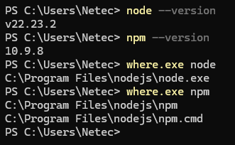

Instalar las herramientas globales después de cambiar de versión de
Node.js.

**PowerShell 7**

``` powershell
npm install -g yo @microsoft/generator-sharepoint@1.23.2 @rushstack/heft @pnp/cli-microsoft365
```

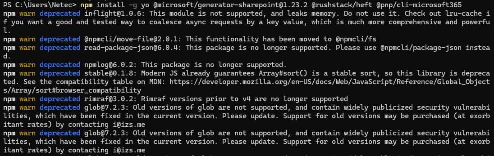

## ACTIVIDAD 2 --- Verificar herramientas

**Objetivo.** Comprobar que las herramientas que se utilizarán durante
el módulo responden desde la sesión de PowerShell 7.

**PowerShell 7**

``` powershell
git --version
code --version
pwsh --version
```

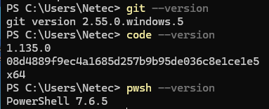

Verificar las herramientas globales.

**PowerShell 7**

``` powershell
npm list -g @microsoft/generator-sharepoint --depth=0
npm list -g @rushstack/heft --depth=0
m365 version
```

Verificar PnP.PowerShell.

**PowerShell 7**

``` powershell
Get-InstalledModule PnP.PowerShell
```

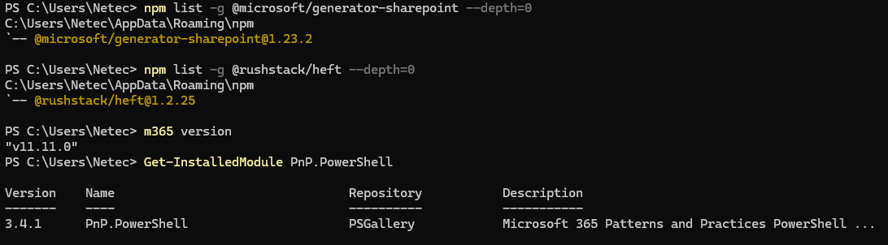

Si PnP.PowerShell no está instalado.

**PowerShell 7**

``` powershell
Install-Module PnP.PowerShell -Scope CurrentUser
Get-InstalledModule PnP.PowerShell
```

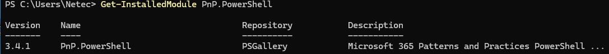

## ACTIVIDAD 3 --- Preparar el generador SPFx 1.23.2

**Objetivo.** Comprobar que Yeoman y el generador fijado para el módulo
están disponibles antes de crear la solución.

**PowerShell 7**

``` powershell
npm install -g yo @microsoft/generator-sharepoint@1.23.2
npm list -g @microsoft/generator-sharepoint --depth=0
yo --version
yo @microsoft/sharepoint --help
```

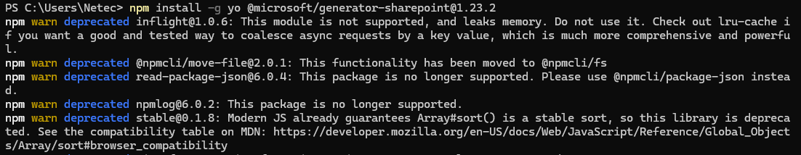

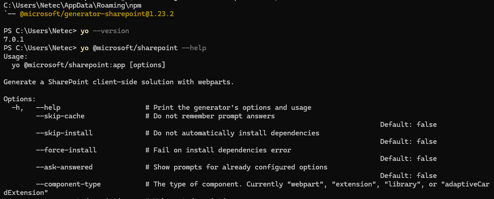

No uses una versión diferente del generador para crear el proyecto del
laboratorio. La versión del generador determina el scaffolding y el
conjunto de dependencias que se instalarán.

## ACTIVIDAD 4 --- Crear el proyecto SPFx

**Objetivo.** Generar la solución spfx-lab2-webpart-XXX con un Web Part
React para SharePoint Online.

Crear la carpeta de trabajo.

**PowerShell 7**

``` powershell
New-Item -ItemType Directory -Path C:\SPFx -Force
Set-Location C:\SPFx
```

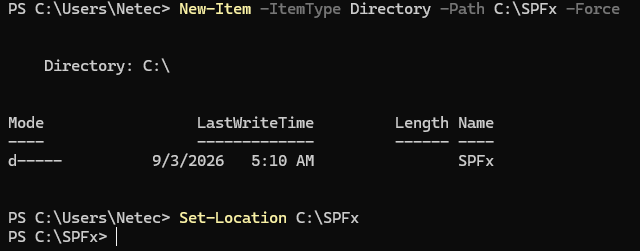

Ejecutar el generador.

**PowerShell 7**

``` powershell
yo @microsoft/sharepoint
```

En el asistente interactivo, utiliza los valores siguientes cuando
aparezcan:

Solution name: `spfx-lab2-webpart-XXX`

Client-side component: WebPart

Web Part name: `HelloSpfxXXX`

Template: React

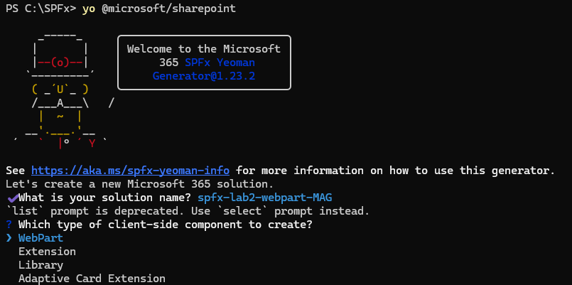

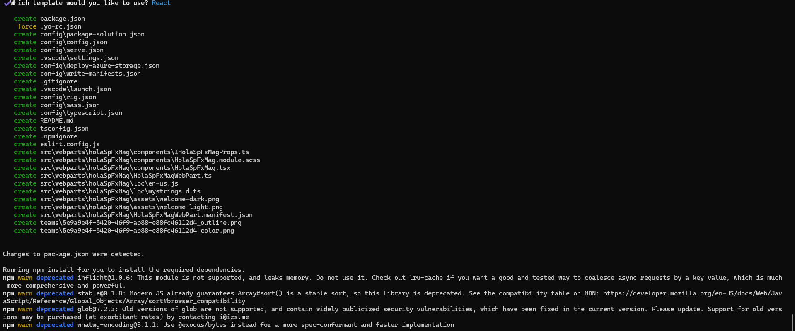

Durante la creación de un proyecto, el generador de SharePoint solicita
seleccionar el tipo de componente que se desea desarrollar. Las opciones
principales son:

  -----------------------------------------------------------------------
  Componente                          Descripción
  ----------------------------------- -----------------------------------
  WebPart                             Componente visual que se agrega a
                                      una página de SharePoint. Permite
                                      construir interfaces interactivas
                                      con React, HTML, CSS y TypeScript,
                                      y puede consumir datos de
                                      SharePoint, Microsoft Graph u otros
                                      servicios. Es el componente
                                      utilizado en este laboratorio.

  Extension                           Componente que permite extender o
                                      modificar determinadas experiencias
                                      de SharePoint sin crear un Web Part
                                      tradicional. Puede utilizarse, por
                                      ejemplo, para agregar acciones a
                                      listas, personalizar campos o
                                      ejecutar código en determinados
                                      puntos de la interfaz.

  Library                             Componente destinado a crear una
                                      biblioteca de código reutilizable
                                      para otros componentes SPFx. Es
                                      apropiado cuando se desea compartir
                                      funciones, clases, componentes o
                                      lógica común entre diferentes
                                      soluciones.

  Adaptive Card Extension             Componente orientado a Viva
                                      Connections que utiliza Adaptive
                                      Cards para presentar información y
                                      acciones de forma compacta e
                                      interactiva. Puede utilizarse para
                                      construir experiencias que se
                                      integren en el dashboard de Viva
                                      Connections.
  -----------------------------------------------------------------------

En SPFx 1.23.2 el asistente interactivo no presenta la antigua pregunta
de Tenant-wide deployment. La configuración de ámbito se comprobará y
ajustará explícitamente en la configuración de empaquetado en una
actividad posterior.

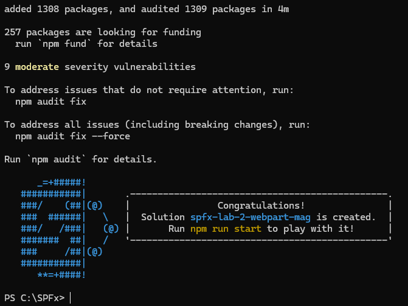

## ACTIVIDAD 5 --- Configurar el proyecto para un tenant compartido

**Objetivo.** Evitar que la solución del participante se configure para
despliegue tenant-wide en el App Catalog compartido.

Abrir la configuración de empaquetado.

**Ruta del archivo**

``` powershell
C:\SPFx\spfx-lab2-webpart-XXX\config\package-solution.json
```

Abre el archivo `package-solution.json` y localiza la propiedad
`skipFeatureDeployment` dentro de solution.

**Fragmento que debe quedar en package-solution.json**

"`skipFeatureDeployment`": false

Si la propiedad aparece con true, cámbiala a false. Si el generador no
la muestra, agrega la propiedad dentro del objeto solution, sin eliminar
otras propiedades generadas por el scaffolding.

Comprobar la configuración.

**PowerShell 7**

``` powershell
Set-Location C:\SPFx\spfx-lab2-webpart-XXX
Get-Content .\config\package-solution.json
```

**Resultado esperado.** package-solution.json contiene
skipFeatureDeployment con valor false. La solución podrá publicarse en
el App Catalog sin solicitar su activación automática en todos los
sitios.

No selecciones opciones de publicación tenant-wide en el App Catalog. En
este módulo el instructor publicará el paquete en el catálogo compartido
y la validación se realizará en el sitio asignado.

## ACTIVIDAD 6 --- Reconocer la estructura del proyecto

**Objetivo.** Identificar las carpetas y archivos principales creados
por el scaffolding moderno basado en Heft.

Abrir el proyecto en Visual Studio Code.

**PowerShell 7**

``` powershell
Set-Location C:\SPFx\spfx-lab2-webpart-XXX
code .
```

Revisar las carpetas principales.

``` powershell
src\webparts\helloSpfxXXX\
config\
```

node_modules\

Revisar archivos.

package.json

tsconfig.json

``` powershell
config\rig.json
config\package-solution.json
config\serve.json
```

Identificar el componente.

**Ruta**

``` powershell
src\webparts\helloSpfxXXX\components\HelloSpfxXXX.tsx
src\webparts\helloSpfxXXX\components\IHelloSpfxXXXProps.ts
```

El proyecto moderno utiliza `config/rig.json` para referenciar el rig de
SPFx. No crees un `config/heft.json` para este laboratorio. Un heft.json
de proyecto solo es necesario cuando se desea extender explícitamente la
configuración compartida del rig.

**Resultado esperado.** Puedes distinguir código fuente, configuración,
dependencias, configuración de TypeScript y archivos del toolchain.

## ACTIVIDAD 7 --- Trabajar con TypeScript y tipado estático

**Objetivo.** Definir una interfaz, crear un objeto tipado y observar
cómo TypeScript detecta una incompatibilidad.

Abrir el archivo.

**Archivo**

``` powershell
src\webparts\helloSpfxXXX\components\HelloSpfxXXX.tsx
```

Incorporar la interfaz y el objeto.

Agregar antes del componente React

``` powershell
interface IProject {
id: number;
name: string;
owner: string;
}
const project: IProject = {
id: 1,
name: "Portal SPFx",
owner: "Laboratorio"
};
```

console.log(project.name);

Provocar el error de tipos.

Cambia temporalmente id: 1 por id: "1" y guarda el archivo.

Desde la raíz del proyecto

``` powershell
Set-Location C:\SPFx\spfx-lab2-webpart-XXX
heft build
```

Observa el error de TypeScript. Después restaura id: 1.

**Resultado esperado.** El build identifica que string no es compatible
con number y, después de restaurar el valor, el proyecto queda listo
para continuar.

## ACTIVIDAD 8 --- Implementar estado con React.useState

**Objetivo.** Agregar estado local al Web Part y actualizar la interfaz
mediante un botón.

Declarar el estado dentro del componente.

Archivo:
src`\webparts`{=tex}`\helloSpfxXXX`{=tex}`\components`{=tex}\`HelloSpfxXXX\`.tsx

``` powershell
const [count, setCount] = React.useState(0);
```

Mostrar el estado.

Dentro del JSX

``` powershell
<p>Has hecho clic {count} veces.</p>
```

Agregar el botón.

Dentro del JSX

``` powershell
<button onClick={() => setCount(count + 1)}>
```

Incrementar

``` powershell
</button>
```

Código completo del componente.

Archivo:
src`\webparts`{=tex}`\helloSpfxXXX`{=tex}`\components`{=tex}\`HelloSpfxXXX\`.tsx

``` powershell
import * as React from "react";
import { IHelloSpfxXXXProps } from "./IHelloSpfxXXXProps";
interface IProject {
id: number;
name: string;
owner: string;
}
const project: IProject = {
id: 1,
name: "Portal SPFx",
owner: "Laboratorio"
};
const HelloSpfxXXX: React.FC<IHelloSpfxXXXProps> = (props) => {
const [count, setCount] = React.useState(0);
```

console.log(project.name);

``` powershell
return (
<div>
<h2>¡Hola SPFx con React!</h2>
<p>Proyecto: {project.name}</p>
<p>Propietario: {project.owner}</p>
<p>Usuario: {props.userDisplayName ?? "Participante"}</p>
<p>Has hecho clic {count} veces.</p>
<button onClick={() => setCount(count + 1)}>
```

Incrementar

``` powershell
</button>
</div>
);
};
export default HelloSpfxXXX;
```

**Resultado esperado.** El contador inicia en 0 y aumenta en uno cada
vez que se pulsa Incrementar.

## ACTIVIDAD 9 --- Instalar o sincronizar dependencias y compilar con Heft

**Objetivo.** Comprobar que el proyecto procesa correctamente
TypeScript, React, ESLint y Webpack.

**PowerShell 7**

``` powershell
Set-Location C:\SPFx\spfx-lab2-webpart-XXX
npm install
heft build
```

**Resultado esperado.** El build termina sin errores. La salida de Heft
muestra las tareas de compilación y el uso de TypeScript, ESLint y
Webpack. En esta etapa todavía no se genera el .sppkg.

## ACTIVIDAD 10 --- Comprender Gulp y Heft

**Objetivo.** Reconocer la diferencia entre el toolchain histórico
basado en Gulp y el modelo moderno utilizado por SPFx 1.23.2.

Gulp: utilizaba tradicionalmente gulpfile.js y tareas definidas mediante
un archivo de tareas.

Heft: coordina tareas mediante configuración y plugins del toolchain.

SPFx 1.22 y posteriores utilizan Heft para proyectos nuevos.

Comprobar el proyecto actual.

**Ruta**

``` powershell
C:\SPFx\spfx-lab2-webpart-XXX\config\rig.json
```

Abre rig.json y comprueba que referencia la configuración del rig de
SPFx.

**Resultado esperado.** El proyecto utiliza Heft y no contiene un
gulpfile.js generado como parte del proyecto moderno.

## ACTIVIDAD 11 --- Ejecutar el Web Part localmente

**Objetivo.** Levantar el servidor local y cargar el Web Part en el
SharePoint Online Workbench disponible durante el periodo de transición.

Confiar en el certificado de desarrollo.

**PowerShell 7**

``` powershell
Set-Location C:\SPFx\spfx-lab2-webpart-XXX
heft trust-dev-cert
```

Configurar el sitio de pruebas para el Workbench.

El proyecto contiene config/`serve.json` con un initialPage que utiliza
el marcador {tenantDomain}. Define la variable
`SPFX_SERVE_TENANT_DOMAIN` con el host y la ruta del sitio, sin incluir
https://.

**PowerShell 7**

``` powershell
$env:SPFX_SERVE_TENANT_DOMAIN = "azurenetecgp1.sharepoint.com/sites/spfxlab"
$env:SPFX_SERVE_TENANT_DOMAIN
```

**Resultado esperado.** La segunda línea muestra
azurenetecgp1.sharepoint.com/sites/spfxlab.

Iniciar Heft.

**PowerShell 7**

``` powershell
heft start
```

Cuando se abra el navegador, la URL debe utilizar una sola vez el
esquema https y debe apuntar al sitio de SharePoint, por ejemplo:
https://azurenetecgp1.sharepoint.com/sites/spfxlab/\_layouts/15/workbench.aspx.

Si aparece una solicitud para permitir scripts de depuración, selecciona
Allow. Después agrega el Web Part mediante el botón + del Workbench y
verifica el título, proyecto, propietario, usuario y contador.

**Resultado esperado.** El Web Part se carga desde el servidor local y
el contador aumenta al pulsar Incrementar.

Nota de vigencia. El SharePoint Online Workbench está deprecated desde
mayo de 2026 y tiene retiro previsto para el 1 de diciembre de 2026.
Durante este módulo se utiliza porque sigue disponible en el entorno de
prueba; para nuevos escenarios de depuración, Microsoft recomienda el
SPFx Debug Toolbar.

## ACTIVIDAD 12 --- Inicializar Git y crear una rama de trabajo

**Objetivo.** Registrar el proyecto inicial y separar el trabajo del
laboratorio mediante una rama.

Configurar la identidad de Git.

**PowerShell 7**

``` powershell
git config --global user.name "Nombre Apellido"
git config --global user.email "correo@ejemplo.com"
git config --get user.name
git config --get user.email
```

Inicializar el repositorio y registrar el estado inicial.

**PowerShell 7**

``` powershell
Set-Location C:\SPFx\spfx-lab2-webpart-XXX
git init
git status
git add .
git commit -m "chore: crear proyecto SPFx inicial"
```

Crear la rama de trabajo.

**PowerShell 7**

``` powershell
git checkout -b feature/hello-spfx
git branch --show-current
```

**Resultado esperado.** La rama activa es feature/hello-spfx y el
repositorio contiene el commit inicial.

## ACTIVIDAD 13 --- Modificar el Web Part y registrar el cambio

**Objetivo.** Realizar una modificación visible y registrar el nuevo
estado mediante un segundo commit.

Modificar el encabezado.

Archivo:
src`\webparts`{=tex}`\helloSpfxXXX`{=tex}`\components`{=tex}\`HelloSpfxXXX\`.tsx

**Antes:**

``` powershell
<h2>¡Hola SPFx con React!</h2>
```

**Después:**

``` powershell
<h2>Laboratorio 2 — SPFx + React</h2>
```

Registrar el cambio.

**PowerShell 7**

``` powershell
Set-Location C:\SPFx\spfx-lab2-webpart-XXX
git status
git add .
git commit -m "feat: actualizar mensaje del Web Part"
git log --oneline -2
```

**Resultado esperado.** El historial muestra el commit inicial y el
commit de actualización.

## ACTIVIDAD 14 --- Generar el paquete de producción

**Objetivo.** Construir y empaquetar la solución para que el instructor
pueda publicarla en el App Catalog.

**PowerShell 7**

``` powershell
Set-Location C:\SPFx\spfx-lab2-webpart-XXX
heft build --production
heft package-solution --production
Get-ChildItem .\sharepoint\solution\*.sppkg | Select-Object Name,Length,LastWriteTime
```

**Resultado esperado.** El build de producción termina sin errores y
sharepoint`\solution `{=tex}contiene un archivo .sppkg.

## ACTIVIDAD 15 --- Publicar e instalar la solución en el tenant compartido

**Objetivo.** Entregar el paquete al instructor, publicarlo en el App
Catalog compartido e instalarlo únicamente en el sitio asignado.

Confirmar el paquete.

**Ruta**

``` powershell
C:\SPFx\spfx-lab2-webpart-XXX\sharepoint\solution\*.sppkg
```

Identifica el archivo `.sppkg` generado en la actividad anterior. No lo
cargues directamente al App Catalog.

Entregar el paquete al instructor.

Entrega el archivo `.sppkg` al instructor. El instructor realizará la
carga y publicación en el App Catalog compartido.

Esperar la publicación.

El instructor publicará la solución identificada como
`spfx-lab2-webpart-XXX`. No selecciones ni solicites una opción que
habilite la solución para todos los sitios de la organización.

Agregar la aplicación al sitio asignado.

En el sitio asignado, abre Configuración \> Agregar una aplicación.
Selecciona De su organización, localiza la solución
`spfx-lab2-webpart-XXX` y agrégala al sitio.

Agregar el Web Part a una página.

Edita una página moderna, selecciona +, agrega un Web Part y busca
`HelloSpfxXXX`.

Validar.

Publica o guarda la página y comprueba el texto modificado y el
contador.

**Resultado esperado.** HelloSpfxXXX está disponible en el sitio
asignado, muestra el mensaje Laboratorio 2 --- SPFx + React y el
contador funciona.

## ACTIVIDAD 16 --- Comprobación final

**Objetivo.** Verificar que el ciclo completo del módulo se completó de
forma reproducible.

☐ Node.js 22.23.2 y npm disponibles.

☐ PowerShell 7.4 o posterior disponible.

☐ Git y Visual Studio Code disponibles.

☐ PnP.PowerShell instalado y verificable.

☐ CLI for Microsoft 365 instalado y verificable.

☐ Generator SharePoint 1.23.2 instalado.

☐ Heft disponible globalmente.

☐ Proyecto creado como `spfx-lab2-webpart-XXX`.

☐ Web Part creado como `HelloSpfxXXX`.

☐ `skipFeatureDeployment` configurado como false.

☐ `config/rig.json` identificado; no se creó `config/heft.json` para
este laboratorio.

☐ TypeScript utilizado con una interfaz tipada.

☐ React.useState funcionando.

☐ heft build exitoso.

☐ heft trust-dev-cert ejecutado.

☐ heft start ejecutado.

☐ `SPFX_SERVE_TENANT_DOMAIN` configurada sin https://.

☐ Web Part ejecutado en el entorno local.

☐ Repositorio Git inicializado.

☐ Rama `feature/hello-spfx` creada.

☐ Commit inicial realizado.

☐ Segundo commit realizado.

☐ Build de producción exitoso.

☐ Archivo `.sppkg` generado.

☐ Paquete publicado en el App Catalog por el instructor.

☐ Aplicación agregada al sitio asignado.

☐ `HelloSpfxXXX` visible y funcional en SharePoint Online.
