# Laboratorio 3 - Panel de proyectos con SPFx, React, Fluent UI y APIs

Duración estimada: 90 minutos

## Objetivo

Construir un Client-Side Web Part SPFx denominado ProjectDashboardXXX que utilice React y TypeScript para presentar proyectos de una lista de SharePoint, mostrar información del usuario autenticado mediante Microsoft Graph y proporcionar un formulario con controles de Fluent UI. Durante el desarrollo se aplicarán useState, useEffect, useRef, un hook personalizado, inputs controlados, validación, separación de responsabilidades y prácticas básicas de seguridad y rendimiento.

## Alcance

El laboratorio cubre desde la creación del sitio de SharePoint del participante y la lista de datos hasta la compilación, generación del paquete .sppkg, publicación en el App Catalog, aprobación del permiso User.Read y validación del Web Part en una página moderna de SharePoint Online. El laboratorio utiliza la ruta estable de creación de proyectos SPFx mediante Yeoman y el generador de SharePoint.

## Requisitos

- Cuenta de Microsoft 365 con permisos para crear un sitio de comunicación, editar páginas y crear listas en SharePoint Online. El App Catalog compartido y la aprobación de permisos de API son administrados por el instructor o el administrador del tenant.
- Node.js 22.23.2 instalado y disponible en PowerShell.
- Git instalado.
- Visual Studio Code instalado.
- PowerShell 7 para las tareas de PnP PowerShell, si se utiliza esa herramienta en el entorno del curso.
- SPFx 1.23.2 y React 17.0.1 para el proyecto de este laboratorio.
- Conexión a Internet para descargar dependencias y acceder a Microsoft 365.

## Antes de comenzar

Este laboratorio utiliza SPFx 1.23.2. Para mantener un procedimiento reproducible, se utilizará explícitamente el generador @microsoft/generator-sharepoint 1.23.2. Cada participante creará y utilizará su propio sitio de práctica `Portal-ProyectosXXX`, donde `XXX` representa sus iniciales, y desarrollará dentro de ese sitio sus componentes. El App Catalog del tenant es compartido y su administración corresponde al instructor. No se utilizará el CLI de SPFx en este laboratorio.

Nota sobre "Site Collection": en SharePoint Online moderno, la experiencia de creación para el participante se presenta como `Crear sitio`. El sitio moderno creado mediante esta experiencia es la unidad independiente que utilizarás en el laboratorio; no necesitas abrir el Centro de administración de SharePoint ni ejecutar comandos administrativos para crearlo.

## Actividad 1. Crear el sitio de práctica y preparar el entorno de publicación

Crear el sitio de SharePoint que utilizarás durante el laboratorio y confirmar que el App Catalog compartido está disponible para la publicación de la solución.

### Paso 1. Abrir SharePoint Online

Inicia sesión en Microsoft 365 con tu cuenta de participante. Abre SharePoint desde el iniciador de aplicaciones de Microsoft 365 o desde la página principal de SharePoint. No necesitas permisos de administrador para crear tu sitio si la creación de sitios está habilitada para los participantes del tenant.


### Paso 2. Iniciar la creación del sitio

En la página principal de SharePoint, selecciona `+ Crear sitio` y después elige `Sitio de comunicación`. Microsoft presenta esta operación como creación de un sitio; en el contexto de este laboratorio, ese sitio será tu espacio independiente de práctica. Si no aparece `+ Crear sitio`, la creación de sitios está restringida en el tenant y debes solicitar al instructor o al administrador que habilite la creación para los participantes o cree el sitio por ti como contingencia. Selecciona **Standard Communication**.


## 

### Paso 3. Configurar el sitio

Configura el sitio con estos valores: Nombre del sitio: `Portal-ProyectosXXX`, donde `XXX` representa tus iniciales. Descripción: `Sitio de práctica para el Laboratorio 3 de SPFx`. Diseño: selecciona `Tema` si está disponible; si tu interfaz muestra otros diseños, utiliza un diseño de comunicación estándar. Si SharePoint solicita un idioma, conserva el idioma predeterminado del tenant. Completa la creación seleccionando `Finalizar`, `Crear sitio` o el botón equivalente que muestre tu interfaz.


### Paso 4. Configurar la URL y finalizar la creación

Revisa la dirección web que SharePoint propone para el sitio. Debe identificar de forma única tu sitio. Si la dirección solicitada ya existe, SharePoint puede proponer una dirección disponible diferente; en ese caso, verifica que el sitio creado sea el tuyo antes de continuar. Finaliza la creación y espera a que el sitio quede disponible.

### Paso 5. Confirmar permisos del sitio

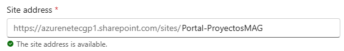

Abre `Portal-ProyectosXXX` con tu cuenta. Debes poder editar páginas y crear listas. Si puedes abrir el sitio pero no puedes realizar esas operaciones, detén el laboratorio y solicita al instructor o al administrador del sitio los permisos necesarios.


### Paso 6. Crear la página de prueba

Dentro de `Portal-ProyectosXXX`, selecciona `Nuevo > Página`. De la plantilla selecciona Pagina en blanco en la parte superior derecha de la lista. Asigna el título `Panel de proyectos` y publica la página. No agregues todavía el Web Part.

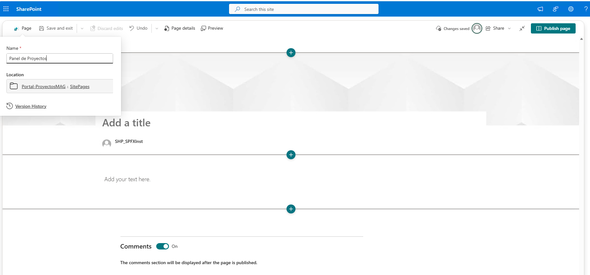

### Paso 7. Confirmar el App Catalog compartido

El App Catalog del tenant es administrado por el instructor. No crees un App Catalog nuevo ni modifiques su configuración. Confirma que el catálogo está disponible y que la biblioteca `Apps for SharePoint` será el destino de publicación del paquete `.sppkg`.

**Resultado esperado.** Existe el sitio `Portal-ProyectosXXX` con la página publicada `Panel de proyectos`, tu cuenta puede editar páginas y crear listas, y el instructor confirma que el App Catalog compartido está disponible.

## Actividad 2. Crear la lista de proyectos

Crear la fuente de datos que el Web Part consultará mediante SharePoint REST.

### Paso 1. Crear la lista

En `Portal-ProyectosXXX`, selecciona Nuevo > Lista > Lista en blanco. Escribe `Proyectos` como nombre. Desactivar **Mostrar lista en navegador de sitio** y selecciona Crear.


### Paso 2. Crear la columna Owner

Abre la lista `Proyectos`. Selecciona + Agregar columna > Una línea de texto. Escribe `Owner` como nombre de columna y guarda.

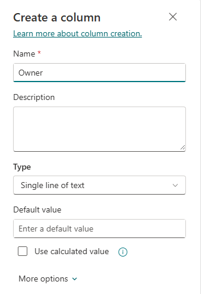

### Paso 3. Crear la columna Status

Selecciona + Agregar columna > Elección. Escribe `Status` como nombre. Agrega exactamente estas opciones: `Activo`, `En pausa`, `Finalizado`. Guarda la columna.


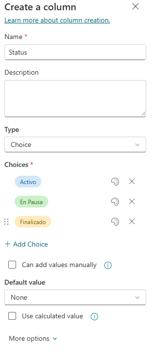

### Paso 4. Crear la columna Description

Selecciona + Agregar columna > Varias líneas de texto. Escribe `Description` como nombre y guarda.


### Paso 5. Agregar registros

Agrega tres elementos con valores:


**Resultado esperado.** La lista `Proyectos` contiene tres registros y las columnas `Title`, `Owner`, `Status` y `Description`.

## Actividad 3. Crear el proyecto SPFx

Crear el Web Part ProjectDashboardXXX con React y TypeScript utilizando el generador estable.

### Paso 1. Crear la carpeta del proyecto

Ejecuta:

```powershell
New-Item -ItemType Directory -Path C:\SPFx\spfx-lab3-webpart-XXX -Force
Set-Location C:\SPFx\spfx-lab3-webpart-XXX
```

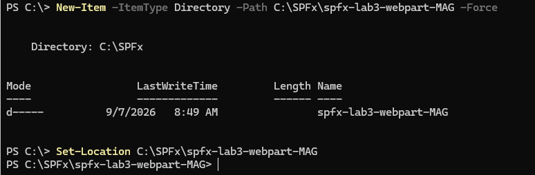

### Paso 2. Ejecutar el generador

Ejecuta:

```powershell
yo @microsoft/sharepoint
```

Responde el asistente con estos valores. En SPFx 1.23.2, el flujo actual no muestra las antiguas preguntas interactivas sobre el paquete base ni sobre la ubicación de los archivos. El generador utiliza el contexto del proyecto actual y, para este laboratorio, solo debes responder las preguntas que realmente aparezcan en tu consola.

- Solution name: `spfx-lab3-webpart-XXX`
- Which type of client-side component to create?: `WebPart`
- What is your Web part name?: `ProjectDashboardXXX`
- Which template would you like to use?: `React`

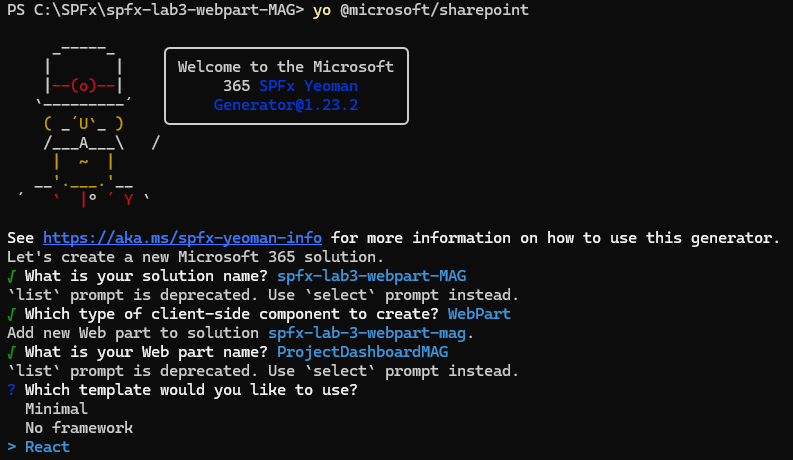

En SPFx 1.23.2, después de seleccionar `React` no se requieren respuestas .

### Paso 3. Configurar el despliegue para el tenant compartido

Abre `config/package-solution.json`. Dentro de la propiedad `solution`, agrega o verifica la propiedad `skipFeatureDeployment` con el valor `false`.

```powershell
code .
```

```json
"skipFeatureDeployment": false
```

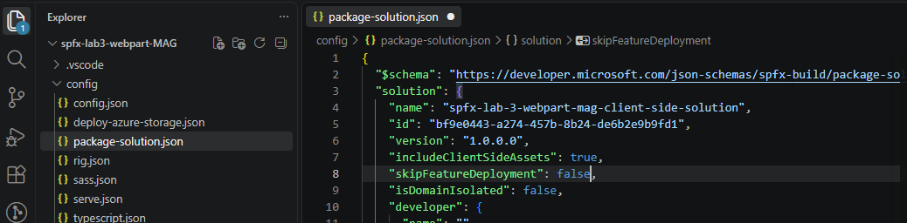

**Resultado esperado.** La carpeta `C:\SPFx\spfx-lab3-webpart-XXX` contiene el proyecto y `package.json`. El archivo `config/package-solution.json` conserva `skipFeatureDeployment` con valor `false`.

## Actividad 4. Instalar dependencias y preparar el certificado de desarrollo

Instalar las dependencias locales del proyecto y confiar en el certificado HTTPS utilizado por el entorno de desarrollo.

### Paso 1. Abrir el proyecto

Desde `C:\SPFx\spfx-lab3-webpart-XXX`, ejecuta:

```powershell
code .
```

### Paso 2. Instalar dependencias

En la terminal integrada de VS Code, ubicada en la raíz del proyecto, ejecuta:

```powershell
npm install
```

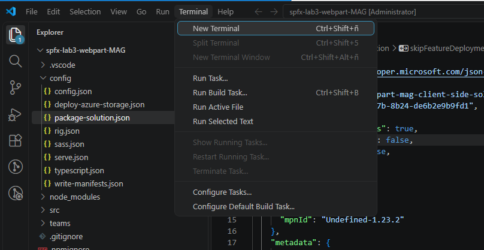

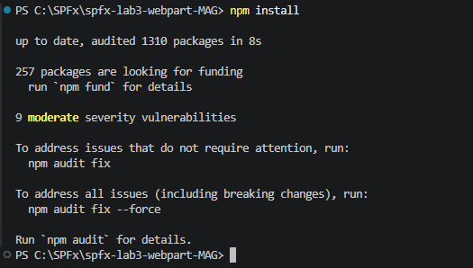

### Paso 3. Verificar React y Fluent UI

Ejecuta:

```powershell
npm list react react-dom @fluentui/react --depth=0
```


**Resultado esperado.** React aparece como `17.0.1`. Si `@fluentui/react` no aparece, instala la dependencia con el siguiente comando y vuelve a ejecutar la verificación.

```powershell
npm install @fluentui/react
```

### Paso 4. Confiar en el certificado de desarrollo

Esta configuración se realiza **una sola vez por estación de trabajo**. Si completaste correctamente esta configuración en el Lab 2, no ejecutes nuevamente este comando.

```powershell
heft trust-dev-cert
```


**Resultado esperado.** Heft completa el proceso de confianza del certificado de desarrollo. **Esta operación se realiza una vez por estación de trabajo.**

## Actividad 5. Reconocer la estructura del proyecto

Identificar los archivos que contienen la configuración, la lógica del Web Part, el componente React y los estilos.

### Paso 1. Abrir el Explorador de VS Code

En el Explorador de archivos de VS Code, expande la carpeta del proyecto.

### Paso 2. Identificar las carpetas

Localiza exactamente estas carpetas: `src`, `config` y `sharepoint`. Si `sharepoint` todavía no aparece, no la crees manualmente; aparecerá cuando el proceso de empaquetado genere la salida de la solución.

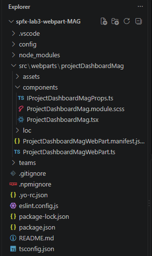

### Paso 3. Identificar los archivos del Web Part

Dentro de `src/webparts/projectDashboardXXX/`, localiza `ProjectDashboardXXXWebPart.ts`. Dentro de `components/`, localiza `ProjectDashboardXXX.tsx` y `ProjectDashboardXXX.module.scss`.


### Paso 4. Identificar la configuración

En la raíz localiza `package.json` y `tsconfig.json`. En `config`, localiza `rig.json`, `package-solution.json` y `serve.json`.

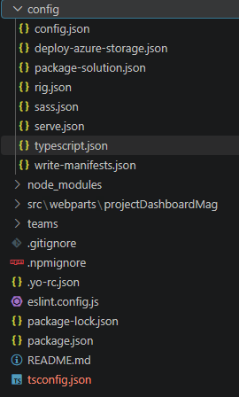

**Resultado esperado.** Puedes distinguir el código del Web Part, el componente React, los estilos, las dependencias y los archivos de configuración. No se asume que `sharepoint/solution` exista antes del empaquetado.

## Actividad 6. Ejecutar el Web Part en SharePoint

Comprobar que el proyecto generado puede ejecutarse antes de modificar el código.

### Paso 1. Definir el sitio utilizado por el Hosted Workbench

En PowerShell, desde la raíz del proyecto, asigna el dominio y la ruta del sitio de laboratorio a la variable utilizada por SPFx. No incluyas `https://` porque `serve.json` ya contiene el protocolo.

```powershell
$env:SPFX_SERVE_TENANT_DOMAIN = " azurenetecgp1.sharepoint.com/sites/Portal-ProyectosXXX"
```

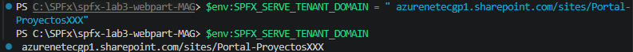

### Paso 2. Iniciar Heft

Ejecuta:

```powershell
heft start
```

No es necesario ejecutar heft build previamente. El comando heft start realizará el proceso necesario para compilar y servir el proyecto en el entorno de desarrollo local.

### Paso 3. Abrir el Hosted Workbench

Heft iniciará el servidor de desarrollo y mostrará la dirección del entorno de prueba. Abre la dirección indicada por la salida del comando. El Hosted Workbench de SharePoint Online está en transición: Microsoft lo marcó como obsoleto desde mayo de 2026 y anunció su retiro para el 1 de diciembre de 2026. Mientras el entorno del curso continúe disponiéndolo, este paso permite probar el proyecto con el contexto de SharePoint.


Selecciona **Cargar scripts de depuración**


El Hosted Workbench de SharePoint Online está en transición: Microsoft lo marcó como obsoleto desde mayo de 2026 y anunció su retiro para el 1 de diciembre de 2026. Mientras el entorno del curso continúe disponiéndolo, este paso permite probar el proyecto con el contexto de SharePoint. Para entornos que ya hayan migrado al Debug Toolbar, se debe utilizar ese mecanismo de depuración.

**Resultado esperado**. El proyecto inicia sin errores y el Web Part `ProjectDashboardXXX` puede cargarse en el entorno de prueba.

## Actividad 7. Crear el modelo de proyecto en TypeScript

Definir un tipo explícito para los elementos que llegan desde SharePoint.

### Paso 1. Crear el archivo IProject.ts

En `src/webparts/projectDashboardXXX/components/`, crea un archivo llamado `IProject.ts`.

**Archivo:** `src/webparts/projectDashboardXXX/components/IProject.ts`

```tsx
export interface IProject {
  Id: number;
  Title: string;
  Owner: string;
  Status: string;
  Description: string;
}
```

### Paso 2. Comprobar el tipado

En el mismo archivo, no agregues propiedades distintas a las definidas. El tipo se utilizará para evitar que el componente React dependa de objetos sin estructura conocida.

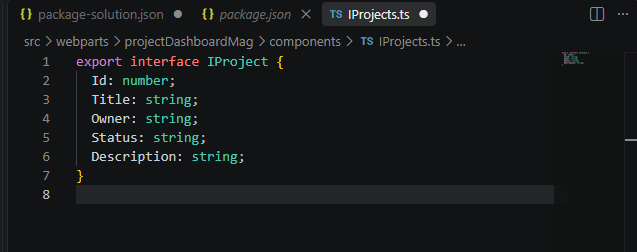

**Resultado esperado.** Existe `IProject.ts` con cinco propiedades tipadas.

## Actividad 8. Implementar useState

Agregar estado React para el contador y comprobar la actualización de la interfaz.

### Paso 1. Reemplazar el componente React

Abre el archivo indicado y reemplaza su contenido completo.

**Archivo:** `src/webparts/projectDashboardXXX/components/ProjectDashboardXXX.tsx`

```tsx
import * as React from 'react';

export default function ProjectDashboardXXX(): React.ReactElement {
  const [count, setCount] = React.useState<number>(0);

  return (
    <div>
      <h2>Panel de proyectos</h2>
      <p>Has hecho clic {count} veces.</p>
      <button onClick={() => setCount(count + 1)}>
        Incrementar
      </button>
    </div>
  );
}
```

### Paso 2. Guardar y observar el resultado

Guarda el archivo. Agrega el componente a la página.

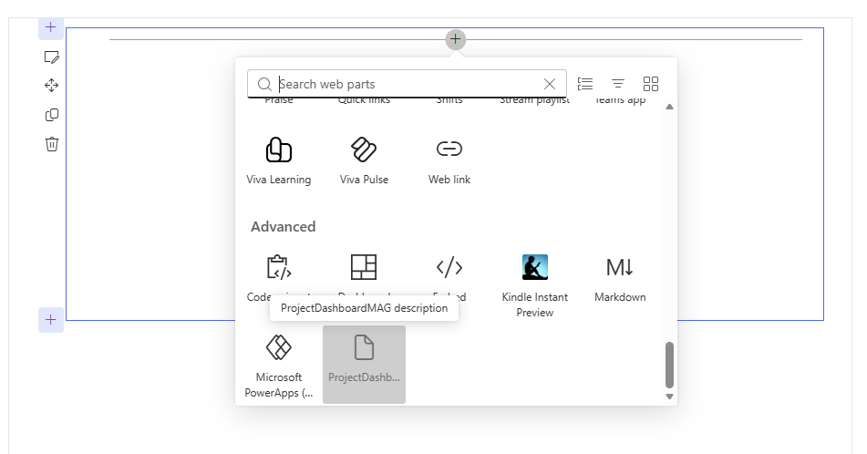

Si `heft start` continúa ejecutándose, el navegador debe actualizar el Web Part. Pulsa `Incrementar` dos veces.

**Resultado esperado.** El contador cambia de 0 a 1 y después a 2 sin recargar la página.

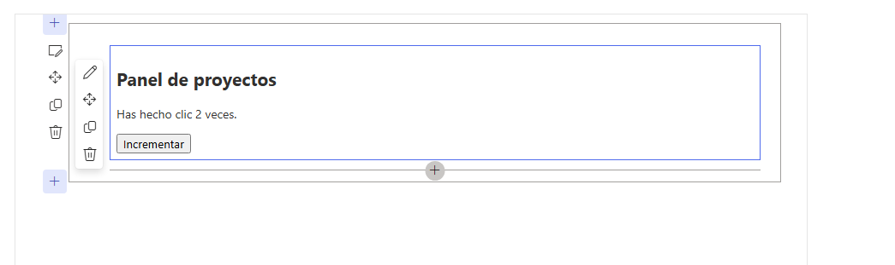

## Actividad 9. Implementar useEffect

Ejecutar un efecto cada vez que cambie el contador.

### Paso 1. Agregar useEffect

Reemplaza el archivo completo por:

**Archivo:** `src/webparts/projectDashboardXXX/components/ProjectDashboardXXX.tsx`

```tsx
import * as React from "react";
import { IProjectDashboardXXXProps } from "./IProjectDashboardXXXProps";

interface IProject {
  id: number;
  name: string;
  owner: string;
}

const project: IProject = {
  id: 1,
  name: "Portal SPFx",
  owner: "Laboratorio"
};

const ProjectDashboardXXX: React.FC<IProjectDashboardXXXProps> = (props) => {
  const [count, setCount] = React.useState(0);
  const [statusMessage, setStatusMessage] =
    React.useState("Sin actividad");

  React.useEffect(() => {
    if (count === 0) {
      setStatusMessage("Sin actividad");
    } else if (count === 1) {
      setStatusMessage("Se registró la primera interacción.");
    } else {
      setStatusMessage(`Se han registrado ${count} interacciones.`);
    }
  }, [count]);

  return (
    <div>
      <h2>Laboratorio 3 — SPFx + React</h2>

      <p>Proyecto: {project.name}</p>
      <p>Propietario: {project.owner}</p>
      <p>Usuario: {props.userDisplayName ?? "Participante"}</p>

      <p>Has hecho clic {count} veces.</p>

      <p>Estado: {statusMessage}</p>

      <button onClick={() => setCount(count + 1)}>
        Incrementar
      </button>
    </div>
  );
};

export default ProjectDashboardXXX;
```


React.useEffect(() => {

...

}, [count]);

Indica a React que ejecute este efecto cuando cambie count.

Por ejemplo, al pasar de count = 1 a count = 2, useEffect vuelve a ejecutarse y actualiza:

setStatusMessage(`Se han registrado ${count} interacciones.`);

Después React vuelve a renderizar el componente y el participante ve inmediatamente el nuevo mensaje.

## Actividad 10. Implementar useRef

## Utilizar useRef para mantener una referencia directa a un elemento de la interfaz y utilizarla para colocar el foco en un campo de texto cuando el usuario lo solicite.

### Paso 1. Reemplazar el componente

Utiliza este contenido completo:

**Archivo:** `src/webparts/projectDashboardXXX/components/ProjectDashboardXXX.tsx`

```tsx
import * as React from "react";

export default function ProjectDashboardXXX(): React.ReactElement {
  const [count, setCount] = React.useState<number>(0);

  const [statusMessage, setStatusMessage] =
    React.useState<string>("Sin actividad");

  const inputRef = React.useRef<HTMLInputElement>(null);

  React.useEffect(() => {
    if (count === 0) {
      setStatusMessage("Sin actividad");
    } else if (count === 1) {
      setStatusMessage("Se registró la primera interacción.");
    } else {
      setStatusMessage(
        `Se han registrado ${count} interacciones.`
      );
    }
  }, [count]);

  const focusInput = (): void => {
    inputRef.current?.focus();
  };

  return (
    <div>
      <h2>Panel de proyectos</h2>

      <p>Has hecho clic {count} veces.</p>

      <p>Estado: {statusMessage}</p>

      <input
        ref={inputRef}
        type="text"
        placeholder="Escribe algo..."
      />

      <button onClick={focusInput}>
        Focalizar input
      </button>

      <button onClick={() => setCount(count + 1)}>
        Incrementar
      </button>
    </div>
  );
}
```


**Resultado esperado.** Al seleccionar `Focalizar input`, el cursor se coloca en el campo de texto.

## Actividad 12. Crear un hook personalizado

Encapsular la lógica de estado para los proyectos en un hook reutilizable.

### Paso 1. Crear useProjects.ts

En `components/`, crea el archivo.

**Archivo:** `src/webparts/projectDashboardXXX/components/useProjects.ts`

```tsx
import * as React from 'react';
import { IProject } from './IProjects';

export function useProjects(): {
  projects: IProject[];
  setProjects: React.Dispatch<React.SetStateAction<IProject[]>>;
} {
  const [projects, setProjects] = React.useState<IProject[]>([]);

  return {
    projects,
    setProjects
  };
}
```

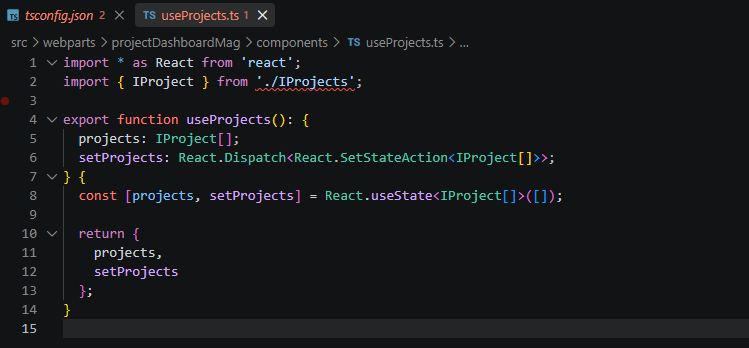

El hook mantiene el estado de la colección de proyectos. En una actividad posterior recibirá una función de carga para obtener datos desde SharePoint.

**Resultado esperado**. `useProjects.ts` exporta `useProjects` y devuelve `projects` y `setProjects`.

## Actividad 13. Incorporar Fluent UI

Utilizar componentes de Fluent UI para construir el formulario.

### Paso 1. Reemplazar el componente

Utiliza el siguiente contenido completo.

**Archivo:** `src/webparts/projectDashboardXXX/components/ProjectDashboardXXX.tsx`

```tsx
import * as React from "react";
import {
  PrimaryButton,
  Stack,
  TextField
} from "@fluentui/react";

export default function ProjectDashboardXXX(): React.ReactElement {
  const [count, setCount] = React.useState<number>(0);
  const [statusMessage, setStatusMessage] =
    React.useState<string>("Sin actividad");
  const [projectName, setProjectName] = React.useState<string>("");

  const inputRef = React.useRef<HTMLInputElement>(null);

  React.useEffect(() => {
    if (count === 0) {
      setStatusMessage("Sin actividad");
    } else if (count === 1) {
      setStatusMessage("Se registró la primera interacción.");
    } else {
      setStatusMessage(
        `Se han registrado ${count} interacciones.`
      );
    }
  }, [count]);

  const focusInput = (): void => {
    inputRef.current?.focus();
  };

  const addProject = (): void => {
    if (projectName.trim()) {
      console.log(`Proyecto agregado: ${projectName}`);
      setProjectName("");
    }
  };

  return (
    <Stack tokens={{ childrenGap: 10 }}>
      <h2>Panel de proyectos</h2>

      <TextField
        label="Nombre del proyecto"
        value={projectName}
        onChange={(_, value) => setProjectName(value || "")}
      />

      <PrimaryButton
        text="Agregar proyecto"
        onClick={addProject}
      />

      <input
        ref={inputRef}
        type="text"
        placeholder="Campo de prueba para useRef"
      />

      <PrimaryButton
        text="Focalizar input"
        onClick={focusInput}
      />

      <p>Has hecho clic {count} veces.</p>

      <p>Estado: {statusMessage}</p>

      <PrimaryButton
        text="Incrementar"
        onClick={() => setCount(count + 1)}
      />
    </Stack>
  );
}
```

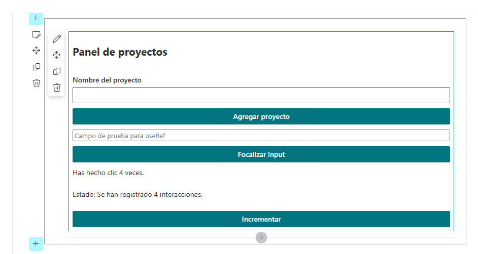

**Resultado esperado.** El contador se actualiza al seleccionar **Incrementar**, el mensaje de estado cambia mediante useEffect y el botón **Focalizar input** coloca el cursor en el campo de texto mediante useRef.

## Actividad 14. Crear un input controlado y validar la entrada

En esta actividad, se va a mantener el valor del formulario en el estado de React y rechazar valores vacíos.

### Paso 1. Actualizar el componente

Utiliza esta versión completa.

**Archivo:** `src/webparts/projectDashboardXXX/components/ProjectDashboardXXX.tsx`

```tsx
import * as React from 'react';
import {
  MessageBar,
  MessageBarType,
  PrimaryButton,
  Stack,
  TextField
} from '@fluentui/react';

export default function ProjectDashboardXXX(): React.ReactElement {
  const [projectName, setProjectName] = React.useState<string>('');
  const [message, setMessage] = React.useState<string>('');

  const handleAddProject = (): void => {
    const normalizedName = projectName.trim();

    if (!normalizedName) {
      setMessage('Escribe un nombre de proyecto.');
      return;
    }

    setMessage(`Proyecto preparado: ${normalizedName}`);
  };

  return (
    <Stack tokens={{ childrenGap: 10 }}>
      <h2>Panel de proyectos</h2>

      <TextField
        label="Nombre del proyecto"
        value={projectName}
        onChange={(_, value) => setProjectName(value || '')}
      />

      <PrimaryButton
        text="Agregar proyecto"
        onClick={handleAddProject}
      />

      {message && (
        <MessageBar
          messageBarType={MessageBarType.info}
        >
          {message}
        </MessageBar>
      )}
    </Stack>
  );
}
```


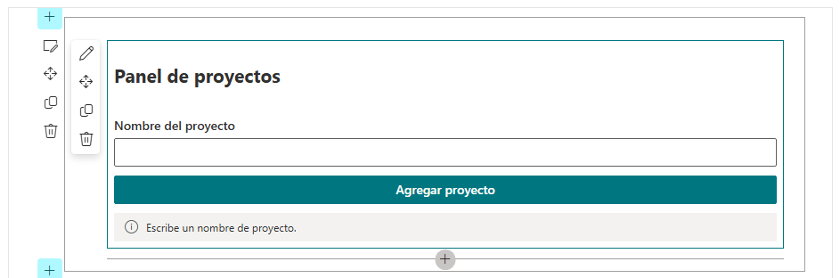

**Resultado esperado**. Al pulsar `Agregar proyecto` con el campo vacío aparece el mensaje de validación. Con `Portal SPFx`, aparece `Proyecto preparado: Portal SPFx`.

## Actividad 15. Conectar SharePoint REST

**Objetivo.** Consultar la lista Proyectos mediante el cliente autenticado de SPFx y mostrar en el Web Part los registros recuperados desde SharePoint.

En esta actividad se conectará el componente React con SharePoint mediante SPHttpClient.

**Importante.** Para esta actividad se asume que la lista Proyectos contiene las columnas Title, Owner, Status y Description, y que Owner es una columna de texto de una sola línea.

### Paso 1. Verificar la interfaz IProject

La aplicación necesita conocer la estructura de los datos que recibirá desde SharePoint.

`src/webparts/projectDashboardXXX/components/IProject.ts`

debe contener:

```tsx
export interface IProject {
  Id: number;
  Title: string;
  Owner: string;
  Status: string;
  Description: string;
}
```

La interfaz representa la estructura de cada elemento de la lista Proyectos. TypeScript utilizará esta definición para comprobar que los datos utilizados por el componente tengan los tipos esperados.

### Paso 2. Preparar las propiedades del componente

El componente React recibirá una función que será responsable de obtener los proyectos desde SharePoint.

src/webparts/projectDashboardXXX/components/IProjectDashboardXXXProps.ts

Validar el contenido:

```tsx
   import { IProject } from "./IProject";
   export interface IProjectDashboardProps {
     userDisplayName: string;
     getProjects: () => Promise<IProject[]>;
}
```

userDisplayName contiene el nombre del usuario actual y getProjects representa la función que permitirá al componente solicitar los proyectos.

La interfaz IProjectDashboardProps se mantiene con ese nombre, aunque el archivo se denomine IProjectDashboardXXXProps.ts.

### Paso 3. Implementar la consulta REST

La comunicación con SharePoint se realizará desde el Web Part principal, donde está disponible this.context.spHttpClient.

**Archivo:**

`src/webparts/projectDashboardXXX/ProjectDashboardXXXWebPart.ts`

Reemplaza el contenido completo del archivo por:

```tsx
import * as React from "react";
import * as ReactDom from "react-dom";
import { Version } from "@microsoft/sp-core-library";
import {
  type IPropertyPaneConfiguration,
  PropertyPaneTextField
} from "@microsoft/sp-property-pane";
import {
  BaseClientSideWebPart
} from "@microsoft/sp-webpart-base";
import { SPHttpClient } from "@microsoft/sp-http";

import * as strings from "ProjectDashboardXXXWebPartStrings";
import ProjectDashboardXXX from "./components/ProjectDashboardXXX";
import { IProjectDashboardProps } from "./components/IProjectDashboardXXXProps";
import { IProject } from "./components/IProject";

export interface IProjectDashboardXXXWebPartProps {
  description: string;
}

export default class ProjectDashboardXXXWebPart
  extends BaseClientSideWebPart<IProjectDashboardXXXWebPartProps> {

  public render(): void {
    const element: React.ReactElement<IProjectDashboardProps> =
      React.createElement(ProjectDashboardXXX, {
        userDisplayName: this.context.pageContext.user.displayName,
        getProjects: this.getProjects.bind(this)
      });

    ReactDom.render(element, this.domElement);
}

  private async getProjects(): Promise<IProject[]> {
    const url =
      `${this.context.pageContext.web.absoluteUrl}` +
      `/_api/web/lists/getbytitle('Proyectos')/items` +
      `?$select=Id,Title,Owner,Status,Description`;

    const response = await this.context.spHttpClient.get(
      url,
      SPHttpClient.configurations.v1
    );

    if (!response.ok) {
      throw new Error(
        `Error al consultar SharePoint: ${response.status} ${response.statusText}`
    );
}

    const data = await response.json();

    return data.value as IProject[];
}

  protected onDispose(): void {
    ReactDom.unmountComponentAtNode(this.domElement);
}

  protected get dataVersion(): Version {
    return Version.parse("1.0");
}

  protected getPropertyPaneConfiguration():
    IPropertyPaneConfiguration {
    return {
      pages: [
        {
          header: {
            description: strings.PropertyPaneDescription
          },
          groups: [
        {
              groupName: strings.BasicGroupName,
              groupFields: [
                PropertyPaneTextField("description", {
                  label: strings.DescriptionFieldLabel
                })
              ]
}
              ]
}
              ]
    };
}
}
```

La función getProjects() construye la URL de SharePoint utilizando la URL del sitio donde está ejecutándose el Web Part:

this.context.pageContext.web.absoluteUrl

La consulta REST:

/_api/web/lists/getbytitle('Proyectos')/items

solicita los elementos de la lista Proyectos. La expresión:

?$select=Id,Title,Owner,Status,Description

limita la respuesta a los campos que serán utilizados en esta actividad.

SPHttpClient realiza la solicitud utilizando el contexto autenticado de SPFx.

### Paso 4. Mostrar los proyectos en el componente React

Ahora se utilizará getProjects() desde el componente React y se mostrarán los registros recuperados.

**Archivo:**

src/webparts/projectDashboardXXX/components/ProjectDashboardXXX.tsx

Reemplaza el contenido completo por:

```tsx
import * as React from "react";
import {
  MessageBar,
  MessageBarType,
  PrimaryButton,
  Stack,
  TextField
} from "@fluentui/react";

import { IProjectDashboardProps } from "./IProjectDashboardXXXProps";
   import { IProject } from "./IProject";

export default function ProjectDashboardXXX(
  props: IProjectDashboardProps
): React.ReactElement {

  const [projectName, setProjectName] =
    React.useState<string>("");

  const [message, setMessage] =
    React.useState<string>("");

  const [projects, setProjects] =
    React.useState<IProject[]>([]);

  const [loading, setLoading] =
    React.useState<boolean>(false);

  const [error, setError] =
    React.useState<string>("");

  const handleAddProject = (): void => {
    const normalizedName = projectName.trim();

    if (!normalizedName) {
      setMessage("Escribe un nombre de proyecto.");
      return;
}

    setMessage(`Proyecto preparado: ${normalizedName}`);
    };

  const loadProjects = async (): Promise<void> => {
    setLoading(true);
    setError("");

    try {
      const data = await props.getProjects();
      setProjects(data);
    } catch (err) {
      setError(
        err instanceof Error
          ? err.message
          : "No fue posible consultar los proyectos."
    );
    } finally {
      setLoading(false);
}
    };

React.useEffect(() => {
    void loadProjects();
  }, []);

  return (
    <Stack tokens={{ childrenGap: 10 }}>
      <h2>Panel de proyectos</h2>

      <p>
        Usuario: {props.userDisplayName}
      </p>

      <TextField
        label="Nombre del proyecto"
        value={projectName}
        onChange={(_, value) => setProjectName(value || "")}
      />

      <PrimaryButton
        text="Agregar proyecto"
        onClick={handleAddProject}
      />

      {message && (
        <MessageBar
          messageBarType={MessageBarType.info}
        >
          {message}
        </MessageBar>
      )}

      <PrimaryButton
        text="Actualizar proyectos"
        onClick={() => void loadProjects()}
        disabled={loading}
      />

      {loading && (
        <MessageBar
          messageBarType={MessageBarType.info}
        >
          Consultando proyectos...
        </MessageBar>
      )}

      {error && (
        <MessageBar
          messageBarType={MessageBarType.error}
        >
          {error}
        </MessageBar>
      )}

      {!loading && !error && (
        <div>
          <h3>Proyectos registrados</h3>

          {projects.length === 0 ? (
            <p>No se encontraron proyectos.</p>
          ) : (
            <ul>
              {projects.map((project) => (
                <li key={project.Id}>
                  <strong>{project.Title}</strong>
                  {" — "}
                  Responsable: {project.Owner}
                  {" — "}
                  Estado: {project.Status}
                  {" — "}
                  {project.Description}
                </li>
              ))}
            </ul>
      )}
        </div>
      )}
    </Stack>
    );
}
```

projects mantiene en el estado de React los registros recuperados desde SharePoint.

El método loadProjects() ejecuta la consulta y actualiza ese estado. useEffect llama a loadProjects() cuando el componente se carga inicialmente.

El botón **Actualizar proyectos** permite volver a consultar la lista sin tener que recargar la página.

### Paso 5. Ejecutar el Web Part

Desde la raíz del proyecto:

Set-Location C:\SPFx\spfx-lab3-webpart-XXX

```powershell
   heft start
```

Cuando se abra el Hosted Workbench, agrega el Web Part **ProjectDashboardXXX**.

Al cargar el Web Part, se realizará automáticamente la consulta a la lista Proyectos.

### Paso 6. Comprobar los datos recuperados

Comprueba que el Web Part muestre la sección:

**Proyectos registrados**

Los registros existentes en la lista Proyectos deben aparecer en pantalla.


Por ejemplo:

Proyectos registrados

Portal SPFx — Responsable: Laboratorio — Estado: Activo — Portal de demostración

Migración Intranet — Responsable: Ana — Estado: En curso — Migración del portal

Los valores dependerán de los registros existentes en la lista.

Agrega un nuevo registro en la lista. Puedes usar una página nueva para dirigirte a las lista del sitio y selecciona Editar en grid. Al finalizar, selecciona Salir de vista.

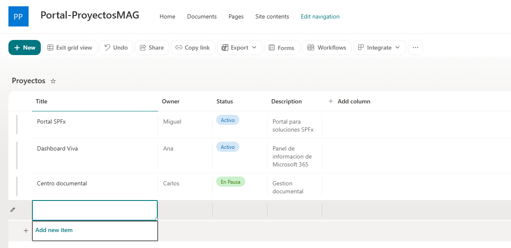

Regresa al componente y elecciona **Actualizar proyectos** y comprueba que la información vuelva a consultarse.

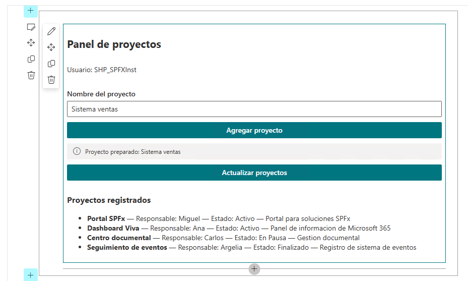

Si la lista no contiene elementos, el Web Part deberá mostrar:

No se encontraron proyectos.

Si ocurre un problema durante la consulta, deberá mostrarse un mensaje de error.

**Resultado esperado.** El Web Part consulta la lista Proyectos mediante SPHttpClient y SharePoint REST, y muestra en pantalla los registros recuperados. El botón **Actualizar proyectos** permite realizar nuevamente la consulta.

## Actividad 16. Pasar los datos de SPFx a React

**Objetivo.** Separar la obtención de datos del contexto de SPFx de la presentación realizada por React. El Web Part proporciona a React la función getProjects, mientras que React se encarga de solicitar y mostrar los proyectos.

En la actividad anterior, la consulta a SharePoint se realizó desde el Web Part mediante SPHttpClient. Ahora se modifica la arquitectura para que el componente React no tenga que conocer ese mecanismo.

El flujo será:

Web Part SPFx

│

│ getProjects()

▼

Componente React

│

│ solicita los proyectos

▼

Estado de React

│

▼

Presentación de los proyectos

De esta forma, cada parte tiene una responsabilidad definida:

- **Web Part:** conoce el contexto de SPFx y la forma de consultar SharePoint.
- **Props:** definen qué información y funciones recibe React.
- **React:** solicita los datos y se encarga de presentarlos.

React no utilizará directamente SPHttpClient.

### Paso 1. Actualizar la interfaz de propiedades

Antes de modificar el componente React, verifica que la interfaz que recibe el componente defina tanto el nombre del usuario como la función que permitirá obtener los proyectos.

**Archivo:**

src/webparts/projectDashboardXXX/components/IProjectDashboardXXXProps.ts

Reemplaza el contenido completo por:

import { IProject } from './IProject';

export interface IProjectDashboardProps {

**userDisplayName: string;**

getProjects: () => Promise<IProject[]>;

}

**La propiedad userDisplayName permitirá mostrar el usuario autenticado.**

La propiedad getProjects representa una función que React podrá ejecutar para obtener los proyectos. La interfaz indica que esta función devuelve una Promise con un arreglo de objetos IProject.

### Paso 2. Actualizar el componente React

Ahora el componente utilizará la función getProjects recibida mediante las props.

**Archivo:**

src/webparts/projectDashboardXXX/components/ProjectDashboardXXX.tsx

Reemplaza el contenido completo por:

```tsx
import * as React from 'react';
import {
  PrimaryButton,
  Stack
} from '@fluentui/react';

import { IProject } from './IProject';
import { IProjectDashboardProps } from './IProjectDashboardXXXProps';

export default function ProjectDashboardXXX(
  props: IProjectDashboardProps
): React.ReactElement {

  const [projects, setProjects] = React.useState<IProject[]>([]);

React.useEffect(() => {
    void props.getProjects().then(setProjects);
  }, [props.getProjects]);

  const reloadProjects = (): void => {
    void props.getProjects().then(setProjects);
    };

  return (
    <Stack tokens={{ childrenGap: 10 }}>
      <h2>Panel de proyectos</h2>
      <p>
        Usuario: {props.userDisplayName}
      </p>
      <PrimaryButton
        text="Recargar proyectos"
        onClick={reloadProjects}
      />

            <ul>
              {projects.map((project) => (
                <li key={project.Id}>
            {project.Title} — {project.Owner} — {project.Status}
                </li>
              ))}
            </ul>
    </Stack>
    );
}
```

En esta versión, React mantiene los proyectos en su propio estado:

const [projects, setProjects] = React.useState<IProject[]>([]);

Cuando el componente se carga, useEffect ejecuta:

props.getProjects()

La función devuelve los proyectos y setProjects los almacena en el estado.

El botón **Recargar proyectos** vuelve a ejecutar getProjects, permitiendo actualizar la información sin modificar el componente ni acceder directamente a SharePoint.

### Paso 3. Actualizar el Web Part

El Web Part es el responsable de proporcionar a React la función getProjects y el nombre del usuario.

**Archivo:**

src/webparts/projectDashboardXXX/ProjectDashboardXXXWebPart.ts

Reemplaza el contenido completo por:

```tsx
import {
  BaseClientSideWebPart
} from '@microsoft/sp-webpart-base';

import {
  IPropertyPaneConfiguration
} from '@microsoft/sp-property-pane';

import {
  SPHttpClient
} from '@microsoft/sp-http';
import * as React from 'react';
import * as ReactDom from 'react-dom';

import ProjectDashboardXXX from './components/ProjectDashboardXXX';
import {
  IProjectDashboardProps
} from './components/IProjectDashboardXXXProps';
import {
  IProject
} from './components/IProject';

export interface IProjectDashboardXXXWebPartProps {
  description: string;
}

export default class ProjectDashboardXXXWebPart
  extends BaseClientSideWebPart<IProjectDashboardXXXWebPartProps> {

  private async getProjects(): Promise<IProject[]> {
    const url =
      `${this.context.pageContext.web.absoluteUrl}` +
      `/_api/web/lists/getbytitle('Proyectos')/items` +
      `?$select=Id,Title,Owner,Status,Description`;

    const response = await this.context.spHttpClient.get(
      url,
      SPHttpClient.configurations.v1
    );

    if (!response.ok) {
      throw new Error(
        `Error al consultar SharePoint: ${response.status} ${response.statusText}`
    );
}
    const data = await response.json();
    return data.value as IProject[];
}
  public render(): void {
    const element: React.ReactElement<IProjectDashboardProps> =
      React.createElement(ProjectDashboardXXX, {
        userDisplayName: this.context.pageContext.user.displayName,
        getProjects: () => this.getProjects()
      });
    ReactDom.render(
      element,
      this.domElement
    );
}

  protected onDispose(): void {
    ReactDom.unmountComponentAtNode(this.domElement);
}

  protected getPropertyPaneConfiguration():
    IPropertyPaneConfiguration {

    return {
      pages: []
    };
}
}
```

Aquí se realiza la separación entre SPFx y React. El método:

private async getProjects(): Promise<IProject[]> {

permanece dentro del Web Part porque necesita acceder a:

this.context.spHttpClient

El Web Part no entrega directamente los datos a React. En su lugar, entrega la función:

getProjects: () => this.getProjects()

React puede ejecutar esa función cuando la necesite. También se proporciona:

userDisplayName:

this.context.pageContext.user.displayName

para que React pueda mostrar el nombre del usuario sin acceder directamente al contexto de SPFx.

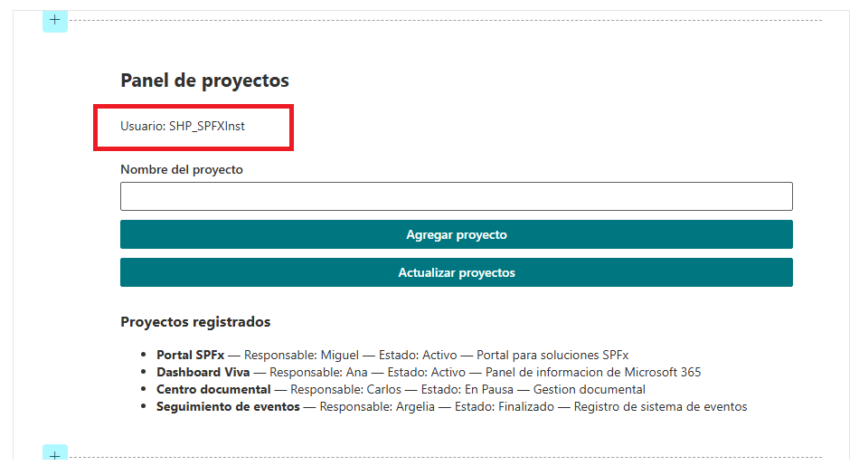

El Web Part debe mostrar:

- **Panel de proyectos**
- El nombre del usuario autenticado.
- El botón **Recargar proyectos**.
- Los proyectos obtenidos de la lista Proyectos.

Al seleccionar **Recargar proyectos**, React vuelve a ejecutar getProjects() y actualiza la información mostrada.

El resultado demuestra la separación de responsabilidades: **SPFx conoce SharePoint y proporciona la función para obtener los datos; React recibe esa función, administra el estado y presenta la información.**

## Actividad 17. Conectar Microsoft Graph

**Objetivo.** Consultar el perfil del usuario autenticado mediante Microsoft Graph y utilizar el nombre obtenido para mostrarlo en el componente React.

Hasta este momento, el nombre del usuario se obtenía directamente desde el contexto de SharePoint mediante:

this.context.pageContext.user.displayName

En esta actividad se cambia ese mecanismo para utilizar **Microsoft Graph**.

El Web Part utilizará MSGraphClientV3, proporcionado por SPFx, para consultar el recurso:

/me

La consulta solicitará únicamente la propiedad **displayName**porque es el único dato que necesita actualmente la interfaz.

El flujo será:

Web Part SPFx

│

│ MSGraphClientV3

▼

Microsoft Graph

│

│ /me

│ displayName

▼

Web Part

│

│ userDisplayName

▼

Componente React

De esta manera, React no necesita conocer Microsoft Graph. La comunicación con Graph permanece en el Web Part, que obtiene el dato y posteriormente lo proporciona al componente mediante las props.

También se conservará la consulta a la lista Proyectos realizada mediante SharePoint REST.

### Paso 1. Preparar el Web Part para utilizar Microsoft Graph

El cliente MSGraphClientV3 ya forma parte de las capacidades disponibles en SPFx. Para utilizarlo, el Web Part debe importar:

import {

MSGraphClientV3

} from '@microsoft/sp-http-msgraph';

El método getGraphUser() será el encargado de obtener el nombre del usuario autenticado.

Sin embargo, no basta con crear este método. Debemos utilizarlo realmente antes de crear el componente React.

Como la consulta a Graph es asíncrona, se utilizará un método renderAsync() para esperar la respuesta antes de construir el componente.

La consulta a Microsoft Graph será:

const response = await client

.api('/me')

.select('displayName')

.get();

El método:

.select('displayName')

limita la información solicitada al dato que necesitamos. Posteriormente:

return response.displayName as string;

devuelve únicamente el nombre para mostrar.

Esto permite mantener una comunicación sencilla entre el Web Part y React: el componente recibe un string y no necesita conocer cómo se obtuvo.

### Paso 2. Actualizar el Web Part completo

**Archivo:**

src/webparts/projectDashboardXXX/ProjectDashboardXXXWebPart.ts

Reemplaza el contenido completo del archivo por:

```tsx
import * as React from 'react';
import * as ReactDom from 'react-dom';
import { Version } from '@microsoft/sp-core-library';
import {
  type IPropertyPaneConfiguration,
  PropertyPaneTextField
} from '@microsoft/sp-property-pane';
import {
  BaseClientSideWebPart
} from '@microsoft/sp-webpart-base';
import {
  SPHttpClient
} from '@microsoft/sp-http';
import {
  MSGraphClientV3
} from '@microsoft/sp-http-msgraph';
import * as strings from 'ProjectDashboardXXXWebPartStrings';
import ProjectDashboardXXX from './components/ProjectDashboardXXX';
import {
  IProjectDashboardProps
} from './components/IProjectDashboardXXXProps';
import {
  IProject
} from './components/IProject';
export interface IProjectDashboardXXXWebPartProps {
  description: string;
}
export default class ProjectDashboardXXXWebPart
  extends BaseClientSideWebPart<IProjectDashboardXXXWebPartProps> {
  public render(): void {
    void this.renderAsync();
}
  private async renderAsync(): Promise<void> {
    const userDisplayName = await this.getGraphUser();
    const element: React.ReactElement<IProjectDashboardProps> =
      React.createElement(ProjectDashboardXXX, {
        userDisplayName,
        getProjects: this.getProjects.bind(this)
      });
    ReactDom.render(
      element,
      this.domElement
    );
}
  private async getProjects(): Promise<IProject[]> {
    const url =
      `${this.context.pageContext.web.absoluteUrl}` +
      `/_api/web/lists/getbytitle('Proyectos')/items` +
      `?$select=Id,Title,Owner,Status,Description`;
    const response = await this.context.spHttpClient.get(
      url,
      SPHttpClient.configurations.v1
    );
    if (!response.ok) {
      throw new Error(
        `Error al consultar SharePoint: ${response.status} ${response.statusText}`
    );
}
    const data = await response.json();
    return data.value as IProject[];
}
  private async getGraphUser(): Promise<string> {
    const client: MSGraphClientV3 =
      await this.context.msGraphClientFactory.getClient('3');
const response = await client
  .api('/me')
  .select('displayName')
  .get();
return response.displayName as string;
}
  protected onDispose(): void {
    ReactDom.unmountComponentAtNode(this.domElement);
}
  protected get dataVersion(): Version {
    return Version.parse('1.0');
}
  protected getPropertyPaneConfiguration():
    IPropertyPaneConfiguration {
    return {
      pages: [
        {
          header: {
            description: strings.PropertyPaneDescription
          },
          groups: [
        {
              groupName: strings.BasicGroupName,
              groupFields: [
                PropertyPaneTextField('description', {
                  label: strings.DescriptionFieldLabel
                })
              ]
}
              ]
}
              ]
    };
}
}
```

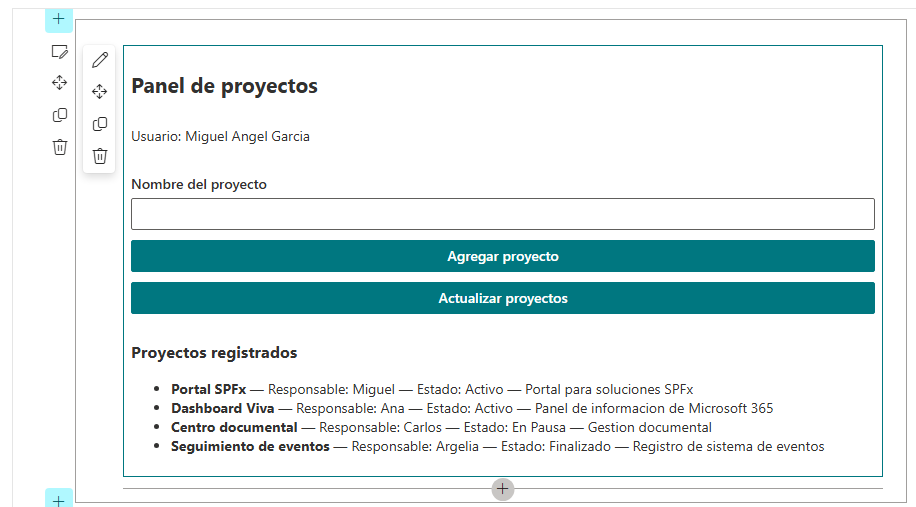

**Elementos importantes de esta modificación**

El método render() ya no crea directamente el componente React:

public render(): void {

void this.renderAsync();

}

En su lugar, delega esa tarea a **renderAsync**().

Esto es necesario porque primero debemos esperar el resultado de Microsoft Graph:

const userDisplayName = await this.getGraphUser();

Una vez obtenido el nombre, se crea el componente React:

const element: React.ReactElement<IProjectDashboardProps> =

React.createElement(ProjectDashboardXXX, {

userDisplayName,

getProjects: this.getProjects.bind(this)

});

De esta forma, React recibe:

userDisplayName

getProjects

pero no recibe ni necesita recibir:

SPHttpClient

MSGraphClientV3

this.context

La consulta a SharePoint continúa encapsulada en:

private async getProjects(): Promise<IProject[]>

y la consulta a Graph en:

private async getGraphUser(): Promise<string>

Cada mecanismo de acceso a datos permanece, por tanto, dentro del Web Part.

**Resultado esperado**

El Web Part debe mostrar el nombre del usuario autenticado en la interfaz. La información del usuario ya no se obtiene mediante:

this.context.pageContext.user.displayName

sino mediante Microsoft Graph:

Microsoft Graph

↓

/me

↓

displayName

↓

getGraphUser()

↓

userDisplayName

↓

React

La consulta de proyectos continúa funcionando mediante SharePoint REST.

**Resultado de la actividad:** el Web Part utiliza dos servicios de Microsoft 365 —SharePoint REST y Microsoft Graph— mientras React permanece desacoplado de ambos mecanismos de acceso.

## Actividad 18. Declarar el permiso User.Read

**Objetivo.** Declarar en la solución SPFx el permiso de Microsoft Graph necesario para consultar el perfil del usuario autenticado mediante /me.

En la Actividad 17 incorporamos MSGraphClientV3 para consultar Microsoft Graph y obtener el nombre del usuario autenticado.

La consulta utilizada fue:

/me

solicitando únicamente:

displayName

Para que la solución pueda solicitar este acceso a Microsoft Graph, debemos declarar el permiso correspondiente en package-solution.json. En este caso se requiere únicamente:

Microsoft Graph → User.Read

La configuración se realiza en la propiedad webApiPermissionRequests, dentro de solution.

**Importante.** Declarar el permiso en este archivo prepara la solicitud que viajará con el paquete de la solución. La aprobación del permiso se realizará posteriormente en SharePoint mediante la administración de acceso a API.

### Paso 1. Actualizar package-solution.json

**Archivo:**

config/package-solution.json

adiciona el siguiente contenido:

"webApiPermissionRequests": [

```json
        {
        "resource": "Microsoft Graph",
        "scope": "User.Read"
}
      ],
```

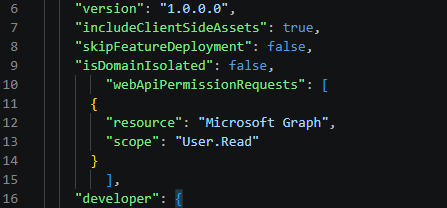

La configuración indica que la solución necesita acceder a **Microsoft Graph** utilizando el ámbito **User.Read**.

### Paso 2. Validar el archivo

Guarda:

config/package-solution.json

Comprueba que VS Code no muestre errores de sintaxis JSON.

No es necesario modificar ninguna otra propiedad del archivo.

El permiso declarado corresponde directamente con el código utilizado en la actividad anterior.

En la Actividad 17, el Web Part utiliza:

const client: MSGraphClientV3 =

await this.context.msGraphClientFactory.getClient('3');

y consulta:

const response = await client

.api('/me')

.select('displayName')

.get();

En esta actividad se declara el permiso que necesita esa operación:

Microsoft Graph

│

└── User.Read

Por lo tanto, el código y la configuración quedan relacionados:

MSGraphClientV3

│

▼

Microsoft Graph /me

│

▼

displayName

Actividad 18

│

▼

Microsoft Graph

│

▼

User.Read

**Resultado esperado**

El archivo config/package-solution.json queda configurado para solicitar:

Recurso: Microsoft Graph

Permiso: User.Read

El JSON debe ser válido y no presentar errores de sintaxis.

Con esto, la solución **declara formalmente el permiso requerido**

La autorización todavía no se ha concedido. La aprobación de User.Read se realizará posteriormente al desplegar la solución y administrar la solicitud de acceso a la API.

## Actividad 19. Aplicar el ciclo de vida con useEffect

**Objetivo.** Relacionar el montaje y desmontaje de un componente funcional de React con el modelo de ciclo de vida de los componentes de clase.

En esta actividad se incorpora un efecto que se ejecuta cuando el componente se monta y cuya función de limpieza se ejecuta cuando el componente se desmonta.

La intención es observar el comportamiento del componente mediante la consola del navegador.

### Paso 1. Agregar un efecto con limpieza

El componente ProjectDashboardXXX ya utiliza useState. Ahora se incorporará useEffect para ejecutar código asociado al ciclo de vida del componente.

La estructura:

React.useEffect(() => {

// código que se ejecuta al montar

return () => {

// código de limpieza al desmontar

};

}, []);

La matriz de dependencias vacía [] indica que el efecto se ejecuta una vez después del montaje. La función retornada representa la limpieza del efecto.

**Archivo modificado:**

src/webparts/projectDashboardXXX/components/ProjectDashboardXXX.tsx

Reemplaza el contenido completo del archivo por:

```tsx
import * as React from 'react';
import {
  PrimaryButton,
  Stack
} from '@fluentui/react';
import { IProject } from './IProject';
import { IProjectDashboardProps } from './IProjectDashboardProps';
export default function ProjectDashboardXXX(
  props: IProjectDashboardProps
): React.ReactElement {

  const [projects, setProjects] =
    React.useState<IProject[]>([]);

React.useEffect(() => {

    console.log('ProjectDashboardXXX montado');

    void props.getProjects().then(setProjects);
  return () => {
      console.log('ProjectDashboardXXX desmontado');
    };
  }, [props.getProjects]);
  return (
    <Stack tokens={{ childrenGap: 10 }}>
      <h2>Panel de proyectos</h2>
      <p>
        Usuario: {props.userDisplayName}
      </p>
      <PrimaryButton
        text="Recargar proyectos"
        onClick={() =>
          void props.getProjects().then(setProjects)
}
      />
      <h3>Proyectos</h3>
            <ul>
        {projects.map((project: IProject) => (
                <li key={project.Id}>
            {project.Title} — {project.Owner} — {project.Status}
                </li>
              ))}
            </ul>
    </Stack>
    );
}
```

### Paso 2. Observar el montaje y desmontaje

Guarda el archivo y ejecuta nuevamente el Web Part. Abre las herramientas de desarrollador del navegador con F12 y selecciona la pestaña **Console**.

Al aparecer el componente debe registrarse:

ProjectDashboardXXX montado

Cuando el componente deje de estar presente en la página, la función de limpieza puede registrar:

ProjectDashboardXXX desmontado

### Paso 3. Relacionar useEffect con el modelo clásico

Conceptualmente, la relación puede expresarse de la siguiente manera:

| React clásico | Componente funcional |
| --- | --- |
| componentDidMount() | useEffect(..., []) |
| Actualización asociada a dependencias | useEffect(..., [dependencia]) |
| componentWillUnmount() | función retornada por useEffect |

En este laboratorio se utiliza una dependencia (props.getProjects) porque la función será proporcionada posteriormente por el Web Part.

**Resultado esperado.**

El componente utiliza useEffect para ejecutar código asociado a su ciclo de vida y dispone de una función de limpieza para el desmontaje.

## Actividad 20. Convertir useProjects en un hook de carga

**Objetivo.** Encapsular la carga asíncrona de proyectos en un hook reutilizable.

Hasta este momento, el componente React conoce directamente la operación que obtiene los proyectos. Ahora se separará esa responsabilidad: el Web Part continuará siendo responsable de obtener los datos y el hook useProjects administrará el estado y la carga.

El componente React recibirá una función, props.getProjects, que puede ejecutar para solicitar los proyectos. React no necesita conocer SPHttpClient ni la URL de SharePoint.

### Paso 1. Crear el hook de carga

**Archivo:** `src/webparts/projectDashboardXXX/components/useProjects.ts`

Reemplaza el contenido completo del archivo por:

```tsx
import * as React from 'react';
import { IProject } from './IProject';
export function useProjects(
  loadProjects: () => Promise<IProject[]>
): {
  projects: IProject[];
  reload: () => Promise<void>;
} {
  const [projects, setProjects] =
    React.useState<IProject[]>([]);
  const reload =
    React.useCallback(async (): Promise<void> => {
      const data = await loadProjects();
      setProjects(data);
    }, [loadProjects]);
React.useEffect(() => {
    void reload();
  }, [reload]);
    return {
    projects,
    reload
    };
}
```

El parámetro loadProjects representa una función que no requiere argumentos, realiza una operación asíncrona y devuelve una promesa cuyo resultado es un arreglo de IProject. El hook no necesita conocer el origen de esos datos.

El estado projects conserva los proyectos recibidos. La función reload ejecuta loadProjects y actualiza ese estado mediante setProjects. El useEffect utiliza reload para realizar la carga inicial.

### Paso 2. Comprender la función recibida

El parámetro loadProjects: () => Promise<IProject[]> indica que el hook recibe una función que:

• no requiere parámetros;

• realiza una operación asíncrona;

• devuelve una promesa;

• finalmente produce un arreglo de IProject.

El hook puede recibir una implementación proveniente de SharePoint, de otro servicio o incluso una función utilizada para pruebas. Su responsabilidad se limita a ejecutar la función recibida y administrar el estado de los proyectos.

### Paso 3. Mantener estable la función de carga

En el Web Part, getProjects se define como una propiedad de instancia. Una referencia estable significa que, mientras exista la instancia del Web Part, la propiedad conserva la misma referencia a la función.

**Archivo modificado:**

`src/webparts/projectDashboardXXX/ProjectDashboardXXXWebPart.ts`

La implementación final utiliza:

```tsx
private readonly getProjects =
  async (): Promise<IProject[]> => {
```

La palabra readonly evita que la propiedad se reasigne después de inicializarse. La función flecha se almacena directamente en la instancia del Web Part y conserva el contexto this necesario para acceder a this.context.

La estabilidad de la referencia permite que useProjects utilice getProjects como dependencia y que React pueda determinar cuándo esa dependencia cambió.

Al crear el elemento React, se pasa directamente la propiedad:

```text
getProjects: this.getProjects
```

No es necesario crear otra función con () => this.getProjects() ni utilizar .bind(this), porque la función flecha almacenada en la propiedad ya conserva el contexto de la instancia.

### Paso 4. Mantener estable la función reload

Dentro de useProjects se utiliza React.useCallback para conservar la referencia de reload mientras loadProjects no cambie:

```tsx
  const reload =
    React.useCallback(async (): Promise<void> => {
      const data = await loadProjects();
      setProjects(data);
    }, [loadProjects]);
```

La dependencia [loadProjects] indica que React debe conservar la función reload mientras la referencia de loadProjects permanezca igual. Si loadProjects cambia, React crea una nueva función reload asociada con la nueva función de carga.

Esto permite utilizar reload como dependencia del efecto que realiza la carga inicial.

### Paso 5. Ejecutar la carga inicial

El hook utiliza el siguiente efecto:

```tsx
React.useEffect(() => {
    void reload();
  }, [reload]);
```

Cuando el hook se ejecuta por primera vez, el efecto solicita los proyectos mediante reload. Si la referencia de reload cambia, el efecto vuelve a ejecutarse. En el flujo normal de este laboratorio, la referencia permanece estable porque loadProjects también permanece estable.

La carga inicial y la recarga manual utilizan la misma función. El botón del componente puede ejecutar reload cuando el participante solicite actualizar los proyectos; esto no significa que la función se ejecute una sola vez.

### Paso 6. Utilizar el hook en el componente React

**Archivo:**

`src/webparts/projectDashboardXXX/components/ProjectDashboardXXX.tsx`

Reemplaza el contenido completo del archivo por:

```tsx
import * as React from 'react';
import {
  PrimaryButton,
  Stack
} from '@fluentui/react';
import { IProject } from './IProject';
import { IProjectDashboardProps } from './IProjectDashboardProps';
import { useProjects } from './useProjects';
export default function ProjectDashboardXXX(
  props: IProjectDashboardProps
): React.ReactElement {
  const {
    projects,
    reload
  } = useProjects(props.getProjects);
React.useEffect(() => {
    console.log('ProjectDashboardXXX montado');

  return () => {
      console.log('ProjectDashboardXXX desmontado');
    };
  }, []);
  return (
    <Stack tokens={{ childrenGap: 10 }}>
      <h2>Panel de proyectos</h2>
      <p>
        Usuario: {props.userDisplayName}
      </p>
      <PrimaryButton
        text="Recargar proyectos"
        onClick={() => void reload()}
      />
      <h3>Proyectos</h3>
            <ul>
        {projects.map((project: IProject) => (
                <li key={project.Id}>
            {project.Title} — {project.Owner} — {project.Status}
                </li>
              ))}
            </ul>
    </Stack>
    );
}
```

El componente recibe getProjects mediante props y lo entrega al hook con useProjects(props.getProjects). A partir de ese momento, consume projects para mostrar los registros y reload para solicitar una nueva carga.

La obtención de los datos permanece fuera del componente React. El Web Part conserva la responsabilidad de comunicarse con SharePoint, mientras que useProjects concentra el estado y el proceso de carga.

### Paso 7. Verificar la separación de responsabilidades

| Elemento | Responsabilidad | Implementación |
| --- | --- | --- |
| Web Part | Obtener los proyectos desde SharePoint. | getProjects |
| useProjects | Administrar el estado y ejecutar la carga. | projects y reload |
| Componente React | Presentar los datos y solicitar recargas. | useProjects(props.getProjects) |

### Paso 8. Probar la carga y la recarga

Guarda los archivos modificados y ejecuta nuevamente el Web Part.

• Al cargar el Web Part, debe ejecutarse la carga inicial y aparecer la lista de proyectos recuperados desde SharePoint.

• Selecciona Recargar proyectos. El botón debe ejecutar reload y actualizar nuevamente el estado projects.

• Los mensajes ProjectDashboardXXX montado y ProjectDashboardXXX desmontado de la Actividad 19 deben conservarse en la consola del navegador.

• Si los proyectos no aparecen, revisa primero que la lista Proyectos exista y que la consulta utilizada por getProjects funcione correctamente.

useProjects administra el estado y la carga de los proyectos, mientras que el Web Part continúa siendo responsable de obtener los datos. El componente React utiliza el hook sin conocer la implementación concreta de SharePoint.

## Actividad 21. Construir el formulario completo

**Objetivo.** Integrar en un solo componente los conceptos trabajados durante el laboratorio:

- useState
- useEffect
- useRef
- hook personalizado
- inputs controlados
- validación
- Fluent UI
- datos provenientes de SharePoint
- usuario autenticado

En esta actividad se construye el estado final del componente React.

También se conserva el useEffect estudiado en la Actividad 19 y se utiliza el hook useProjects creado en la Actividad 20.

### Paso 1. Preparar el componente final

**Archivo:**

src/webparts/projectDashboardXXX/components/ProjectDashboardXXX.tsx

Reemplaza el contenido completo del archivo por:

```tsx
import * as React from 'react';

import {
  MessageBar,
  MessageBarType,
  PrimaryButton,
  Stack,
  TextField
} from '@fluentui/react';

import { IProject } from './IProject';
import { IProjectDashboardProps } from './IProjectDashboardProps';
import { useProjects } from './useProjects';

export default function ProjectDashboardXXX(
  props: IProjectDashboardProps
): React.ReactElement {

  const [count, setCount] =
    React.useState<number>(0);

  const [projectName, setProjectName] =
    React.useState<string>('');

  const [owner, setOwner] =
    React.useState<string>('');

  const [message, setMessage] =
    React.useState<string>('');

  const inputRef =
    React.useRef<HTMLInputElement>(null);

  const { projects, reload } =
    useProjects(props.getProjects);

React.useEffect(() => {

    console.log('ProjectDashboardXXX montado');

  return () => {

      console.log('ProjectDashboardXXX desmontado');

    };

  }, []);

  const handleAddProject = (): void => {

    const normalizedName =
      projectName.trim();

    const normalizedOwner =
      owner.trim();

    if (!normalizedName) {

      setMessage(
        'Escribe un nombre de proyecto.'
    );

      return;
}

    if (!normalizedOwner) {

      setMessage(
        'Escribe un responsable.'
    );

      return;
}

      setMessage(
      `Proyecto preparado: ${normalizedName} — Responsable: ${normalizedOwner}`
    );

    };

  const focusInput = (): void => {

    inputRef.current?.focus();

    };

  return (

    <Stack tokens={{ childrenGap: 10 }}>

      <h2>Panel de proyectos</h2>

      <p>
        Usuario: {props.userDisplayName}
      </p>

      <TextField
        label="Nombre del proyecto"
        value={projectName}
        onChange={(_, value) =>
          setProjectName(value || '')
}
      />

      <TextField
        label="Responsable"
        value={owner}
        onChange={(_, value) =>
          setOwner(value || '')
}
      />

      <PrimaryButton
        text="Agregar proyecto"
        onClick={handleAddProject}
      />

      <input
        ref={inputRef}
        type="text"
        placeholder="Campo de prueba para useRef"
      />

      <PrimaryButton
        text="Focalizar campo"
        onClick={focusInput}
      />

      {message && (

        <MessageBar
          messageBarType={MessageBarType.info}
        >
          {message}
        </MessageBar>

      )}

      <p>
        Contador de prueba: {count}
      </p>

      <PrimaryButton
        text="Incrementar"
        onClick={() =>
          setCount(count + 1)
}
      />

      <PrimaryButton
        text="Recargar proyectos"
        onClick={() => void reload()}
      />

      <h3>Proyectos</h3>

            <ul>

        {projects.map((project: IProject) => (

                <li key={project.Id}>
            {project.Title} — {project.Owner} — {project.Status}
                </li>

              ))}

            </ul>

    </Stack>

    );
}
```

El componente utiliza:

const { projects, reload } =

useProjects(props.getProjects);

El Web Part proporciona getProjects.

El hook se encarga de ejecutar esa función y mantener:

projects

y:

reload

El componente solamente consume esos valores para presentar la información.

## Actividad 22. Aplicar controles básicos de seguridad

**Objetivo.** Aplicar principios básicos de seguridad al desarrollo del Web Part.

En esta actividad **no se modifica ningún archivo**.

Se revisan decisiones de implementación que ya forman parte del código.

### Paso 1. Mantener el mínimo privilegio

El laboratorio solicita únicamente:

Microsoft Graph

User.Read

Este permiso es suficiente para consultar:

/me

y obtener:

displayName

No se deben agregar permisos adicionales que no sean necesarios para la funcionalidad implementada.

### Paso 2. No almacenar tokens manualmente

No agregues código que almacene tokens de acceso en:

localStorage

sessionStorage

cookies

SPFx proporciona los mecanismos necesarios para trabajar con servicios autenticados.

### Paso 3. Validar la entrada

El formulario normaliza los valores mediante:

const normalizedName = projectName.trim();

y:

const normalizedOwner = owner.trim();

Después rechaza cadenas vacías. Los valores proporcionados por el usuario no deben insertarse mediante innerHTML.

### Paso 4. Utilizar HTTPS

Las llamadas a Microsoft 365 utilizan los mecanismos proporcionados por SPFx.

No se debe cambiar **https** por **http**en la configuración de desarrollo.

El proyecto mantiene el principio de mínimo privilegio, no almacena manualmente tokens y valida las entradas del formulario.

## Actividad 23. Revisar optimizaciones básicas de rendimiento

**Objetivo.** Identificar patrones que pueden reducir llamadas innecesarias y mejorar el comportamiento de una aplicación React.

Esta actividad es conceptual y **no modifica ningún archivo**.

### Paso 1. Cargar datos independientes en paralelo

Cuando dos operaciones son independientes, pueden ejecutarse mediante Promise.all.

Ejemplo conceptual:

```text
const [projects, userDisplayName] =
  await Promise.all([
    this.getProjects(),
    this.getUserDisplayName()
  ]);
```

Esto permite que ambas operaciones avancen en paralelo.

En este laboratorio no se incorpora este patrón al Web Part final porque la obtención del usuario y la carga de proyectos se encuentran separadas en diferentes mecanismos.

### Paso 2. Evitar llamadas en cada renderizado

El hook utiliza:

React.useCallback(...)

para mantener estable la función reload mientras no cambie loadProjects. El efecto depende de:

[reload]

Por lo tanto, un cambio de estado como el contador o los campos del formulario no provoca automáticamente una nueva consulta a SharePoint.

### Paso 3. Comprender lazy loading

El patrón React.lazy permite cargar un componente cuando sea necesario.

Ejemplo conceptual:

const DetalleProyecto =

React.lazy(

() => import('./DetalleProyecto')

);

Este ejemplo **no se implementa** en el laboratorio porque no existe un segundo componente que necesite cargarse de forma diferida.

Promise.all, useCallback y React.lazy pueden resultar útiles y comprende por qué no todos deben incorporarse al Web Part actual.

## Actividad 24. Revisar TypeScript estricto

**Objetivo.** Comprobar que la configuración de TypeScript conserva las reglas generadas por el scaffolding de SPFx.

Esta actividad **no requiere modificar tsconfig.json**.

### Paso 1. Abrir tsconfig.json

En la raíz del proyecto abre:

tsconfig.json

Localiza:

"compilerOptions"

y revisa la configuración generada por SPFx.

### Paso 2. No modificar la configuración para ocultar errores

En tsconfig.json, la propiedad strict forma parte de las opciones de compilación de TypeScript. Cuando está configurada como:

"strict": true

TypeScript aplica un conjunto de comprobaciones estrictas que permiten detectar errores relacionados con los tipos y con posibles valores no válidos durante la compilación.

Si al escribir el código del laboratorio aparece un error de TypeScript, no debes modificar o eliminar esta propiedad para hacer desaparecer el error. El error debe corregirse en el código que lo está provocando.

Por ejemplo, si TypeScript indica que una variable puede contener undefined, la solución consiste en revisar el tipo de la variable y la lógica que utiliza ese valor. No se debe desactivar una comprobación estricta únicamente para evitar que el compilador informe del problema.

En este laboratorio, la configuración de TypeScript debe permanecer compatible con la versión de SPFx utilizada para crear el proyecto. Por esta razón, no agregues ni elimines:

"strict": true

como una medida para solucionar errores producidos por el código.

## Actividad 25. Compilar la solución

**Objetivo.** Comprobar que TypeScript, React, Fluent UI, SPFx y la configuración del proyecto pueden procesarse conjuntamente.

Esta actividad no modifica archivos fuente.

### Paso 1. Guardar todos los archivos

En VS Code selecciona:

**Archivo > Guardar todo**

Antes de continuar, corrige los errores de TypeScript que aparezcan en el editor.

### Paso 2. Compilar con Heft

Desde la raíz del proyecto ejecuta:

heft build

Si aparece un error de compilación, debe corregirse antes de continuar con el empaquetado.

## Actividad 26. Generar el paquete .sppkg

**Objetivo.** Crear el paquete de solución que será publicado en SharePoint.

Esta actividad no modifica manualmente los archivos fuente.

### Paso 1. Generar el paquete

Desde la raíz del proyecto ejecuta:

heft package-solution --production

### Paso 2.****Localizar el paquete

En VS Code abre:

sharepoint/solution/

Localiza el archive .sppkg

El nombre exacto depende de la configuración de la solución.

## Actividad 27. Publicar la solución y aprobar User.Read

**Objetivo.** Publicar la solución y completar la autorización requerida por Microsoft Graph.

Esta actividad se realiza con apoyo del instructor.

### Paso 1. Publicar en el App Catalog

Carga el paquete en Apps for SharePoint del App Catalog compartido.

### Paso 2. Confirmar la implementación

El instructor confirma la implementación de la solución cuando SharePoint presente la ventana correspondiente.

### Paso 3. Revisar el acceso de API

Abre:

- SharePoint Admin Center
- Más características
- Aplicaciones
- Acceso de API

Debes localizar la solicitud:

Microsoft Graph

User.Read

### Paso 5. Aprobar el permiso

Selecciona la solicitud y elige **Aprobar**.

**Resultado esperado.**

La solución se encuentra publicada y la solicitud:

Microsoft Graph / User.Read

aparece como aprobada.

## Actividad 28. Agregar ProjectDashboardXXX a la página

**Objetivo.** Incorporar el Web Part publicado a la página moderna del sitio.

Esta actividad no modifica archivos del proyecto.

### Paso 1. Abrir la página

Abre Portal-ProyectosXXX

y selecciona Panel de proyectos

### Paso 2. Editar la página

### Paso 3. Insertar el Web Part

Selecciona + en una sección de la página. Busca:

ProjectDashboardXXX

y selecciónalo.

### Paso 4. Publicar

Selecciona:

**Publicar**o **Volver a publicar**según corresponda.

**Resultado esperado.**

La página publicada contiene el Web Part:

ProjectDashboardXXX

## Actividad 29. Validar el funcionamiento completo

**Objetivo.** Comprobar la integración de React, Fluent UI, SharePoint REST y Microsoft Graph.

Esta actividad no modifica archivos.

### Paso 1. Validar el usuario

Comprueba que aparezca:

Usuario:

seguido del nombre de la cuenta autenticada.

### Paso 2. Validar los proyectos

Comprueba que aparezcan los registros:

Portal SPFx

Dashboard Viva

Centro Documental

provenientes de la lista:

Proyectos

### Paso 3. Validar el input controlado

En:

Nombre del proyecto

escribe:

Nuevo proyecto

El valor debe permanecer sincronizado con el estado React.

### Paso 4. Validar la validación

Borra el contenido de:

Nombre del proyecto

y selecciona:

**Agregar proyecto**

Debe aparecer:

Escribe un nombre de proyecto.

Después introduce:

Nuevo proyecto

y un responsable.

Selecciona nuevamente:

**Agregar proyecto**

Debe aparecer el mensaje indicando que el proyecto fue preparado.

### Paso 5. Validar useRef

Selecciona:

**Focalizar campo**

El cursor debe posicionarse en:

Campo de prueba para useRef

### Paso 6. Validar useState

Selecciona:

**Incrementar**

El contador debe aumentar:

Contador de prueba: 0

Contador de prueba: 1

Contador de prueba: 2

...

### Paso 7. Validar la recarga

Selecciona:

**Recargar proyectos**

El hook debe volver a ejecutar la función proporcionada por el Web Part y actualizar la lista.

### Paso 8. Validar Microsoft Graph

Abre:

**F12 > Console**

Comprueba que no existan errores de autorización relacionados con:

/me

El nombre mostrado debe corresponder al usuario autenticado.

### Paso 9. Validar SharePoint REST

Comprueba que los proyectos mostrados correspondan con los registros existentes en:

Proyectos

Agrega, si corresponde, un cuarto elemento directamente en SharePoint y utiliza:

**Recargar proyectos**

para comprobar que la consulta devuelve el nuevo registro.

### Paso 10. Validar Fluent UI

Comprueba que los campos, botones y mensaje utilizados por el formulario correspondan con los componentes de Fluent UI empleados en el código.

**Resultado esperado.**

El Web Part funciona en una página moderna de SharePoint y demuestra conjuntamente:

- React
- useState
- useEffect
- useRef
- hooks personalizados
- TypeScript
- Fluent UI
- inputs controlados
- validación
- SharePoint REST
- Microsoft Graph
- permisos de Graph
- compilación con Heft
- empaquetado .sppkg
