Duración estimada: 90 minutos

# Objetivo

Construir un Client-Side Web Part SPFx denominado ProjectDashboardXXX
que utilice React y TypeScript para presentar proyectos de una lista de
SharePoint, mostrar información del usuario autenticado mediante
Microsoft Graph y proporcionar un formulario con controles de Fluent UI.
Durante el desarrollo se aplicarán useState, useEffect, useRef, un hook
personalizado, inputs controlados, validación, separación de
responsabilidades y prácticas básicas de seguridad y rendimiento.

# Alcance

El laboratorio cubre desde la creación del sitio de SharePoint del
participante y la lista de datos hasta la compilación, generación del
paquete .sppkg, publicación en el App Catalog, aprobación del permiso
User.Read y validación del Web Part en una página moderna de SharePoint
Online. El laboratorio utiliza la ruta estable de creación de proyectos
SPFx mediante Yeoman y el generador de SharePoint.

# Requisitos

- Cuenta de Microsoft 365 con permisos para crear un sitio de
  comunicación, editar páginas y crear listas en SharePoint Online. El
  App Catalog compartido y la aprobación de permisos de API son
  administrados por el instructor o el administrador del tenant.

- Node.js 22.23.2 instalado y disponible en PowerShell.

- Git instalado.

- Visual Studio Code instalado.

- PowerShell 7 para las tareas de PnP PowerShell, si se utiliza esa
  herramienta en el entorno del curso.

- SPFx 1.23.2 y React 17.0.1 para el proyecto de este laboratorio.

- Conexión a Internet para descargar dependencias y acceder a Microsoft
  365.

# Antes de comenzar

Este laboratorio utiliza SPFx 1.23.2. Para mantener un procedimiento
reproducible, se utilizará explícitamente el generador
@microsoft/generator-sharepoint 1.23.2. Cada participante creará y
utilizará su propio sitio de práctica \`Portal-ProyectosXXX\`, donde
\`XXX\` representa sus iniciales, y desarrollará dentro de ese sitio sus
componentes. El App Catalog del tenant es compartido y su administración
corresponde al instructor. No se utilizará el CLI de SPFx en este
laboratorio.

Nota sobre "Site Collection": en SharePoint Online moderno, la
experiencia de creación para el participante se presenta como \`Crear
sitio\`. El sitio moderno creado mediante esta experiencia es la unidad
independiente que utilizarás en el laboratorio; no necesitas abrir el
Centro de administración de SharePoint ni ejecutar comandos
administrativos para crearlo.

# Actividad 1. Crear el sitio de práctica y preparar el entorno de publicación

Crear el sitio de SharePoint que utilizarás durante el laboratorio y
confirmar que el App Catalog compartido está disponible para la
publicación de la solución.

## Paso 1. Abrir SharePoint Online

Inicia sesión en Microsoft 365 con tu cuenta de participante. Abre
SharePoint desde el iniciador de aplicaciones de Microsoft 365 o desde
la página principal de SharePoint. No necesitas permisos de
administrador para crear tu sitio si la creación de sitios está
habilitada para los participantes del tenant.

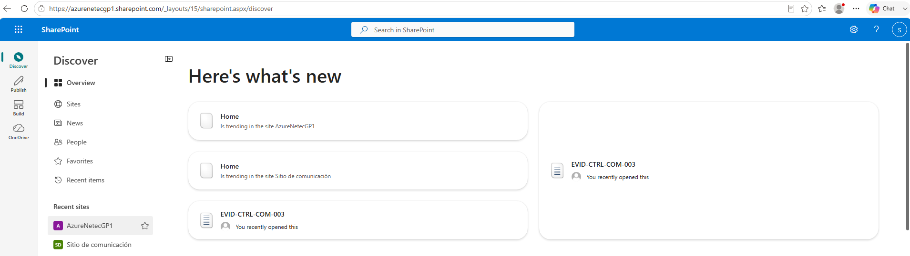

## Paso 2. Iniciar la creación del sitio

En la página principal de SharePoint, selecciona \`+ Crear sitio\` y
después elige \`Sitio de comunicación\`. Microsoft presenta esta
operación como creación de un sitio; en el contexto de este laboratorio,
ese sitio será tu espacio independiente de práctica. Si no aparece \`+
Crear sitio\`, la creación de sitios está restringida en el tenant y
debes solicitar al instructor o al administrador que habilite la
creación para los participantes o cree el sitio por ti como
contingencia. Selecciona **Standard Communication**.

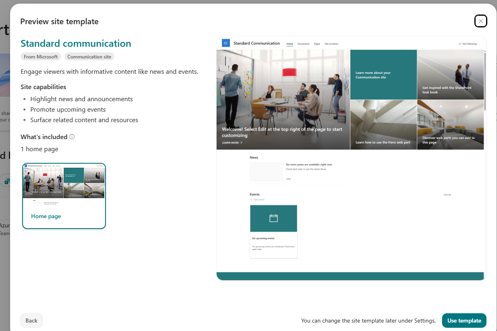

## Paso 3. Configurar el sitio

Configura el sitio con estos valores: Nombre del sitio:
\`Portal-ProyectosXXX\`, donde \`XXX\` representa tus iniciales.
Descripción: \`Sitio de práctica para el Laboratorio 3 de SPFx\`.
Diseño: selecciona \`Tema\` si está disponible; si tu interfaz muestra
otros diseños, utiliza un diseño de comunicación estándar. Si SharePoint
solicita un idioma, conserva el idioma predeterminado del tenant.
Completa la creación seleccionando \`Finalizar\`, \`Crear sitio\` o el
botón equivalente que muestre tu interfaz.

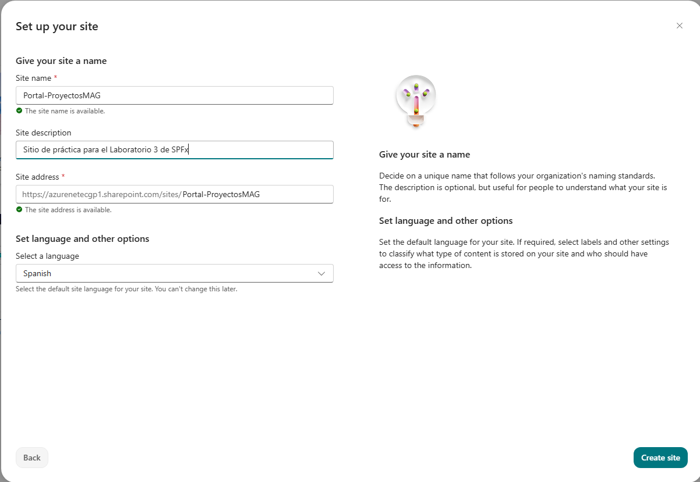

## Paso 4. Configurar la URL y finalizar la creación

Revisa la dirección web que SharePoint propone para el sitio. Debe
identificar de forma única tu sitio. Si la dirección solicitada ya
existe, SharePoint puede proponer una dirección disponible diferente; en
ese caso, verifica que el sitio creado sea el tuyo antes de continuar.
Finaliza la creación y espera a que el sitio quede disponible.

## Paso 5. Confirmar permisos del sitio

Abre \`Portal-ProyectosXXX\` con tu cuenta. Debes poder editar páginas y
crear listas. Si puedes abrir el sitio pero no puedes realizar esas
operaciones, detén el laboratorio y solicita al instructor o al
administrador del sitio los permisos necesarios.
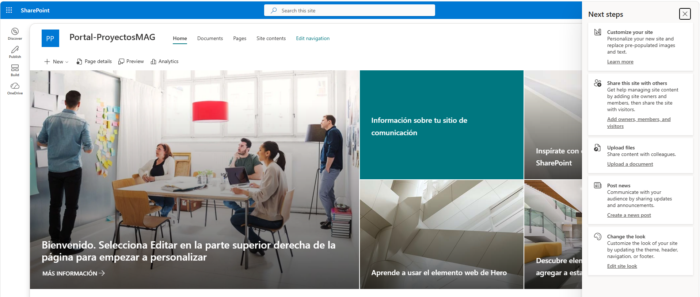

## Paso 6. Crear la página de prueba

Dentro de \`Portal-ProyectosXXX\`, selecciona \`Nuevo \> Página\`. De la
plantilla selecciona Pagina en blanco en la parte superior derecha de la
lista. Asigna el título \`Panel de proyectos\` y publica la página. No
agregues todavía el Web Part.

## Paso 7. Confirmar el App Catalog compartido

El App Catalog del tenant es administrado por el instructor. No crees un
App Catalog nuevo ni modifiques su configuración. Confirma que el
catálogo está disponible y que la biblioteca \`Apps for SharePoint\`
será el destino de publicación del paquete \`.sppkg\`.

Resultado esperado. Existe el sitio \`Portal-ProyectosXXX\` con la
página publicada \`Panel de proyectos\`, tu cuenta puede editar páginas
y crear listas, y el instructor confirma que el App Catalog compartido
está disponible.

# Actividad 2. Crear la lista de proyectos

Crear la fuente de datos que el Web Part consultará mediante SharePoint
REST.

## Paso 1. Crear la lista

En \`Portal-ProyectosXXX\`, selecciona Nuevo \> Lista \> Lista en
blanco. Escribe \`Proyectos\` como nombre. Desactivar **Mostrar lista en
navegador de sitio** y selecciona Crear.

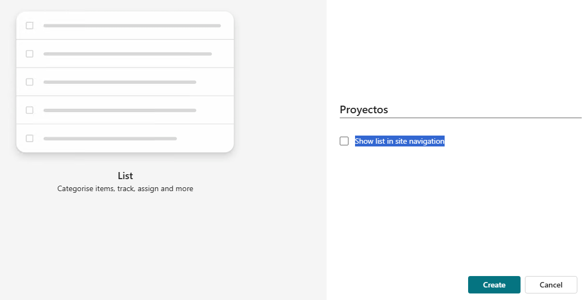

## Paso 2. Crear la columna Owner

Abre la lista \`Proyectos\`. Selecciona + Agregar columna \> Una línea
de texto. Escribe \`Owner\` como nombre de columna y guarda.

## Paso 3. Crear la columna Status

Selecciona + Agregar columna \> Elección. Escribe \`Status\` como
nombre. Agrega exactamente estas opciones: \`Activo\`, \`En pausa\`,
\`Finalizado\`. Guarda la columna.

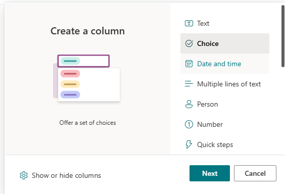

## Paso 4. Crear la columna Description

Selecciona + Agregar columna \> Varias líneas de texto. Escribe
\`Description\` como nombre y guarda.

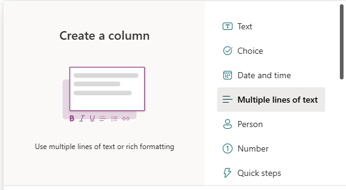

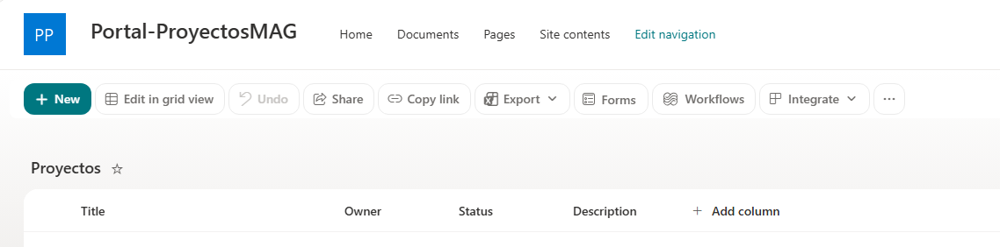

## Paso 5. Agregar registros

Agrega tres elementos con valores:

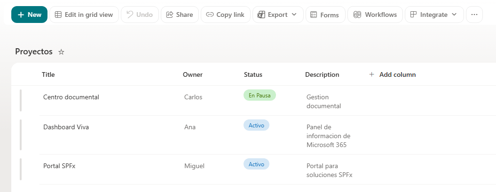

**Resultado esperado.** La lista \`Proyectos\` contiene tres registros y
las columnas \`Title\`, \`Owner\`, \`Status\` y \`Description\`.

# Actividad 3. Crear el proyecto SPFx

Crear el Web Part ProjectDashboardXXX con React y TypeScript utilizando
el generador estable.

## Paso 1. Crear la carpeta del proyecto

Ejecuta:

<table>
<colgroup>
<col style="width: 100%" />
</colgroup>
<thead>
<tr class="header">
<th>New-Item -ItemType Directory -Path C:\SPFx\spfx-lab3-webpart-MAG
-Force 
Set-Location C:\SPFx\spfx-lab3-webpart-MAG</th>
</tr>
</thead>
<tbody>
</tbody>
</table>

## Paso 2. Ejecutar el generador

Ejecuta:

| yo @microsoft/sharepoint |
|--------------------------|

Responde el asistente con estos valores. En SPFx 1.23.2, el flujo actual
no muestra las antiguas preguntas interactivas sobre el paquete base ni
sobre la ubicación de los archivos. El generador utiliza el contexto del
proyecto actual y, para este laboratorio, solo debes responder las
preguntas que realmente aparezcan en tu consola.

- Solution name: \`spfx-lab3-webpart-XXX\`

- Which type of client-side component to create?: \`WebPart\`

- What is your Web part name?: \`ProjectDashboardXXX\`

- Which template would you like to use?: \`React\`

En SPFx 1.23.2, después de seleccionar \`React\` no se requieren
respuestas adicionales.

## Paso 3. Configurar el despliegue para el tenant compartido

Abre \`config/package-solution.json\`. Dentro de la propiedad
\`solution\`, agrega o verifica la propiedad \`skipFeatureDeployment\`
con el valor \`false\`.

| "skipFeatureDeployment": false |
|--------------------------------|

**Resultado esperado.** La carpeta \`C:\SPFx\spfx-lab3-webpart-XXX\`
contiene el proyecto y \`package.json\`. El archivo
\`config/package-solution.json\` conserva \`skipFeatureDeployment\` con
valor \`false\`.

# Actividad 4. Instalar dependencias y preparar el certificado de desarrollo

Instalar las dependencias locales del proyecto y confiar en el
certificado HTTPS utilizado por el entorno de desarrollo.

## Paso 1. Abrir el proyecto

Desde \`C:\SPFx\spfx-lab3-webpart-XXX\`, ejecuta:

| code . |
|--------|

## Paso 2. Instalar dependencias

En la terminal integrada de VS Code, ubicada en la raíz del proyecto,
ejecuta:

| npm install |
|-------------|

## Paso 3. Verificar React y Fluent UI

Ejecuta:

| npm list react react-dom @fluentui/react --depth=0 |
|----------------------------------------------------|

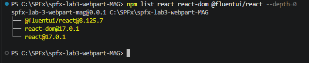

**Resultado esperado.** React aparece como \`17.0.1\`. Si
\`@fluentui/react\` no aparece, instala la dependencia con el siguiente
comando y vuelve a ejecutar la verificación.

| npm install @fluentui/react |
|-----------------------------|

## Paso 4. Confiar en el certificado de desarrollo

Esta configuración se realiza **una sola vez por estación de trabajo**.
Si completaste correctamente esta configuración en el Lab 2, no ejecutes
nuevamente este comando.

| heft trust-dev-cert |
|---------------------|

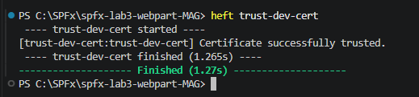

**Resultado esperado.** Heft completa el proceso de confianza del
certificado de desarrollo. **Esta operación se realiza una vez por
estación de trabajo.**

# Actividad 5. Reconocer la estructura del proyecto

Identificar los archivos que contienen la configuración, la lógica del
Web Part, el componente React y los estilos.

## Paso 1. Abrir el Explorador de VS Code

En el Explorador de archivos de VS Code, expande la carpeta del
proyecto.

## Paso 2. Identificar las carpetas

Localiza exactamente estas carpetas: \`src\`, \`config\` y
\`sharepoint\`. Si \`sharepoint\` todavía no aparece, no la crees
manualmente; aparecerá cuando el proceso de empaquetado genere la salida
de la solución.

## Paso 3. Identificar los archivos del Web Part

Dentro de \`src/webparts/projectDashboardXXX/\`, localiza
\`ProjectDashboardXXXWebPart.ts\`. Dentro de \`components/\`, localiza
\`ProjectDashboardXXX.tsx\` y \`ProjectDashboardXXX.module.scss\`.

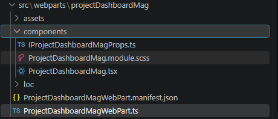

## Paso 4. Identificar la configuración

En la raíz localiza \`package.json\` y \`tsconfig.json\`. En \`config\`,
localiza \`rig.json\`, \`package-solution.json\` y \`serve.json\`.

**Resultado esperado.** Puedes distinguir el código del Web Part, el
componente React, los estilos, las dependencias y los archivos de
configuración. No se asume que \`sharepoint/solution\` exista antes del
empaquetado.

# Actividad 6. Ejecutar el Web Part en SharePoint

Comprobar que el proyecto generado puede ejecutarse antes de modificar
el código.

## Paso 1. Definir el sitio utilizado por el Hosted Workbench

En PowerShell, desde la raíz del proyecto, asigna el dominio y la ruta
del sitio de laboratorio a la variable utilizada por SPFx. No incluyas
\`https://\` porque \`serve.json\` ya contiene el protocolo.

| \$env:SPFX_SERVE_TENANT_DOMAIN = " azurenetecgp1.sharepoint.com/sites/Portal-ProyectosXXX" |
|--------------------------------------------------------------------------------------------|
| \$env:SPFX_SERVE_TENANT_DOMAIN                                                             |

## Paso 2. Iniciar Heft

Ejecuta:

| heft start |
|------------|

No es necesario ejecutar heft build previamente. El comando heft start
realizará el proceso necesario para compilar y servir el proyecto en el
entorno de desarrollo local.

## Paso 3. Abrir el Hosted Workbench

Heft iniciará el servidor de desarrollo y mostrará la dirección del
entorno de prueba. Abre la dirección indicada por la salida del comando.
El Hosted Workbench de SharePoint Online está en transición: Microsoft
lo marcó como obsoleto desde mayo de 2026 y anunció su retiro para el 1
de diciembre de 2026. Mientras el entorno del curso continúe
disponiéndolo, este paso permite probar el proyecto con el contexto de
SharePoint.

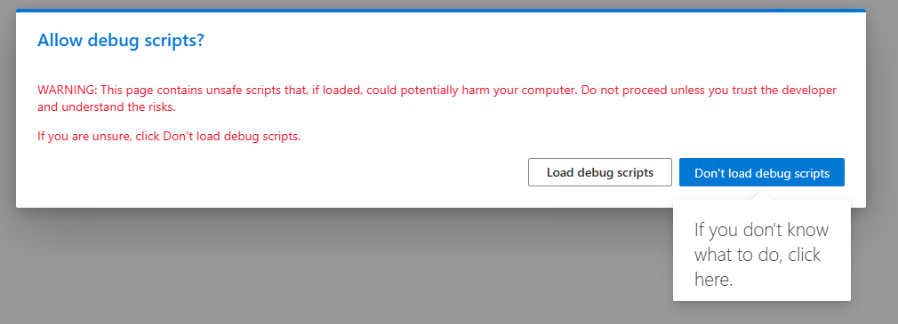

Selecciona **Cargar scripts de depuración**

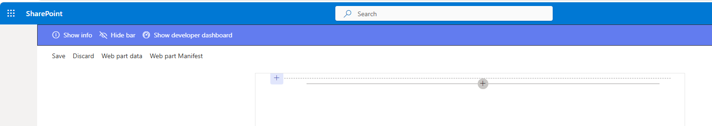

El Hosted Workbench de SharePoint Online está en transición: Microsoft
lo marcó como obsoleto desde mayo de 2026 y anunció su retiro para el 1
de diciembre de 2026. Mientras el entorno del curso continúe
disponiéndolo, este paso permite probar el proyecto con el contexto de
SharePoint. Para entornos que ya hayan migrado al Debug Toolbar, se debe
utilizar ese mecanismo de depuración.

**Resultado esperado**. El proyecto inicia sin errores y el Web Part
\`ProjectDashboardXXX\` puede cargarse en el entorno de prueba.

# Actividad 7. Crear el modelo de proyecto en TypeScript

Definir un tipo explícito para los elementos que llegan desde
SharePoint.

## Paso 1. Crear el archivo IProject.ts

En \`src/webparts/projectDashboardXXX/components/\`, crea un archivo
llamado \`IProject.ts\`.

Archivo: src/webparts/projectDashboardXXX/components/IProject.ts

<table>
<colgroup>
<col style="width: 100%" />
</colgroup>
<thead>
<tr class="header">
<th>export interface IProject { 
Id: number; 
Title: string; 
Owner: string; 
Status: string; 
Description: string; 
}</th>
</tr>
</thead>
<tbody>
</tbody>
</table>

## Paso 2. Comprobar el tipado

En el mismo archivo, no agregues propiedades distintas a las definidas.
El tipo se utilizará para evitar que el componente React dependa de
objetos sin estructura conocida.

**Resultado esperado.** Existe \`IProject.ts\` con cinco propiedades
tipadas.

# Actividad 8. Implementar useState

Agregar estado React para el contador y comprobar la actualización de la
interfaz.

## Paso 1. Reemplazar el componente React

Abre el archivo indicado y reemplaza su contenido completo.

Archivo:
src/webparts/projectDashboardXXX/components/ProjectDashboardXXX.tsx

<table>
<colgroup>
<col style="width: 100%" />
</colgroup>
<thead>
<tr class="header">
<th>import * as React from 'react'; 
 
export default function ProjectDashboardXXX(): React.ReactElement
{ 
const [count, setCount] = React.useState&lt;number&gt;(0); 
 
return ( 
&lt;div&gt; 
&lt;h2&gt;Panel de proyectos&lt;/h2&gt; 
&lt;p&gt;Has hecho clic {count} veces.&lt;/p&gt; 
&lt;button onClick={() =&gt; setCount(count + 1)}&gt; 
Incrementar 
&lt;/button&gt; 
&lt;/div&gt; 
); 
}</th>
</tr>
</thead>
<tbody>
</tbody>
</table>

## Paso 2. Guardar y observar el resultado

Guarda el archivo. Agrega el componente a la página.

Si \`heft start\` continúa ejecutándose, el navegador debe actualizar el
Web Part. Pulsa \`Incrementar\` dos veces.

Resultado esperado. El contador cambia de 0 a 1 y después a 2 sin
recargar la página.

# Actividad 9. Implementar useEffect

Ejecutar un efecto cada vez que cambie el contador.

## Paso 1. Agregar useEffect

Reemplaza el archivo completo por:

Archivo:
src/webparts/projectDashboardXXX/components/ProjectDashboardXXX.tsx

<table>
<colgroup>
<col style="width: 100%" />
</colgroup>
<thead>
<tr class="header">
<th>
import * as React from "react";

import { IProjectDashboardMagProps } from
"./IProjectDashboardMagProps";

interface IProject {

id: number;

name: string;

owner: string;

}

const project: IProject = {

id: 1,

name: "Portal SPFx",

owner: "Laboratorio"

};

const ProjectDashboardMag: React.FC&lt;IProjectDashboardMagProps&gt;
= (props) =&gt; {

const [count, setCount] = React.useState(0);

const [statusMessage, setStatusMessage] =

React.useState("Sin actividad");

React.useEffect(() =&gt; {

if (count === 0) {

setStatusMessage("Sin actividad");

} else if (count === 1) {

setStatusMessage("Se registró la primera interacción.");

} else {

setStatusMessage(`Se han registrado ${count} interacciones.`);

}

}, [count]);

return (

&lt;div&gt;

&lt;h2&gt;Laboratorio 3 — SPFx + React&lt;/h2&gt;

&lt;p&gt;Proyecto: {project.name}&lt;/p&gt;

&lt;p&gt;Propietario: {project.owner}&lt;/p&gt;

&lt;p&gt;Usuario: {props.userDisplayName ??
"Participante"}&lt;/p&gt;

&lt;p&gt;Has hecho clic {count} veces.&lt;/p&gt;

&lt;p&gt;Estado: {statusMessage}&lt;/p&gt;

&lt;button onClick={() =&gt; setCount(count + 1)}&gt;

Incrementar

&lt;/button&gt;

&lt;/div&gt;

);

};

export default ProjectDashboardMag;
</th>
</tr>
</thead>
<tbody>
</tbody>
</table>

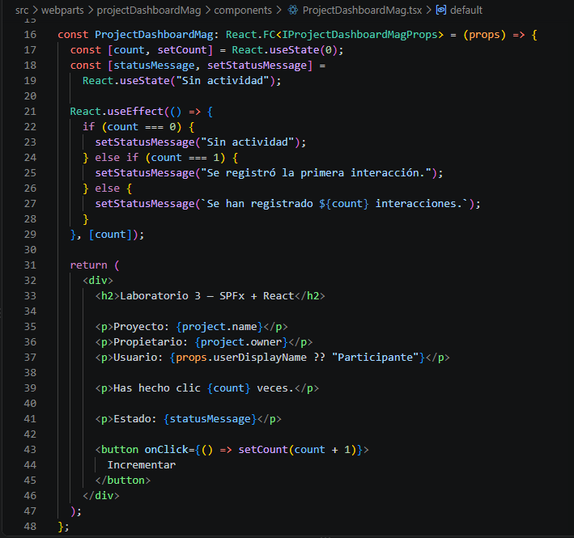

React.useEffect(() =\> {

...

}, \[count\]);

Indica a React que ejecute este efecto cuando cambie count.

Por ejemplo, al pasar de count = 1 a count = 2, useEffect vuelve a
ejecutarse y actualiza:

setStatusMessage(\`Se han registrado \${count} interacciones.\`);

Después React vuelve a renderizar el componente y el participante ve
inmediatamente el nuevo mensaje.

# Actividad 10. Implementar useRef

## Utilizar useRef para mantener una referencia directa a un elemento de la interfaz y utilizarla para colocar el foco en un campo de texto cuando el usuario lo solicite.

## Paso 1. Reemplazar el componente

Utiliza este contenido completo:

Archivo:
src/webparts/projectDashboardXXX/components/ProjectDashboardXXX.tsx

<table>
<colgroup>
<col style="width: 100%" />
</colgroup>
<thead>
<tr class="header">
<th>
import * as React from "react";

export default function ProjectDashboardMag(): React.ReactElement
{

const [count, setCount] = React.useState&lt;number&gt;(0);

const [statusMessage, setStatusMessage] =

React.useState&lt;string&gt;("Sin actividad");

const inputRef = React.useRef&lt;HTMLInputElement&gt;(null);

React.useEffect(() =&gt; {

if (count === 0) {

setStatusMessage("Sin actividad");

} else if (count === 1) {

setStatusMessage("Se registró la primera interacción.");

} else {

setStatusMessage(

`Se han registrado ${count} interacciones.`

);

}

}, [count]);

const focusInput = (): void =&gt; {

inputRef.current?.focus();

};

return (

&lt;div&gt;

&lt;h2&gt;Panel de proyectos&lt;/h2&gt;

&lt;p&gt;Has hecho clic {count} veces.&lt;/p&gt;

&lt;p&gt;Estado: {statusMessage}&lt;/p&gt;

&lt;input

ref={inputRef}

type="text"

placeholder="Escribe algo..."

/&gt;

&lt;button onClick={focusInput}&gt;

Focalizar input

&lt;/button&gt;

&lt;button onClick={() =&gt; setCount(count + 1)}&gt;

Incrementar

&lt;/button&gt;

&lt;/div&gt;

);

}
</th>
</tr>
</thead>
<tbody>
</tbody>
</table>

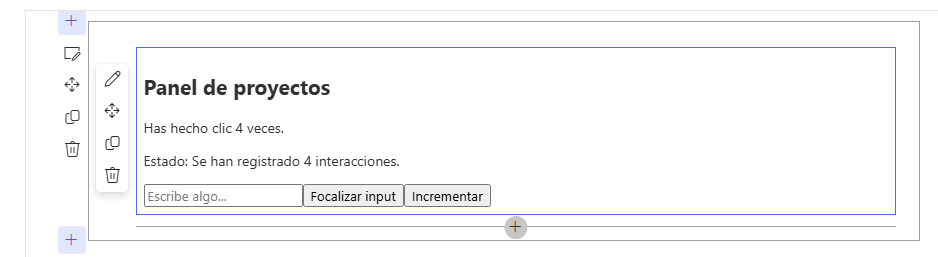

**Resultado esperado.** Al seleccionar \`Focalizar input\`, el cursor se
coloca en el campo de texto.

# Actividad 12. Crear un hook personalizado

Encapsular la lógica de estado para los proyectos en un hook
reutilizable.

## Paso 1. Crear useProjects.ts

En \`components/\`, crea el archivo.

Archivo: src/webparts/projectDashboardXXX/components/useProjects.ts

<table>
<colgroup>
<col style="width: 100%" />
</colgroup>
<thead>
<tr class="header">
<th>import * as React from 'react'; 
import { IProject } from './IProjects'; 
 
export function useProjects(): { 
projects: IProject[]; 
setProjects:
React.Dispatch&lt;React.SetStateAction&lt;IProject[]&gt;&gt;; 
} { 
const [projects, setProjects] =
React.useState&lt;IProject[]&gt;([]); 
 
return { 
projects, 
setProjects 
}; 
}</th>
</tr>
</thead>
<tbody>
</tbody>
</table>

El hook mantiene el estado de la colección de proyectos. En una
actividad posterior recibirá una función de carga para obtener datos
desde SharePoint.

**Resultado esperado**. \`useProjects.ts\` exporta \`useProjects\` y
devuelve \`projects\` y \`setProjects\`.

# Actividad 13. Incorporar Fluent UI

Utilizar componentes de Fluent UI para construir el formulario.

## Paso 1. Reemplazar el componente

Utiliza el siguiente contenido completo.

Archivo:
src/webparts/projectDashboardXXX/components/ProjectDashboardXXX.tsx

<table>
<colgroup>
<col style="width: 100%" />
</colgroup>
<thead>
<tr class="header">
<th>
import * as React from "react";

import {

PrimaryButton,

Stack,

TextField

} from "@fluentui/react";

export default function ProjectDashboardMag(): React.ReactElement
{

const [count, setCount] = React.useState&lt;number&gt;(0);

const [statusMessage, setStatusMessage] =

React.useState&lt;string&gt;("Sin actividad");

const [projectName, setProjectName] =
React.useState&lt;string&gt;("");

const inputRef = React.useRef&lt;HTMLInputElement&gt;(null);

React.useEffect(() =&gt; {

if (count === 0) {

setStatusMessage("Sin actividad");

} else if (count === 1) {

setStatusMessage("Se registró la primera interacción.");

} else {

setStatusMessage(

`Se han registrado ${count} interacciones.`

);

}

}, [count]);

const focusInput = (): void =&gt; {

inputRef.current?.focus();

};

const addProject = (): void =&gt; {

if (projectName.trim()) {

console.log(`Proyecto agregado: ${projectName}`);

setProjectName("");

}

};

return (

&lt;Stack tokens={{ childrenGap: 10 }}&gt;

&lt;h2&gt;Panel de proyectos&lt;/h2&gt;

&lt;TextField

label="Nombre del proyecto"

value={projectName}

onChange={(_, value) =&gt; setProjectName(value || "")}

/&gt;

&lt;PrimaryButton

text="Agregar proyecto"

onClick={addProject}

/&gt;

&lt;input

ref={inputRef}

type="text"

placeholder="Campo de prueba para useRef"

/&gt;

&lt;PrimaryButton

text="Focalizar input"

onClick={focusInput}

/&gt;

&lt;p&gt;Has hecho clic {count} veces.&lt;/p&gt;

&lt;p&gt;Estado: {statusMessage}&lt;/p&gt;

&lt;PrimaryButton

text="Incrementar"

onClick={() =&gt; setCount(count + 1)}

/&gt;

&lt;/Stack&gt;

);

}
</th>
</tr>
</thead>
<tbody>
</tbody>
</table>

Resultado esperado. El contador se actualiza al seleccionar
**Incrementar**, el mensaje de estado cambia mediante useEffect y el
botón **Focalizar input** coloca el cursor en el campo de texto mediante
useRef.

# Actividad 14. Crear un input controlado y validar la entrada

En esta actividad, se va a mantener el valor del formulario en el estado
de React y rechazar valores vacíos.

## Paso 1. Actualizar el componente

Utiliza esta versión completa.

Archivo:
src/webparts/projectDashboardXXX/components/ProjectDashboardXXX.tsx

<table>
<colgroup>
<col style="width: 100%" />
</colgroup>
<thead>
<tr class="header">
<th>import * as React from 'react'; 
import { 
MessageBar, 
MessageBarType, 
PrimaryButton, 
Stack, 
TextField 
} from '@fluentui/react'; 
 
export default function ProjectDashboardXXX(): React.ReactElement
{ 
const [projectName, setProjectName] =
React.useState&lt;string&gt;(''); 
const [message, setMessage] = React.useState&lt;string&gt;(''); 
 
const handleAddProject = (): void =&gt; { 
const normalizedName = projectName.trim(); 
 
if (!normalizedName) { 
setMessage('Escribe un nombre de proyecto.'); 
return; 
} 
 
setMessage(`Proyecto preparado: ${normalizedName}`); 
}; 
 
return ( 
&lt;Stack tokens={{ childrenGap: 10 }}&gt; 
&lt;h2&gt;Panel de proyectos&lt;/h2&gt; 
 
&lt;TextField 
label="Nombre del proyecto" 
value={projectName} 
onChange={(_, value) =&gt; setProjectName(value || '')} 
/&gt; 
 
&lt;PrimaryButton 
text="Agregar proyecto" 
onClick={handleAddProject} 
/&gt; 
 
{message &amp;&amp; ( 
&lt;MessageBar 
messageBarType={MessageBarType.info} 
&gt; 
{message} 
&lt;/MessageBar&gt; 
)} 
&lt;/Stack&gt; 
); 
}</th>
</tr>
</thead>
<tbody>
</tbody>
</table>

**Resultado esperado**. Al pulsar \`Agregar proyecto\` con el campo
vacío aparece el mensaje de validación. Con \`Portal SPFx\`, aparece
\`Proyecto preparado: Portal SPFx\`.

# Actividad 15. Conectar SharePoint REST

**Objetivo.** Consultar la lista Proyectos mediante el cliente
autenticado de SPFx y mostrar en el Web Part los registros recuperados
desde SharePoint.

En esta actividad se conectará el componente React con SharePoint
mediante SPHttpClient.

**Importante.** Para esta actividad se asume que la lista Proyectos
contiene las columnas Title, Owner, Status y Description, y que Owner es
una columna de texto de una sola línea.

**Paso 1. Verificar la interfaz IProject**

La aplicación necesita conocer la estructura de los datos que recibirá
desde SharePoint.

src/webparts/projectDashboardMag/components/IProject.ts

debe contener:

export interface IProject {

Id: number;

Title: string;

Owner: string;

Status: string;

Description: string;

}

La interfaz representa la estructura de cada elemento de la lista
Proyectos. TypeScript utilizará esta definición para comprobar que los
datos utilizados por el componente tengan los tipos esperados.

**Paso 2. Preparar las propiedades del componente**

El componente React recibirá una función que será responsable de obtener
los proyectos desde SharePoint.

src/webparts/projectDashboardMag/components/IProjectDashboardXXXProps.ts

Reemplaza el contenido por:

import { IProject } from "./IProject";

export interface IProjectDashboardProps {

userDisplayName: string;

getProjects: () =\> Promise\<IProject\[\]\>;

}

userDisplayName contiene el nombre del usuario actual y getProjects
representa la función que permitirá al componente solicitar los
proyectos.

La interfaz IProjectDashboardProps se mantiene con ese nombre, aunque el
archivo se denomine IProjectDashboardMagProps.ts.

**Paso 3. Implementar la consulta REST**

La comunicación con SharePoint se realizará desde el Web Part principal,
donde está disponible this.context.spHttpClient.

**Archivo:**

src/webparts/projectDashboardMag/ProjectDashboardMagWebPart.ts

Reemplaza el contenido completo del archivo por:

import \* as React from "react";

import \* as ReactDom from "react-dom";

import { Version } from "@microsoft/sp-core-library";

import {

type IPropertyPaneConfiguration,

PropertyPaneTextField

} from "@microsoft/sp-property-pane";

import {

BaseClientSideWebPart

} from "@microsoft/sp-webpart-base";

import { SPHttpClient } from "@microsoft/sp-http";

import \* as strings from "ProjectDashboardMagWebPartStrings";

import ProjectDashboardMag from "./components/ProjectDashboardMag";

import { IProjectDashboardProps } from
"./components/IProjectDashboardMagProps";

import { IProject } from "./components/IProject";

export interface IProjectDashboardMagWebPartProps {

description: string;

}

export default class ProjectDashboardMagWebPart

extends BaseClientSideWebPart\<IProjectDashboardMagWebPartProps\> {

public render(): void {

const element: React.ReactElement\<IProjectDashboardProps\> =

React.createElement(ProjectDashboardMag, {

userDisplayName: this.context.pageContext.user.displayName,

getProjects: this.getProjects.bind(this)

});

ReactDom.render(element, this.domElement);

}

private async getProjects(): Promise\<IProject\[\]\> {

const url =

\`\${this.context.pageContext.web.absoluteUrl}\` +

\`/\_api/web/lists/getbytitle('Proyectos')/items\` +

\`?\$select=Id,Title,Owner,Status,Description\`;

const response = await this.context.spHttpClient.get(

url,

SPHttpClient.configurations.v1

);

if (!response.ok) {

throw new Error(

\`Error al consultar SharePoint: \${response.status}
\${response.statusText}\`

);

}

const data = await response.json();

return data.value as IProject\[\];

}

protected onDispose(): void {

ReactDom.unmountComponentAtNode(this.domElement);

}

protected get dataVersion(): Version {

return Version.parse("1.0");

}

protected getPropertyPaneConfiguration():

IPropertyPaneConfiguration {

return {

pages: \[

{

header: {

description: strings.PropertyPaneDescription

},

groups: \[

{

groupName: strings.BasicGroupName,

groupFields: \[

PropertyPaneTextField("description", {

label: strings.DescriptionFieldLabel

})

\]

}

\]

}

\]

};

}

}

La función getProjects() construye la URL de SharePoint utilizando la
URL del sitio donde está ejecutándose el Web Part:

this.context.pageContext.web.absoluteUrl

La consulta REST:

/\_api/web/lists/getbytitle('Proyectos')/items

solicita los elementos de la lista Proyectos.

La expresión:

?\$select=Id,Title,Owner,Status,Description

limita la respuesta a los campos que serán utilizados en esta actividad.

SPHttpClient realiza la solicitud utilizando el contexto autenticado de
SPFx.

**Paso 4. Mostrar los proyectos en el componente React**

Ahora se utilizará getProjects() desde el componente React y se
mostrarán los registros recuperados.

**Archivo:**

src/webparts/projectDashboardMag/components/ProjectDashboardMag.tsx

Reemplaza el contenido completo por:

import \* as React from "react";

import {

MessageBar,

MessageBarType,

PrimaryButton,

Stack,

TextField

} from "@fluentui/react";

import { IProjectDashboardProps } from "./IProjectDashboardMagProps";

import { IProject } from "./IProject";

export default function ProjectDashboardMag(

props: IProjectDashboardProps

): React.ReactElement {

const \[projectName, setProjectName\] =

React.useState\<string\>("");

const \[message, setMessage\] =

React.useState\<string\>("");

const \[projects, setProjects\] =

React.useState\<IProject\[\]\>(\[\]);

const \[loading, setLoading\] =

React.useState\<boolean\>(false);

const \[error, setError\] =

React.useState\<string\>("");

const handleAddProject = (): void =\> {

const normalizedName = projectName.trim();

if (!normalizedName) {

setMessage("Escribe un nombre de proyecto.");

return;

}

setMessage(\`Proyecto preparado: \${normalizedName}\`);

};

const loadProjects = async (): Promise\<void\> =\> {

setLoading(true);

setError("");

try {

const data = await props.getProjects();

setProjects(data);

} catch (err) {

setError(

err instanceof Error

? err.message

: "No fue posible consultar los proyectos."

);

} finally {

setLoading(false);

}

};

React.useEffect(() =\> {

void loadProjects();

}, \[\]);

return (

\<Stack tokens={{ childrenGap: 10 }}\>

\<h2\>Panel de proyectos\</h2\>

\<p\>

Usuario: {props.userDisplayName}

\</p\>

\<TextField

label="Nombre del proyecto"

value={projectName}

onChange={(\_, value) =\> setProjectName(value \|\| "")}

/\>

\<PrimaryButton

text="Agregar proyecto"

onClick={handleAddProject}

/\>

{message && (

\<MessageBar

messageBarType={MessageBarType.info}

\>

{message}

\</MessageBar\>

)}

\<PrimaryButton

text="Actualizar proyectos"

onClick={() =\> void loadProjects()}

disabled={loading}

/\>

{loading && (

\<MessageBar

messageBarType={MessageBarType.info}

\>

Consultando proyectos...

\</MessageBar\>

)}

{error && (

\<MessageBar

messageBarType={MessageBarType.error}

\>

{error}

\</MessageBar\>

)}

{!loading && !error && (

\<div\>

\<h3\>Proyectos registrados\</h3\>

{projects.length === 0 ? (

\<p\>No se encontraron proyectos.\</p\>

) : (

\<ul\>

{projects.map((project) =\> (

\<li key={project.Id}\>

\<strong\>{project.Title}\</strong\>

{" — "}

Responsable: {project.Owner}

{" — "}

Estado: {project.Status}

{" — "}

{project.Description}

\</li\>

))}

\</ul\>

)}

\</div\>

)}

\</Stack\>

);

}

projects mantiene en el estado de React los registros recuperados desde
SharePoint.

El método loadProjects() ejecuta la consulta y actualiza ese estado.
useEffect llama a loadProjects() cuando el componente se carga
inicialmente.

El botón **Actualizar proyectos** permite volver a consultar la lista
sin tener que recargar la página.

**Paso 5. Ejecutar el Web Part**

Desde la raíz del proyecto:

Set-Location C:\SPFx\spfx-lab3-webpart-MAG

heft start

Cuando se abra el Hosted Workbench, agrega el Web Part
**ProjectDashboardMag**.

Al cargar el Web Part, se realizará automáticamente la consulta a la
lista Proyectos.

**Paso 6. Comprobar los datos recuperados**

Comprueba que el Web Part muestre la sección:

**Proyectos registrados**

Los registros existentes en la lista Proyectos deben aparecer en
pantalla.

Por ejemplo:

Proyectos registrados

> Portal SPFx — Responsable: Laboratorio — Estado: Activo — Portal de
> demostración
>
> Migración Intranet — Responsable: Ana — Estado: En curso — Migración
> del portal

Los valores dependerán de los registros existentes en la lista.

Selecciona **Actualizar proyectos** y comprueba que la información
vuelva a consultarse.

Si la lista no contiene elementos, el Web Part deberá mostrar:

No se encontraron proyectos.

Si ocurre un problema durante la consulta, deberá mostrarse un mensaje
de error.

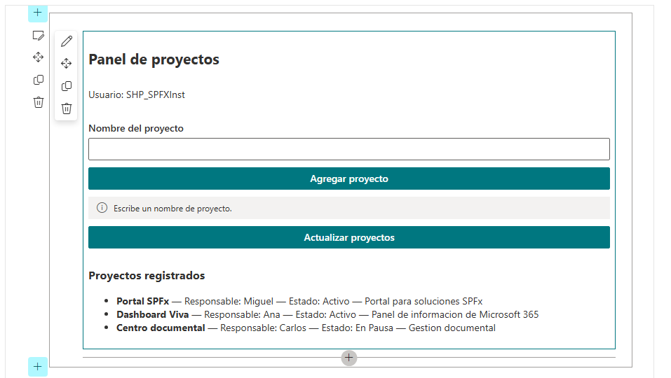

**Resultado esperado.** El Web Part consulta la lista Proyectos mediante
SPHttpClient y SharePoint REST, y muestra en pantalla los registros
recuperados. El botón **Actualizar proyectos** permite realizar
nuevamente la consulta.

# Actividad 16. Pasar los datos de SPFx a React

## Separar la obtención de datos del contexto de SPFx de la presentación realizada por React. El Web Part proporciona a React la función getProjects, y React utiliza esa función para consultar y mostrar los proyectos.

## Paso 1. Actualizar el componente React

Reemplaza el archivo completo por:

Archivo:
src/webparts/projectDashboardXXX/components/ProjectDashboardXXX.tsx

<table>
<colgroup>
<col style="width: 100%" />
</colgroup>
<thead>
<tr class="header">
<th>
import * as React from "react";

import {

MessageBar,

MessageBarType,

PrimaryButton,

Stack

} from "@fluentui/react";

import { IProjectDashboardProps } from
"./IProjectDashboardMagProps";

import { IProject } from "./IProject";

export default function ProjectDashboardMag(

props: IProjectDashboardProps

): React.ReactElement {

const [projects, setProjects] =

React.useState&lt;IProject[]&gt;([]);

const [loading, setLoading] =

React.useState&lt;boolean&gt;(false);

const [error, setError] =

React.useState&lt;string&gt;("");

const loadProjects = async (): Promise&lt;void&gt; =&gt; {

setLoading(true);

setError("");

try {

const data = await props.getProjects();

setProjects(data);

} catch (err) {

setError(

err instanceof Error

? err.message

: "No fue posible consultar los proyectos."

);

} finally {

setLoading(false);

}

};

React.useEffect(() =&gt; {

void loadProjects();

}, []);

return (

&lt;Stack tokens={{ childrenGap: 10 }}&gt;

&lt;h2&gt;Panel de proyectos&lt;/h2&gt;

&lt;p&gt;

Usuario: {props.userDisplayName}

&lt;/p&gt;

&lt;PrimaryButton

text="Recargar proyectos"

onClick={() =&gt; void loadProjects()}

disabled={loading}

/&gt;

{loading &amp;&amp; (

&lt;MessageBar

messageBarType={MessageBarType.info}

&gt;

Consultando proyectos...

&lt;/MessageBar&gt;

)}

{error &amp;&amp; (

&lt;MessageBar

messageBarType={MessageBarType.error}

&gt;

{error}

&lt;/MessageBar&gt;

)}

{!loading &amp;&amp; !error &amp;&amp; (

&lt;&gt;

&lt;h3&gt;Proyectos registrados&lt;/h3&gt;

{projects.length === 0 ? (

&lt;p&gt;No se encontraron proyectos.&lt;/p&gt;

) : (

&lt;ul&gt;

{projects.map((project) =&gt; (

&lt;li key={project.Id}&gt;

{project.Title} — {project.Owner} — {project.Status}

&lt;/li&gt;

))}

&lt;/ul&gt;

)}

&lt;/&gt;

)}

&lt;/Stack&gt;

);

}
</th>
</tr>
</thead>
<tbody>
</tbody>
</table>

**Revisar los imports**

En este archivo observa que las referencias son relativas a la carpeta
components:

> import { IProjectDashboardProps } from "./IProjectDashboardMagProps";
>
> import { IProject } from "./IProject";

No deben utilizarse rutas como:

> ./components/IProject

porque ProjectDashboardMag.tsx ya se encuentra dentro de components.

**Resultado esperado**

Al cargar el Web Part, React solicita los proyectos mediante
props.getProjects() y muestra los elementos de la lista **Proyectos**.

El botón **Recargar proyectos** vuelve a ejecutar la consulta. Si la
consulta falla, se muestra el mensaje de error; si no existen elementos,
se muestra **No se encontraron proyectos**.

**Punto importante para el participante:** en esta actividad, React **no
conoce SPHttpClient ni construye la URL REST**. Recibe la función
getProjects como propiedad y se encarga de utilizar el resultado para
actualizar y mostrar su estado.

## Paso 2. Pasar las props desde el Web Part

En el método \`render()\` del Web Part, utiliza \`ReactDom.render()\`
con \`projects\`, \`userDisplayName\` y \`onReloadProjects\`. La
implementación completa del Web Part se proporcionará después de
integrar Graph.

Resultado esperado. React recibe datos tipados mediante
\`IProjectDashboardProps\` y no necesita conocer \`SPHttpClient\`.

El Web Part proporciona a React las propiedades necesarias para trabajar
con el contexto de SharePoint. En particular, envía el nombre del
usuario y la función getProjects, que es la encargada de consultar la
lista mediante SPHttpClient.

En el método render() del Web Part, utiliza:

> public render(): void {
>
> const element: React.ReactElement\<IProjectDashboardProps\> =
>
> React.createElement(ProjectDashboardMag, {
>
> userDisplayName: this.context.pageContext.user.displayName,
>
> getProjects: this.getProjects.bind(this)
>
> });
>
> ReactDom.render(element, this.domElement);
>
> }

La función getProjects permanece en el Web Part porque necesita acceder
a:

this.context.spHttpClient

React recibe esa función como una propiedad (props.getProjects) y puede
ejecutarla cuando necesita obtener o recargar los proyectos.

**Archivo:**
src/webparts/projectDashboardMag/ProjectDashboardMagWebPart.ts

> import \* as React from "react";
>
> import \* as ReactDom from "react-dom";
>
> import { Version } from "@microsoft/sp-core-library";
>
> import {
>
> type IPropertyPaneConfiguration,
>
> PropertyPaneTextField
>
> } from "@microsoft/sp-property-pane";
>
> import {
>
> BaseClientSideWebPart
>
> } from "@microsoft/sp-webpart-base";
>
> import { SPHttpClient } from "@microsoft/sp-http";
>
> import \* as strings from "ProjectDashboardMagWebPartStrings";
>
> import ProjectDashboardMag from "./components/ProjectDashboardMag";
>
> import { IProjectDashboardProps } from
> "./components/IProjectDashboardMagProps";
>
> import { IProject } from "./components/IProject";
>
> export interface IProjectDashboardMagWebPartProps {
>
> description: string;
>
> }
>
> export default class ProjectDashboardMagWebPart
>
> extends BaseClientSideWebPart\<IProjectDashboardMagWebPartProps\> {
>
> public render(): void {
>
> const element: React.ReactElement\<IProjectDashboardProps\> =
>
> React.createElement(ProjectDashboardMag, {
>
> userDisplayName: this.context.pageContext.user.displayName,
>
> getProjects: this.getProjects.bind(this)
>
> });
>
> ReactDom.render(element, this.domElement);
>
> }
>
> private async getProjects(): Promise\<IProject\[\]\> {
>
> const url =
>
> \`\${this.context.pageContext.web.absoluteUrl}\` +
>
> \`/\_api/web/lists/getbytitle('Proyectos')/items\` +
>
> \`?\$select=Id,Title,Owner,Status,Description\`;
>
> const response = await this.context.spHttpClient.get(
>
> url,
>
> SPHttpClient.configurations.v1
>
> );
>
> if (!response.ok) {
>
> throw new Error(
>
> \`Error al consultar SharePoint: \${response.status}
> \${response.statusText}\`
>
> );
>
> }
>
> const data = await response.json();
>
> return data.value as IProject\[\];
>
> }
>
> protected onDispose(): void {
>
> ReactDom.unmountComponentAtNode(this.domElement);
>
> }
>
> protected get dataVersion(): Version {
>
> return Version.parse("1.0");
>
> }
>
> protected getPropertyPaneConfiguration():
>
> IPropertyPaneConfiguration {
>
> return {
>
> pages: \[
>
> {
>
> header: {
>
> description: strings.PropertyPaneDescription
>
> },
>
> groups: \[
>
> {
>
> groupName: strings.BasicGroupName,
>
> groupFields: \[
>
> PropertyPaneTextField("description", {
>
> label: strings.DescriptionFieldLabel
>
> })
>
> \]
>
> }
>
> \]
>
> }
>
> \]
>
> };
>
> }
>
> }

**Resultado esperado.** El Web Part proporciona a React las propiedades
userDisplayName y getProjects mediante IProjectDashboardProps. React
puede solicitar los proyectos y mostrarlos sin acceder directamente al
contexto de SPFx ni utilizar SPHttpClient.

**Actividad 17. Conectar Microsoft Graph**

**Objetivo.** Consultar el perfil del usuario autenticado mediante
Microsoft Graph y utilizar la información obtenida desde el Web Part.

**Paso 1. Obtener el cliente de Microsoft Graph**

El Web Part principal utilizará MSGraphClientV3, proporcionado por SPFx,
para acceder a Microsoft Graph.

**Archivo:**
src/webparts/projectDashboardMag/ProjectDashboardMagWebPart.ts

Reemplaza el contenido completo por:

> import \* as React from "react";
>
> import \* as ReactDom from "react-dom";
>
> import { Version } from "@microsoft/sp-core-library";
>
> import {
>
> type IPropertyPaneConfiguration,
>
> PropertyPaneTextField
>
> } from "@microsoft/sp-property-pane";
>
> import {
>
> BaseClientSideWebPart
>
> } from "@microsoft/sp-webpart-base";
>
> import { SPHttpClient } from "@microsoft/sp-http";
>
> import { MSGraphClientV3 } from "@microsoft/sp-http-msgraph";
>
> import \* as strings from "ProjectDashboardMagWebPartStrings";
>
> import ProjectDashboardMag from "./components/ProjectDashboardMag";
>
> import { IProjectDashboardProps } from
> "./components/IProjectDashboardMagProps";
>
> import { IProject } from "./components/IProject";
>
> export interface IProjectDashboardMagWebPartProps {
>
> description: string;
>
> }
>
> export default class ProjectDashboardMagWebPart
>
> extends BaseClientSideWebPart\<IProjectDashboardMagWebPartProps\> {
>
> public render(): void {
>
> const element: React.ReactElement\<IProjectDashboardProps\> =
>
> React.createElement(ProjectDashboardMag, {
>
> userDisplayName: this.context.pageContext.user.displayName,
>
> getProjects: this.getProjects.bind(this)
>
> });
>
> ReactDom.render(element, this.domElement);
>
> }
>
> private async getProjects(): Promise\<IProject\[\]\> {
>
> const url =
>
> \`\${this.context.pageContext.web.absoluteUrl}\` +
>
> \`/\_api/web/lists/getbytitle('Proyectos')/items\` +
>
> \`?\$select=Id,Title,Owner,Status,Description\`;
>
> const response = await this.context.spHttpClient.get(
>
> url,
>
> SPHttpClient.configurations.v1
>
> );
>
> if (!response.ok) {
>
> throw new Error(
>
> \`Error al consultar SharePoint: \${response.status}
> \${response.statusText}\`
>
> );
>
> }
>
> const data = await response.json();
>
> return data.value as IProject\[\];
>
> }
>
> private async getGraphUser(): Promise\<string\> {
>
> const client: MSGraphClientV3 =
>
> await this.context.msGraphClientFactory.getClient("3");
>
> const response = await client
>
> .api("/me")
>
> .select("displayName")
>
> .get();
>
> return response.displayName as string;
>
> }
>
> protected onDispose(): void {
>
> ReactDom.unmountComponentAtNode(this.domElement);
>
> }
>
> protected get dataVersion(): Version {
>
> return Version.parse("1.0");
>
> }
>
> protected getPropertyPaneConfiguration():
>
> IPropertyPaneConfiguration {
>
> return {
>
> pages: \[
>
> {
>
> header: {
>
> description: strings.PropertyPaneDescription
>
> },
>
> groups: \[
>
> {
>
> groupName: strings.BasicGroupName,
>
> groupFields: \[
>
> PropertyPaneTextField("description", {
>
> label: strings.DescriptionFieldLabel
>
> })
>
> \]
>
> }
>
> \]
>
> }
>
> \]
>
> };
>
> }
>
> }

La parte nueva de esta actividad es la función:

private async getGraphUser(): Promise\<string\> {

const client: MSGraphClientV3 =

await this.context.msGraphClientFactory.getClient("3");

const response = await client

.api("/me")

.select("displayName")

.get();

return response.displayName as string;

}

getGraphUser() obtiene el cliente de Microsoft Graph mediante el
contexto de SPFx y consulta el endpoint /me.

La consulta:

/me

representa al usuario autenticado.

Con:

.select("displayName")

se solicita únicamente el nombre para mostrar.

El resultado se devuelve como string para que posteriormente pueda ser
utilizado por el componente React.

**Importante.** En este paso solamente se incorpora la función de
consulta a Microsoft Graph. Todavía no se está pasando el resultado
userDisplayName de Graph al componente React. Esa integración se
realizará en el siguiente paso de la actividad.

**Resultado esperado**

El Web Part contiene una función getGraphUser() capaz de obtener el
nombre para mostrar del usuario autenticado mediante Microsoft Graph
utilizando MSGraphClientV3.

La consulta se realiza desde el Web Part, manteniendo la separación
establecida en las actividades anteriores: **SPFx accede a los servicios
y React se encarga de presentar la información**.

**Paso 2. Limitar los datos solicitados**

La consulta a Microsoft Graph puede solicitar únicamente las propiedades
que necesita la aplicación. En este caso, el Web Part solamente necesita
el nombre para mostrar del usuario.

En getGraphUser(), utiliza:

> const response = await client
>
> .api("/me")
>
> .select("displayName")
>
> .get();

La expresión .select("displayName") limita la respuesta de Microsoft
Graph al dato que utilizará la interfaz.

La función completa queda:

**Archivo:**
src/webparts/projectDashboardMag/ProjectDashboardMagWebPart.ts

> private async getGraphUser(): Promise\<string\> {
>
> const client: MSGraphClientV3 =
>
> await this.context.msGraphClientFactory.getClient("3");
>
> const response = await client
>
> .api("/me")
>
> .select("displayName")
>
> .get();
>
> return response.displayName as string;
>
> }

**Resultado esperado.** La llamada a /me solicita únicamente displayName
y devuelve el nombre para mostrar del usuario autenticado. El Web Part
obtiene este dato mediante Microsoft Graph y queda preparado para
utilizarlo posteriormente en la interfaz React.

# Actividad 18. Declarar el permiso User.Read

Solicitar únicamente el permiso de Microsoft Graph necesario para
consultar \`/me\`.

## Paso 1. Abrir package-solution.json

Abre \`config/package-solution.json\`. Dentro de la propiedad
\`solution\`, agrega \`webApiPermissionRequests\`.

Archivo: config/package-solution.json — propiedad dentro de solution

<table>
<colgroup>
<col style="width: 100%" />
</colgroup>
<thead>
<tr class="header">
<th>"skipFeatureDeployment": false, 
"webApiPermissionRequests": [ 
{ 
"resource": "Microsoft Graph", 
"scope": "User.Read" 
} 
]</th>
</tr>
</thead>
<tbody>
</tbody>
</table>

No elimines propiedades existentes de \`solution\`. Agrega la propiedad
con una coma válida respecto de la propiedad anterior.

## Paso 2. Validar el JSON

Guarda el archivo y comprueba que VS Code no muestre un error de
sintaxis JSON.

**Resultado esperado.** La solución declara exactamente \`Microsoft
Graph\` con el ámbito \`User.Read\`.

# Actividad 19. Aplicar el ciclo de vida con useEffect

Relacionar montaje y desmontaje del componente funcional con el modelo
de ciclo de vida de componentes de clase.

## Paso 1. Agregar un efecto con limpieza

En \`ProjectDashboardXXX.tsx\`, utiliza el siguiente patrón:

Fragmento:
src/webparts/projectDashboardXXX/components/ProjectDashboardXXX.tsx

<table>
<colgroup>
<col style="width: 100%" />
</colgroup>
<thead>
<tr class="header">
<th>React.useEffect(() =&gt; { 
console.log('ProjectDashboardXXX montado'); 
 
return () =&gt; { 
console.log('ProjectDashboardXXX desmontado'); 
}; 
}, []);</th>
</tr>
</thead>
<tbody>
</tbody>
</table>

## Paso 2. Comparar con React clásico

Interpreta la relación de forma conceptual: \`componentDidMount()\` se
aproxima a un \`useEffect(..., \[\])\`; un efecto con dependencias
responde a cambios de esas dependencias; la función retornada por el
efecto se utiliza para limpieza.

Resultado esperado. La consola registra el montaje y, cuando el
componente deja de estar presente, puede registrar su desmontaje.

# Actividad 20. Convertir useProjects en un hook de carga

Encapsular la carga asíncrona de proyectos en un hook reutilizable.

## Paso 1. Reemplazar useProjects.ts

Utiliza el contenido completo:

Archivo: src/webparts/projectDashboardXXX/components/useProjects.ts

<table>
<colgroup>
<col style="width: 100%" />
</colgroup>
<thead>
<tr class="header">
<th>import * as React from 'react'; 
import { IProject } from './IProject'; 
 
export function useProjects( 
loadProjects: () =&gt; Promise&lt;IProject[]&gt; 
): { 
projects: IProject[]; 
reload: () =&gt; Promise&lt;void&gt;; 
} { 
const [projects, setProjects] =
React.useState&lt;IProject[]&gt;([]); 
 
const reload = React.useCallback(async (): Promise&lt;void&gt; =&gt;
{ 
const data = await loadProjects(); 
setProjects(data); 
}, [loadProjects]); 
 
React.useEffect(() =&gt; { 
void reload(); 
}, [reload]); 
 
return { 
projects, 
reload 
}; 
}</th>
</tr>
</thead>
<tbody>
</tbody>
</table>

## Paso 2. Hacer estable la función de carga

En la implementación final, \`getProjects\` se define como una función
flecha de instancia en el Web Part, por lo que su referencia es estable.
El hook la recibe como dependencia para controlar cuándo debe recargar
los datos.

Patrón conceptual

<table>
<colgroup>
<col style="width: 100%" />
</colgroup>
<thead>
<tr class="header">
<th>const loadProjects = React.useCallback( 
() =&gt; this.props.getProjects(), 
[this.props] 
);</th>
</tr>
</thead>
<tbody>
</tbody>
</table>

Este fragmento es conceptual; la implementación final utiliza la función
estable proporcionada por el Web Part.

Resultado esperado. El hook recibe una función de carga y administra el
estado de los proyectos.

# Actividad 21. Construir el formulario completo

Integrar estado, validación, Fluent UI, proyectos obtenidos desde
SharePoint y usuario autenticado.

## Paso 1. Preparar el componente final

Reemplaza \`ProjectDashboardXXX.tsx\` por el siguiente archivo completo.

Archivo:
src/webparts/projectDashboardXXX/components/ProjectDashboardXXX.tsx

<table>
<colgroup>
<col style="width: 100%" />
</colgroup>
<thead>
<tr class="header">
<th>import * as React from 'react'; 
import { 
MessageBar, 
MessageBarType, 
PrimaryButton, 
Stack, 
TextField 
} from '@fluentui/react'; 
import { IProject } from './IProject'; 
import { IProjectDashboardProps } from './IProjectDashboardProps'; 
import { useProjects } from './useProjects'; 
 
export default function ProjectDashboardXXX( 
props: IProjectDashboardProps 
): React.ReactElement { 
const [count, setCount] = React.useState&lt;number&gt;(0); 
const [projectName, setProjectName] =
React.useState&lt;string&gt;(''); 
const [owner, setOwner] = React.useState&lt;string&gt;(''); 
const [message, setMessage] = React.useState&lt;string&gt;(''); 
 
const inputRef = React.useRef&lt;HTMLInputElement&gt;(null); 
const { projects, reload } = useProjects(props.getProjects); 
 
const handleAddProject = (): void =&gt; { 
const normalizedName = projectName.trim(); 
const normalizedOwner = owner.trim(); 
 
if (!normalizedName) { 
setMessage('Escribe un nombre de proyecto.'); 
return; 
} 
 
if (!normalizedOwner) { 
setMessage('Escribe un responsable.'); 
return; 
} 
 
setMessage( 
`Proyecto preparado: ${normalizedName} — Responsable:
${normalizedOwner}` 
); 
}; 
 
const focusInput = (): void =&gt; { 
inputRef.current?.focus(); 
}; 
 
return ( 
&lt;Stack tokens={{ childrenGap: 10 }}&gt; 
&lt;h2&gt;Panel de proyectos&lt;/h2&gt; 
&lt;p&gt;Usuario: {props.userDisplayName}&lt;/p&gt; 
 
&lt;TextField 
label="Nombre del proyecto" 
value={projectName} 
onChange={(_, value) =&gt; setProjectName(value || '')} 
/&gt; 
 
&lt;TextField 
label="Responsable" 
value={owner} 
onChange={(_, value) =&gt; setOwner(value || '')} 
/&gt; 
 
&lt;PrimaryButton 
text="Agregar proyecto" 
onClick={handleAddProject} 
/&gt; 
 
&lt;input 
ref={inputRef} 
type="text" 
placeholder="Campo de prueba para useRef" 
/&gt; 
 
&lt;PrimaryButton 
text="Focalizar campo" 
onClick={focusInput} 
/&gt; 
 
{message &amp;&amp; ( 
&lt;MessageBar messageBarType={MessageBarType.info}&gt; 
{message} 
&lt;/MessageBar&gt; 
)} 
 
&lt;p&gt;Contador de prueba: {count}&lt;/p&gt; 
&lt;PrimaryButton 
text="Incrementar" 
onClick={() =&gt; setCount(count + 1)} 
/&gt; 
 
&lt;PrimaryButton 
text="Recargar proyectos" 
onClick={() =&gt; void reload()} 
/&gt; 
 
&lt;h3&gt;Proyectos&lt;/h3&gt; 
&lt;ul&gt; 
{projects.map((project: IProject) =&gt; ( 
&lt;li key={project.Id}&gt; 
{project.Title} — {project.Owner} — {project.Status} 
&lt;/li&gt; 
))} 
&lt;/ul&gt; 
&lt;/Stack&gt; 
); 
}</th>
</tr>
</thead>
<tbody>
</tbody>
</table>

# Actividad 22. Aplicar controles básicos de seguridad

Aplicar mínimo privilegio, evitar almacenamiento manual de tokens,
validar entradas y utilizar HTTPS.

## Paso 1. Mantener el mínimo privilegio

El único permiso de Microsoft Graph solicitado por este laboratorio es
\`User.Read\`, porque la aplicación únicamente consulta \`/me\` para
obtener \`displayName\`.

## Paso 2. No almacenar tokens manualmente

No agregues código que guarde tokens de acceso en \`localStorage\`,
\`sessionStorage\`, cookies creadas por el Web Part o archivos del
proyecto. SPFx administra el acceso a los servicios autenticados
mediante sus clientes y contexto.

## Paso 3. Validar la entrada

Antes de aceptar el nombre y el responsable, elimina espacios al inicio
y al final y rechaza cadenas vacías. No insertes valores proporcionados
por el usuario mediante \`innerHTML\`.

## Paso 4. Utilizar HTTPS

Las llamadas de desarrollo y las llamadas a Microsoft 365 deben utilizar
los mecanismos HTTPS proporcionados por SPFx. No cambies \`https\` por
\`http\` en \`serve.json\`.

Resultado esperado. El proyecto solicita únicamente el permiso requerido
y el formulario rechaza entradas vacías sin almacenar tokens
manualmente.

# Actividad 23. Revisar optimizaciones básicas de rendimiento

Revisar patrones para evitar llamadas innecesarias, cargar datos
independientes en paralelo y comprender el propósito de lazy loading.

## Paso 1. Cargar datos independientes en paralelo

Analiza el patrón \`Promise.all\` del siguiente ejemplo. En este
laboratorio se estudia como patrón de optimización; no lo incorpores al
Web Part final porque la carga de usuario y proyectos se realiza
mediante mecanismos distintos.

Fragmento:
src/webparts/projectDashboardXXX/ProjectDashboardXXXWebPart.ts

<table>
<colgroup>
<col style="width: 100%" />
</colgroup>
<thead>
<tr class="header">
<th>const [projects, userDisplayName] = await Promise.all([ 
this.getProjects(), 
this.getUserDisplayName() 
]);</th>
</tr>
</thead>
<tbody>
</tbody>
</table>

## Paso 2. Evitar llamadas en cada renderizado

El hook \`useProjects\` recibe una función estable mediante
\`React.useCallback\`. Su efecto depende de esa función y no se ejecuta
por cada cambio de estado del formulario.

## Paso 3. Comprender lazy loading

El laboratorio solo requiere comprender el patrón. No agregues
\`React.lazy\` al Web Part final porque no existe un segundo componente
que necesitemos cargar de forma diferida.

Ejemplo conceptual; no crear este archivo en el laboratorio

<table>
<colgroup>
<col style="width: 100%" />
</colgroup>
<thead>
<tr class="header">
<th>const DetalleProyecto = React.lazy( 
() =&gt; import('./DetalleProyecto') 
);</th>
</tr>
</thead>
<tbody>
</tbody>
</table>

Resultado esperado. Identificas cuándo \`Promise.all\` puede reducir el
tiempo total de espera y verificas que el Web Part final no repite la
consulta de proyectos por cada cambio del formulario.

# Actividad 24. Revisar TypeScript estricto

Comprobar que la configuración del proyecto conserva las reglas de
TypeScript proporcionadas por el scaffolding.

## Paso 1. Abrir tsconfig.json

En la raíz del proyecto abre \`tsconfig.json\`. Busca la propiedad
\`compilerOptions\` y revisa la configuración generada por SPFx.

## Paso 2. No modificar la configuración sin necesidad

No agregues ni elimines \`strict\` únicamente para ocultar errores del
laboratorio. Si el archivo generado no contiene \`"strict": true\`,
conserva la configuración generada por la versión de SPFx utilizada.

Resultado esperado. La configuración de TypeScript permanece compatible
con el proyecto generado y los errores de tipos se detectan durante la
compilación.

# Actividad 25. Compilar la solución

Comprobar que TypeScript, React, Fluent UI, SPFx y los archivos de
configuración pueden procesarse conjuntamente.

## Paso 1. Guardar todos los archivos

En VS Code selecciona Archivo \> Guardar todo. Corrige primero cualquier
indicador rojo de error de TypeScript.

## Paso 2. Compilar con Heft

Abre una terminal en la raíz del proyecto y ejecuta:

| heft build |
|------------|

Resultado esperado. La ejecución termina sin errores. Si aparece un
error, corrígelo antes de continuar con el empaquetado.

# Actividad 26. Generar el paquete .sppkg

Crear el artefacto de producción que se publicará en el App Catalog.

## Paso 1. Generar el paquete

Desde la raíz del proyecto ejecuta:

| heft package-solution --production |
|------------------------------------|

## Paso 2. Localizar el paquete

En VS Code, expande \`sharepoint/solution/\`. Localiza el archivo
\`.sppkg\` generado. El nombre se deriva de la configuración de la
solución; no asumas que será exactamente \`projectdashboard.sppkg\`.

Resultado esperado. Existe un único paquete \`.sppkg\` correspondiente a
la ejecución que acabas de realizar.

# Actividad 27. Publicar la solución y aprobar User.Read

Entregar el paquete al instructor para su publicación en el App Catalog
compartido y completar la aprobación administrativa del permiso
solicitado.

## Paso 1. Entregar el paquete al instructor

Entrega al instructor el archivo \`.sppkg\` generado en
\`sharepoint/solution/\`. El participante no administra el App Catalog
compartido.

## Paso 2. Publicación en el App Catalog

El instructor carga el archivo \`.sppkg\` en la biblioteca \`Apps for
SharePoint\` del App Catalog compartido.

## Paso 3. Confirmar la implementación

El instructor confirma la implementación de la solución cuando
SharePoint muestre la ventana correspondiente.

## Paso 4. Revisar Acceso de API

El instructor abre SharePoint Admin Center \> Más características \>
Aplicaciones \> Acceso de API y localiza la solicitud pendiente para
\`Microsoft Graph\` con el permiso \`User.Read\`.

## Paso 5. Aprobar el permiso

El instructor selecciona la solicitud \`User.Read\`, elige Aprobar y
confirma la aprobación.

Resultado esperado. El paquete aparece en \`Apps for SharePoint\` y la
solicitud de \`Microsoft Graph / User.Read\` aparece como aprobada.

# Actividad 28. Agregar ProjectDashboardXXX a la página

Agregar el Web Part publicado a la página moderna del sitio de
laboratorio.

## Paso 1. Abrir la página

Abre \`Portal-ProyectosXXX\` y entra en la página \`Panel de proyectos\`
creada en la Actividad 1.

## Paso 2. Editar la página

Selecciona Editar.

## Paso 3. Insertar el Web Part

Selecciona el botón \`+\` de una sección de la página. En el selector de
Web Parts, busca \`ProjectDashboardXXX\` y selecciónalo.

## Paso 4. Publicar la página

Selecciona Publicar o Volver a publicar, según el estado de la página.

Resultado esperado. La página publicada contiene el Web Part
\`ProjectDashboardXXX\`.

# Actividad 29. Validar el funcionamiento completo

Comprobar la interfaz, el estado React, el input controlado, SharePoint
REST, Microsoft Graph y Fluent UI.

## Paso 1. Validar el usuario

En el Web Part verifica que aparezca \`Usuario:\` seguido del nombre de
la cuenta con la que iniciaste sesión.

## Paso 2. Validar los proyectos

Verifica que aparezcan los tres registros creados en la lista
\`Proyectos\`: \`Portal SPFx\`, \`Dashboard Viva\` y \`Centro
Documental\`.

## Paso 3. Validar el input controlado

Escribe \`Nuevo proyecto\` en \`Nombre del proyecto\`. El texto escrito
debe permanecer sincronizado con el estado del componente.

## Paso 4. Validar la validación

Borra el contenido de \`Nombre del proyecto\` y pulsa \`Agregar
proyecto\`. Debe aparecer el mensaje \`Escribe un nombre de proyecto.\`.
Escribe \`Nuevo proyecto\` y \`Responsable\` en el segundo campo;
después pulsa \`Agregar proyecto\`.

## Paso 5. Validar Fluent UI

Comprueba visualmente que los campos y botones utilizados por el
formulario corresponden a componentes de Fluent UI y que la interfaz se
renderiza sin errores.

## Paso 6. Validar Graph

Abre F12 \> Console y confirma que no existen errores de autorización
relacionados con \`/me\`. El nombre mostrado en la interfaz debe
corresponder al usuario autenticado.

## Paso 7. Validar REST

Comprueba que la lista de proyectos corresponde a los registros
existentes en \`Proyectos\`. Si agregas un cuarto elemento directamente
en la lista de SharePoint, utiliza la función de recarga para comprobar
que la nueva consulta lo devuelve.

Resultado esperado. El Web Part funciona en una página moderna de
SharePoint y demuestra la integración de React, Fluent UI, SharePoint
REST y Microsoft Graph.

# Código completo de los archivos principales

Los siguientes bloques representan el estado final de los archivos
principales utilizados en el laboratorio. Si el generador creó
propiedades adicionales en los archivos, consérvalas salvo cuando este
laboratorio indique explícitamente reemplazar el archivo completo.

Archivo completo:
src/webparts/projectDashboardXXX/components/IProject.ts

<table>
<colgroup>
<col style="width: 100%" />
</colgroup>
<thead>
<tr class="header">
<th>export interface IProject { 
Id: number; 
Title: string; 
Owner: string; 
Status: string; 
Description: string; 
}</th>
</tr>
</thead>
<tbody>
</tbody>
</table>

Archivo completo:
src/webparts/projectDashboardXXX/components/IProjectDashboardProps.ts

<table>
<colgroup>
<col style="width: 100%" />
</colgroup>
<thead>
<tr class="header">
<th>import { IProject } from './IProject'; 
 
export interface IProjectDashboardProps { 
userDisplayName: string; 
getProjects: () =&gt; Promise&lt;IProject[]&gt;; 
}</th>
</tr>
</thead>
<tbody>
</tbody>
</table>

Archivo completo:
src/webparts/projectDashboardXXX/components/useProjects.ts

<table>
<colgroup>
<col style="width: 100%" />
</colgroup>
<thead>
<tr class="header">
<th>import * as React from 'react'; 
import { IProject } from './IProject'; 
 
export function useProjects( 
loadProjects: () =&gt; Promise&lt;IProject[]&gt; 
): { 
projects: IProject[]; 
reload: () =&gt; Promise&lt;void&gt;; 
} { 
const [projects, setProjects] =
React.useState&lt;IProject[]&gt;([]); 
 
const reload = React.useCallback(async (): Promise&lt;void&gt; =&gt;
{ 
const data = await loadProjects(); 
setProjects(data); 
}, [loadProjects]); 
 
React.useEffect(() =&gt; { 
void reload(); 
}, [reload]); 
 
return { 
projects, 
reload 
}; 
}</th>
</tr>
</thead>
<tbody>
</tbody>
</table>

Archivo completo:
src/webparts/projectDashboardXXX/components/ProjectDashboardXXX.tsx

<table>
<colgroup>
<col style="width: 100%" />
</colgroup>
<thead>
<tr class="header">
<th>import * as React from 'react'; 
import { 
MessageBar, 
MessageBarType, 
PrimaryButton, 
Stack, 
TextField 
} from '@fluentui/react'; 
import { IProject } from './IProject'; 
import { IProjectDashboardProps } from './IProjectDashboardProps'; 
import { useProjects } from './useProjects'; 
 
export default function ProjectDashboardXXX( 
props: IProjectDashboardProps 
): React.ReactElement { 
const [count, setCount] = React.useState&lt;number&gt;(0); 
const [projectName, setProjectName] =
React.useState&lt;string&gt;(''); 
const [owner, setOwner] = React.useState&lt;string&gt;(''); 
const [message, setMessage] = React.useState&lt;string&gt;(''); 
 
const inputRef = React.useRef&lt;HTMLInputElement&gt;(null); 
const { projects, reload } = useProjects(props.getProjects); 
 
const handleAddProject = (): void =&gt; { 
const normalizedName = projectName.trim(); 
const normalizedOwner = owner.trim(); 
 
if (!normalizedName) { 
setMessage('Escribe un nombre de proyecto.'); 
return; 
} 
 
if (!normalizedOwner) { 
setMessage('Escribe un responsable.'); 
return; 
} 
 
setMessage( 
`Proyecto preparado: ${normalizedName} — Responsable:
${normalizedOwner}` 
); 
}; 
 
const focusInput = (): void =&gt; { 
inputRef.current?.focus(); 
}; 
 
return ( 
&lt;Stack tokens={{ childrenGap: 10 }}&gt; 
&lt;h2&gt;Panel de proyectos&lt;/h2&gt; 
&lt;p&gt;Usuario: {props.userDisplayName}&lt;/p&gt; 
 
&lt;TextField 
label="Nombre del proyecto" 
value={projectName} 
onChange={(_, value) =&gt; setProjectName(value || '')} 
/&gt; 
 
&lt;TextField 
label="Responsable" 
value={owner} 
onChange={(_, value) =&gt; setOwner(value || '')} 
/&gt; 
 
&lt;PrimaryButton 
text="Agregar proyecto" 
onClick={handleAddProject} 
/&gt; 
 
&lt;input 
ref={inputRef} 
type="text" 
placeholder="Campo de prueba para useRef" 
/&gt; 
 
&lt;PrimaryButton 
text="Focalizar campo" 
onClick={focusInput} 
/&gt; 
 
{message &amp;&amp; ( 
&lt;MessageBar messageBarType={MessageBarType.info}&gt; 
{message} 
&lt;/MessageBar&gt; 
)} 
 
&lt;p&gt;Contador de prueba: {count}&lt;/p&gt; 
&lt;PrimaryButton 
text="Incrementar" 
onClick={() =&gt; setCount(count + 1)} 
/&gt; 
 
&lt;PrimaryButton 
text="Recargar proyectos" 
onClick={() =&gt; void reload()} 
/&gt; 
 
&lt;h3&gt;Proyectos&lt;/h3&gt; 
&lt;ul&gt; 
{projects.map((project: IProject) =&gt; ( 
&lt;li key={project.Id}&gt; 
{project.Title} — {project.Owner} — {project.Status} 
&lt;/li&gt; 
))} 
&lt;/ul&gt; 
&lt;/Stack&gt; 
); 
}</th>
</tr>
</thead>
<tbody>
</tbody>
</table>

Archivo completo:
src/webparts/projectDashboardXXX/ProjectDashboardXXXWebPart.ts

<table>
<colgroup>
<col style="width: 100%" />
</colgroup>
<thead>
<tr class="header">
<th>import * as React from 'react'; 
import * as ReactDom from 'react-dom'; 
import { Version } from '@microsoft/sp-core-library'; 
import { BaseClientSideWebPart } from
'@microsoft/sp-webpart-base'; 
import { 
MSGraphClientV3, 
SPHttpClient 
} from '@microsoft/sp-http'; 
 
import ProjectDashboardXXX from
'./components/ProjectDashboardXXX'; 
import { IProject } from './components/IProject'; 
import { IProjectDashboardProps } from
'./components/IProjectDashboardProps'; 
 
export interface IProjectDashboardXXXWebPartProps {} 
 
export default class ProjectDashboardXXXWebPart 
extends BaseClientSideWebPart&lt;IProjectDashboardXXXWebPartProps&gt;
{ 
 
private readonly getProjects = async (): Promise&lt;IProject[]&gt; =&gt;
{ 
const url = 
`${this.context.pageContext.web.absoluteUrl}` + 
`/_api/web/lists/getbytitle('Proyectos')/items` + 
`?$select=Id,Title,Owner,Status,Description`; 
 
const response = await this.context.spHttpClient.get( 
url, 
SPHttpClient.configurations.v1 
); 
 
if (!response.ok) { 
throw new Error( 
`Error al consultar SharePoint: ${response.status}
${response.statusText}` 
); 
} 
 
const data = await response.json(); 
return data.value as IProject[]; 
}; 
 
private readonly getUserDisplayName = async (): Promise&lt;string&gt;
=&gt; { 
const client: MSGraphClientV3 = 
await this.context.msGraphClientFactory.getClient('3'); 
 
const response = await client 
.api('/me') 
.select('displayName') 
.get(); 
 
return response.displayName as string; 
}; 
 
private userDisplayName: string = ''; 
 
protected async onInit(): Promise&lt;void&gt; { 
await super.onInit(); 
this.userDisplayName = await this.getUserDisplayName(); 
} 
 
public render(): void { 
const element: React.ReactElement&lt;IProjectDashboardProps&gt; = 
React.createElement(ProjectDashboardXXX, { 
userDisplayName: this.userDisplayName, 
getProjects: this.getProjects 
}); 
 
ReactDom.render(element, this.domElement); 
} 
 
protected onDispose(): void { 
ReactDom.unmountComponentAtNode(this.domElement); 
} 
 
protected get dataVersion(): Version { 
return Version.parse('1.0'); 
} 
}</th>
</tr>
</thead>
<tbody>
</tbody>
</table>

Fragmento final: config/package-solution.json — dentro de solution

<table>
<colgroup>
<col style="width: 100%" />
</colgroup>
<thead>
<tr class="header">
<th>"skipFeatureDeployment": false, 
"webApiPermissionRequests": [ 
{ 
"resource": "Microsoft Graph", 
"scope": "User.Read" 
} 
]</th>
</tr>
</thead>
<tbody>
</tbody>
</table>

# Comprobación final

Marca cada criterio únicamente cuando hayas comprobado físicamente el
resultado en el entorno del laboratorio.

☐ App Catalog disponible.

☐ Sitio \`Portal-ProyectosXXX\` creado y accesible.

☐ Página \`Panel de proyectos\` creada y publicada.

☐ Lista \`Proyectos\` creada con las columnas requeridas.

☐ Lista \`Proyectos\` contiene los tres registros de prueba.

☐ Node.js 22.23.2 verificado.

☐ Proyecto SPFx 1.23.2 creado mediante Yeoman.

☐ React 17.0.1 disponible.

☐ Fluent UI disponible.

☐ Certificado de desarrollo confiado mediante Heft.

☐ ProjectDashboardXXX ejecutado en el entorno de prueba.

☐ useState implementado y probado.

☐ useEffect implementado y probado.

☐ useRef implementado y probado.

☐ Hook personalizado \`useProjects\` implementado.

☐ Fluent UI implementado.

☐ Input controlado implementado.

☐ Validación de entradas implementada.

☐ SharePoint REST devuelve los elementos de \`Proyectos\`.

☐ Microsoft Graph \`/me\` devuelve el usuario autenticado.

☐ Solicitud \`Microsoft Graph / User.Read\` aprobada.

☐ Patrón \`Promise.all\` revisado como técnica de optimización.

☐ Solución compilada con \`heft build\`.

☐ Paquete \`.sppkg\` generado.

☐ Paquete publicado en \`Apps for SharePoint\`.

☐ ProjectDashboardXXX agregado a la página \`Panel de proyectos\`.

☐ Usuario autenticado visible.

☐ Proyectos visibles desde SharePoint.

☐ Formulario y validación funcionando.

