#Laboratorio 4 — Extensiones avanzadas con SPFx

Duración estimada: 90 minutos

## Objetivo

Crear extensiones avanzadas de SharePoint Framework (SPFx) para personalizar distintas superficies de SharePoint: la experiencia general mediante Application Customizers, las acciones de una lista mediante un ListView Command Set y la navegación mediante un Application Customizer. En este laboratorio, «Navigation Customizer» es el nombre funcional de la solución de navegación; técnicamente se implementa como un Application Customizer.

El laboratorio parte del entorno preparado en el Lab 3. Se utiliza SPFx 1.23.2, Node.js 22 LTS y Heft. Cada participante ya dispone del sitio de SharePoint Portal-ProyectosXXX, donde XXX representa sus iniciales.

A lo largo del laboratorio, cada extensión se construirá con nombres que incluyen XXX. Antes de ejecutar los comandos o compilar, sustituye XXX por tus iniciales en los nombres indicados.

# Actividad 1. Preparar SharePoint para las pruebas

El sitio de SharePoint ya fue creado y está asociado a cada participante. En esta actividad se verifica el acceso al portal y la lista Proyectos que se utilizarán durante las pruebas de las extensiones.

## Paso 1. Abrir el portal de proyectos

Abre la siguiente dirección en el navegador, sustituyendo XXX por tus iniciales:

```
https://azurenetecgp1.sharepoint.com/sites/Portal-ProyectosXXX
```

Comprueba que puedas acceder al sitio con tu cuenta de Microsoft 365 y que el nombre del sitio corresponda a Portal-ProyectosXXX.

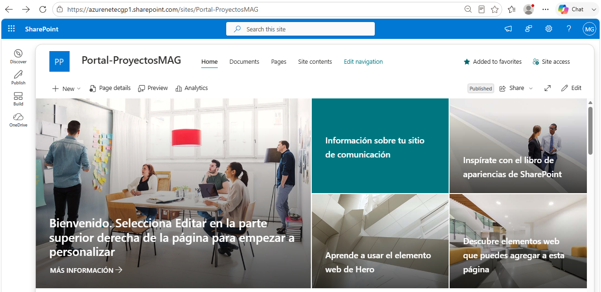

## Paso 2. Verificar la lista Proyectos

En el sitio, abre la lista Proyectos. Debe estar disponible para realizar las pruebas de las extensiones del laboratorio.

Comprueba que la lista contenga, como mínimo, las columnas Title, Owner, Status y Description. Estas columnas se utilizarán durante las pruebas del Command Set y del panel de detalles.

## Paso 3. Verificar los datos de prueba

Comprueba que la lista contenga registros de prueba suficientes para seleccionar elementos y comprobar las extensiones. Puedes utilizar los siguientes registros de referencia:

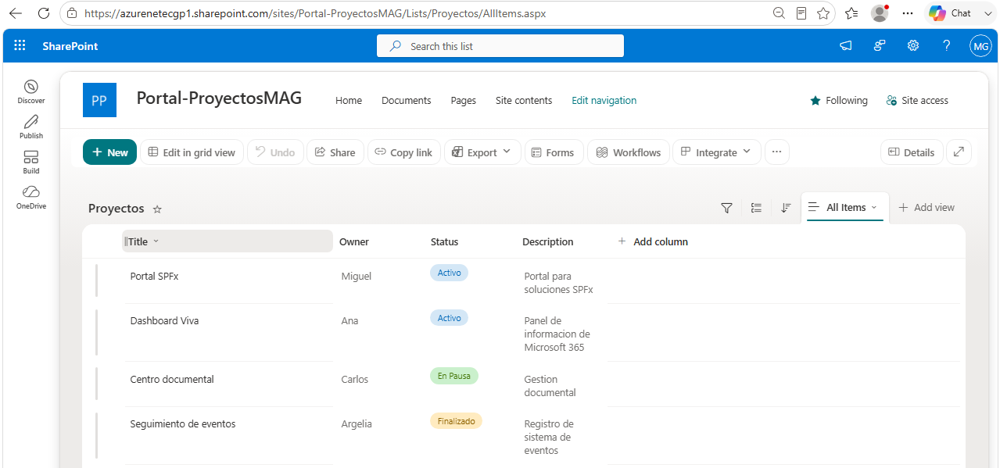

# Actividad 2. Crear el Application Customizer

Crear una extensión que inserte un mensaje global en SharePoint.

## Paso 1. Crear el proyecto

Desde PowerShell, crea la carpeta de la solución, reemplazando XXX por tus iniciales, y cámbiate en ella:

```
mkdir C:\SPFx\M4-Extensiones\ApplicationCustomizerXXX 
cd C:\SPFx\M4-Extensiones\ApplicationCustomizerXXX
yo @microsoft/sharepoint
```

Cuando aparezcan las preguntas del generador, selecciona una extensión y después el tipo Application Customizer.

Nombre de la solución: ApplicationCustomizerXXX

• Extension

• Application Customizer

Nombre: PortalBannerXXX

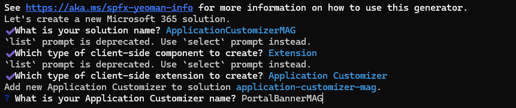

## Paso 2. Abrir el proyecto

```
code .
```

## Paso 3. Identificar el archivo principal

El generador crea una clase TypeScript que representa la extensión Application Customizer. En este archivo se implementará el código que SharePoint ejecutará cuando cargue la extensión.

En el Explorador de VS Code, localiza el archivo generado dentro de la carpeta de la extensión. La ruta y el nombre deben corresponder al identificador utilizado por el generador.

## Paso 4. Reemplaza el archivo principal

Edita: src/extensions/portalBannerXXX/PortalBannerXXXApplicationCustomizer.ts

Selecciona todo su contenido, elimínalo y reemplázalo por el código completo que se proporciona a continuación.

El archivo completo incluye la definición de las propiedades:

```
export interface IPortalBannerXXXProperties {
  TopMessage: string;
  BottomMessage: string;
}
```

Estas propiedades permiten que los mensajes de la extensión se proporcionen mediante su configuración, en lugar de quedar definidos únicamente dentro de la lógica del componente.


Reemplaza el contenido completo del archivo por el siguiente código. En esta primera versión, la barra y el footer se insertan directamente como elementos HTML.

Archivo: src/extensions/portalBannerXXX/PortalBannerXXXApplicationCustomizer.ts

```
import {
  BaseApplicationCustomizer
} from '@microsoft/sp-application-base';

export interface IPortalBannerXXXProperties {
  TopMessage: string;
  BottomMessage: string;
}

export default class PortalBannerXXX
  extends BaseApplicationCustomizer<IPortalBannerXXXProperties> {

  private _topContainer: HTMLDivElement | undefined;
  private _bottomContainer: HTMLDivElement | undefined;

  public onInit(): Promise<void> {
    const topMessage: string =
      this.properties.TopMessage ||
      'Bienvenido al Portal-ProyectosXXX';

    const bottomMessage: string =
Archivo que se va a modificar: src\extensions\portalBannerXXX\PortalBannerXXXApplicationCustomizer.ts
      'Información corporativa';

    this._topContainer =
      document.createElement('div');

    this._topContainer.innerText = topMessage;
    this._topContainer.style.padding = '10px';
    this._topContainer.style.background = '#0078d4';
    this._topContainer.style.color = 'white';
    this._topContainer.style.textAlign = 'center';

    document.body.insertBefore(
      this._topContainer,
      document.body.firstChild
    );

    this._bottomContainer =
      document.createElement('div');

    this._bottomContainer.innerText = bottomMessage;
    this._bottomContainer.style.padding = '8px';
    this._bottomContainer.style.background = '#333';
    this._bottomContainer.style.color = 'white';
    this._bottomContainer.style.textAlign = 'center';

    document.body.appendChild(
      this._bottomContainer
    );

    return Promise.resolve();
  }

  public onDispose(): void {
    if (this._topContainer) {
      this._topContainer.remove();
      this._topContainer = undefined;
    }

    if (this._bottomContainer) {
      this._bottomContainer.remove();
      this._bottomContainer = undefined;
    }
  }
}
```

La función onInit se ejecuta cuando SharePoint inicializa la extensión. Los dos contenedores se guardan como propiedades de la clase para poder eliminarlos posteriormente en onDispose.

Con esto, ll proyecto contiene el Application Customizer PortalBannerXXX y su código puede crear un mensaje superior y un footer global.

Editar configuración

Edita el archivo config\serve.json. En serveConfigurations > default > pageUrl, indica la URL de la página principal de tu sitio. En customActions, conserva el GUID que generó Yeoman y comprueba que location sea ClientSideExtension.ApplicationCustomizer.

```
{
  "$schema": "https://developer.microsoft.com/json-schemas/spfx-build/serve.schema.json",
  "port": 4321,
  "https": true,
  "serveConfigurations": {
    "default": {
      "pageUrl": "https://azurenetecgp1.sharepoint.com/sites/Portal-ProyectosXXX/SitePages/Home.aspx",
      "customActions": {
        "GUID-GENERADO-POR-YEOMAN": {
          "location": "ClientSideExtension.ApplicationCustomizer",
          "properties": {
            "TopMessage": "Bienvenido al Portal-ProyectosXXX",
            "BottomMessage": "Información corporativa"
          }
        }
      }
    }
  }
}
```

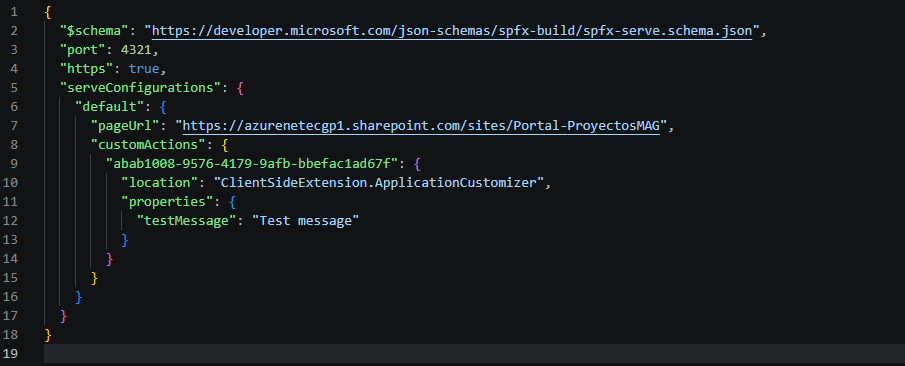

Desde tu portal de SharePoint, ubícate en la página principal.

Desde la terminal, compila y ejecuta con heft

```
heft build
heft start

```

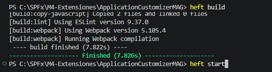

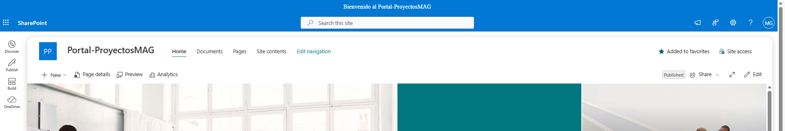

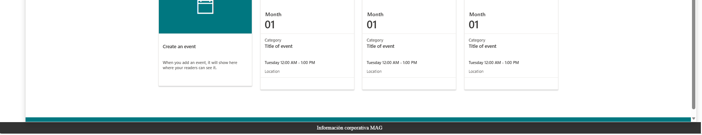

# Actividad 3. Integrar Fluent UI en el Application Customizer

Sustituir el mensaje HTML superior por un componente MessageBar de Fluent UI y conservar el footer global implementado en la actividad anterior.

En la actividad anterior se creó el Application Customizer y se comprobó su funcionamiento como extensión de página. Ahora se modificará su implementación para utilizar un componente de Fluent UI en lugar de generar directamente el mensaje superior mediante HTML.

## Paso 1. Reemplazar el archivo completo

```
Archivo: src/extensions/portalBannerXXX/PortalBannerXXXApplicationCustomizer.ts
```

Reemplaza el contenido completo por:

```
Archivo: src/extensions/portalBannerXXX/PortalBannerXXXApplicationCustomizer.ts
import * as React from 'react';
import * as ReactDom from 'react-dom';
import {
  BaseApplicationCustomizer
} from '@microsoft/sp-application-base';
import * as React from 'react';
import * as ReactDom from 'react-dom';

import {
  BaseApplicationCustomizer
} from '@microsoft/sp-application-base';

import {
Archivo que se va a modificar: src\extensions\portalBannerXXX\PortalBannerXXXApplicationCustomizer.ts
  MessageBarType


export interface IPortalBannerXXXProperties {
  TopMessage: string;
  BottomMessage: string;
}


  private _bottomContainer: HTMLDivElement | undefined;

  public onInit(): Promise<void> {
    const topMessage: string =
      this.properties.TopMessage ||
      'Bienvenido al Portal-ProyectosXXX';

    const bottomMessage: string =
      this.properties.BottomMessage ||
      'Información corporativa';

    this._topContainer =
      document.createElement('div');

    ReactDom.render(
      React.createElement(
        MessageBar,
        {
          messageBarType: MessageBarType.info
        },
        topMessage
      ),
      this._topContainer
    );

    document.body.insertBefore(
      this._topContainer,
      document.body.firstChild
    );

    this._bottomContainer =
      document.createElement('div');

    this._bottomContainer.innerText = bottomMessage;
    this._bottomContainer.style.padding = '8px';
    this._bottomContainer.style.background = '#333';
    this._bottomContainer.style.color = 'white';
    this._bottomContainer.style.textAlign = 'center';

    document.body.appendChild(
      this._bottomContainer
    );

    return Promise.resolve();
  }

  public onDispose(): void {
    if (this._topContainer) {
      ReactDom.unmountComponentAtNode(
        this._topContainer
      );

      this._topContainer.remove();
      this._topContainer = undefined;
    }

    if (this._bottomContainer) {
      this._bottomContainer.remove();
      this._bottomContainer = undefined;
    }
  }
}
```

El componente MessageBar se crea mediante React.createElement porque el Application Customizer trabaja con una clase SPFx y un contenedor HTML creado dinámicamente. ReactDom.render monta el componente dentro de ese contenedor.

## Paso 2. Verificar las dependencias de React y Fluent UI

El código de esta actividad utiliza React, React DOM y Fluent UI. En la terminal del proyecto, comprueba que las dependencias estén disponibles:

```
npm list react react-dom @fluentui/react
```

Para SPFx 1.23.2, React y React DOM deben utilizar la versión 17.0.1. Si alguna dependencia de React no aparece, instala las versiones compatibles con el siguiente comando:

## Paso 2. Verificar las dependencias de React y Fluent UI

El código de esta actividad utiliza React, React DOM y Fluent UI. En la terminal del proyecto, comprueba las versiones instaladas:

```
npm list react react-dom @fluentui/react
```

En SPFx 1.23.2, React y React DOM deben quedar en la versión 17.0.1. Si alguna aparece en otra versión, corrígela antes de continuar:

```
npm install react@17.0.1 react-dom@17.0.1 --save-exact
```

Vuelve a ejecutar la comprobación:

```
npm list react react-dom @fluentui/react
```

Si @fluentui/react no aparece, instálalo en el proyecto y vuelve a comprobar las dependencias:

```
npm install @fluentui/react --save-exact
```

No continúes con la integración de Fluent UI hasta comprobar que React y React DOM muestran 17.0.1.


## Paso 3. Configurar la ejecución de prueba

Archivo que se va a modificar: config\serve.json

```
        "GUID-GENERADO-POR-YEOMAN": {
          "location": "ClientSideExtension.ApplicationCustomizer",
          "properties": {
            "TopMessage": "Bienvenido al Portal-ProyectosXXX",
            "BottomMessage": "Extensión SPFx en ejecución"
          }
        }
      }
    }
  }
}
```

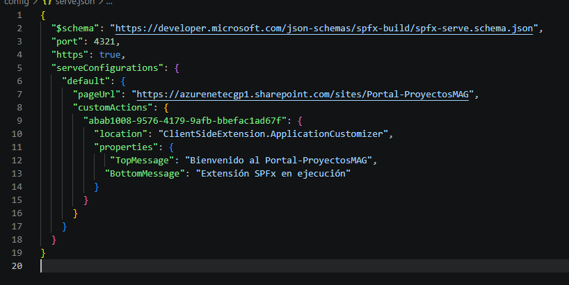

La propiedad TopMessage se utiliza como contenido del MessageBar y BottomMessage conserva el mensaje del footer. Si una propiedad no tiene valor, se utiliza el texto predeterminado.

Resultado esperado. Al cargar una página de SharePoint aparece el MessageBar superior con el mensaje configurado y el footer al final de la página. La extensión puede retirar ambos elementos cuando se destruye.

# Actividad 4. Crear el Command Set

Agregar comandos personalizados a los elementos seleccionados de la lista Proyectos: Aprobar, Rechazar y Ver detalles.

## Paso 1. Crear el proyecto

Desde PowerShell, cambia a la carpeta de trabajo del laboratorio y ejecuta los siguientes comandos para crear la solución y entrar en ella:

```
cd C:\SPFx\M4-Extensiones
mkdir CommandSetXXX
cd CommandSetXXX
yo @microsoft/sharepoint
```

Cuando se inicie el generador de SharePoint Framework, responde las preguntas con los siguientes valores:

1. What is your solution name? → CommandSetXXX

2. Which type of client-side component to create? → Extension

3. Which type of client-side extension to create? → ListView Command Set

4. What is your ListView Command Set name? → ProjectCommandSetXXX

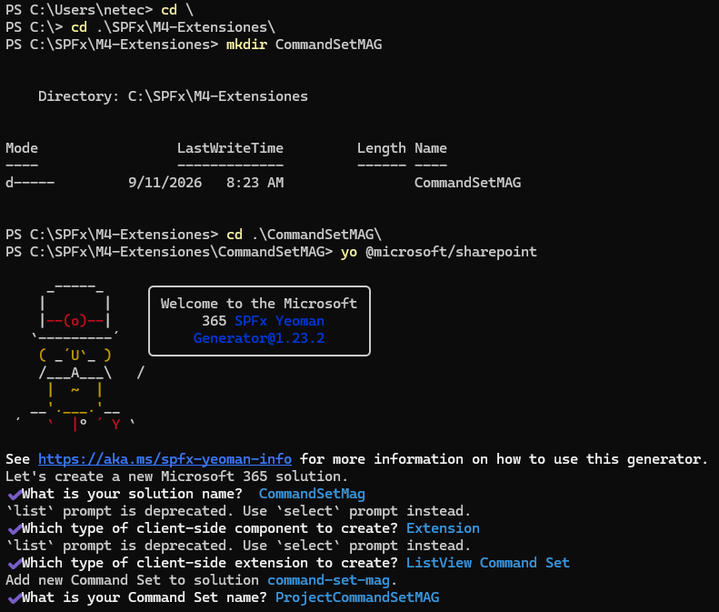

## Paso 2. Abrir el proyecto y verificar dependencias

Cuando termine el generador, abre el proyecto en Visual Studio Code:

```
code .
```

En la terminal del proyecto, comprueba que estén disponibles React, React DOM, Fluent UI y el paquete de diálogos que utiliza el Command Set:

```
npm list react react-dom @fluentui/react @microsoft/sp-dialog
```

Si React o React DOM no aparecen con la versión 17.0.1, instala las versiones exactas y vuelve a comprobar:

```
npm install react@17.0.1 react-dom@17.0.1 --save-exact
```

Si @microsoft/sp-dialog no está disponible, instálalo con la versión del framework:

```
npm install @microsoft/sp-dialog@1.23.2 --save-exact
```

Si @fluentui/react no está disponible, instálalo y vuelve a ejecutar npm list:

```
npm install @fluentui/react --save-exact
```

## Paso 3. Identificar la clase

```
Archivo que se va a revisar: src\extensions\projectCommandSetXXX\ProjectCommandSetXXXCommandSet.ts
```

La clase extiende BaseListViewCommandSet. Yeoman genera el archivo principal con el sufijo CommandSet. Por ejemplo, para la solución CommandSetMAG, el archivo es src\extensions\projectCommandSetMag\ProjectCommandSetMagCommandSet.ts y el manifiesto es ProjectCommandSetMagCommandSet.manifest.json. No renombres manualmente los archivos generados.

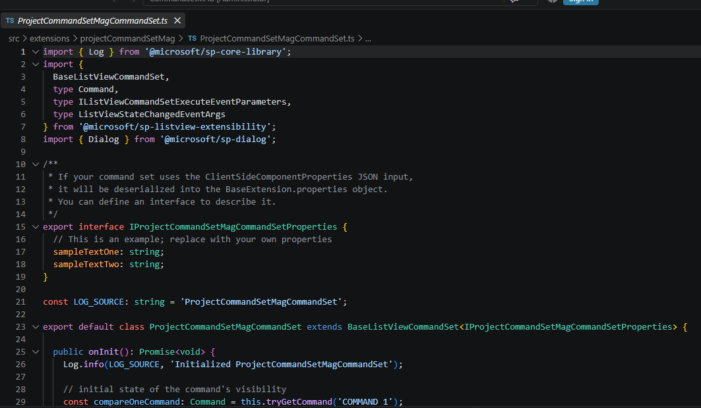

## Paso 4. Definir los identificadores

Abre el manifiesto del Command Set y localiza la propiedad items. Este archivo es donde se declaran los identificadores que SharePoint utilizará para cada comando:

No cambies el valor de la propiedad id que generó Yeoman. Ese GUID identifica de forma única la extensión. En este paso se modifica la propiedad items y se conserva el valor de alias generado por Yeoman.

```
Archivo que se va a modificar: src\extensions\projectCommandSetXXX\ProjectCommandSetXXXCommandSet.manifest.json
{
  "$schema": "https://developer.microsoft.com/json-schemas/spfx/command-set-extension.manifest.schema.json",
  "id": "GUID-GENERADO-POR-YEOMAN",
  "alias": "ProjectCommandSetXXXCommandSet",
  "componentType": "Extension",
  "extensionType": "ListViewCommandSet",
  "version": "*",
  "manifestVersion": 2,
  "requiresCustomScript": false,
  "items": {
    "COMMAND_APPROVE_XXX": {
      "title": {
        "default": "Aprobar"
      },
      "type": "command"
    },
    "COMMAND_REJECT_XXX": {
      "title": {
        "default": "Rechazar"
      },
      "type": "command"
    },
    "COMMAND_DETAILS_XXX": {
      "title": {
        "default": "Ver detalles"
      },
      "type": "command"
    }
  }
}

```

Los mismos tres identificadores deben aparecer exactamente iguales en ProjectCommandSetXXXCommandSet.ts, tanto en tryGetCommand() como en los casos de onExecute(). No cambies un identificador en un archivo sin cambiarlo también en el otro.

Nota sobre GUID. El valor GUID-GENERADO-POR-YEOMAN es solo un marcador en este documento. Conserva el GUID real que Yeoman creó en el manifest y utiliza exactamente ese mismo valor en config\serve.json. No generes ni inventes otro GUID.

## Paso 5. Reemplazar la clase completa

Reemplaza el contenido completo del archivo por la versión final mostrada a continuación.

```
Archivo que se va a modificar: src\extensions\projectCommandSetXXX\ProjectCommandSetXXXCommandSet.ts
import {
  BaseListViewCommandSet,
  IListViewCommandSetExecuteEventParameters,
  IListViewCommandSetListViewUpdatedParameters
} from '@microsoft/sp-listview-extensibility';

import { Dialog } from '@microsoft/sp-dialog';

export interface IProjectCommandSetXXXProperties {
  Title: string;
}

export default class ProjectCommandSetXXXCommandSet
  extends BaseListViewCommandSet<IProjectCommandSetXXXProperties> {

  public onInit(): Promise<void> {
    return Promise.resolve();
  }

  public onListViewUpdated(
    event: IListViewCommandSetListViewUpdatedParameters
  ): void {
    const hasSelection: boolean =
      event.selectedRows.length > 0;

    const approveCommand =
      this.tryGetCommand('COMMAND_APPROVE_XXX');
    const rejectCommand =
      this.tryGetCommand('COMMAND_REJECT_XXX');
    const detailsCommand =
      this.tryGetCommand('COMMAND_DETAILS_XXX');

    if (approveCommand) {
      approveCommand.visible = hasSelection;
    }
    if (rejectCommand) {
      rejectCommand.visible = hasSelection;
    }
    if (detailsCommand) {
      detailsCommand.visible = hasSelection;
    }
  }

  public onExecute(
    event: IListViewCommandSetExecuteEventParameters
  ): void {
    if (event.selectedRows.length === 0) {
      return;
    }

    switch (event.itemId) {
      case 'COMMAND_APPROVE_XXX':
        void Dialog.alert('Elemento aprobado');
        break;

      case 'COMMAND_REJECT_XXX':
        void Dialog.alert('Elemento rechazado');
        break;

      case 'COMMAND_DETAILS_XXX':
        void Dialog.alert('Ver detalles seleccionado');
        break;

      default:
        throw new Error(
          `Comando no reconocido: ${event.itemId}`
        );
    }
  }

  public onDispose(): void {
    // No existen recursos adicionales que liberar.
  }
}


```

onListViewUpdated controla la visibilidad de los comandos según exista una selección. onExecute identifica el comando mediante event.itemId. En esta primera versión, Aprobar, Rechazar y Ver detalles muestran una confirmación para comprobar que el Command Set se está ejecutando correctamente.

Resultado esperado. Los tres comandos aparecen cuando existe un elemento seleccionado. Aprobar y Rechazar muestran una confirmación y Ver detalles muestra el mensaje provisional.

# Actividad 5. Trabajar con los datos del elemento seleccionado

Modificar el Command Set para leer Title, Owner y Status del primer elemento seleccionado. El cambio se realiza sobre el archivo completo.

## Paso 1. Reemplazar la clase completa

La versión final obtiene event.selectedRows[0] y consulta los campos mediante getValueByName(), que recibe el nombre interno del campo. En este paso Ver detalles muestra esos valores en un diálogo.

```
Archivo que se va a modificar: src\extensions\projectCommandSetXXX\ProjectCommandSetXXXCommandSet.ts
import {
  BaseListViewCommandSet,
  IListViewCommandSetExecuteEventParameters,
  IListViewCommandSetListViewUpdatedParameters
} from '@microsoft/sp-listview-extensibility';

import { Dialog } from '@microsoft/sp-dialog';

export interface IProjectCommandSetXXXProperties {
  Title: string;
}

export default class ProjectCommandSetXXXCommandSet
  extends BaseListViewCommandSet<IProjectCommandSetXXXProperties> {

  public onInit(): Promise<void> {
    return Promise.resolve();
  }

  public onListViewUpdated(
    event: IListViewCommandSetListViewUpdatedParameters
  ): void {
    const hasSelection: boolean =
      event.selectedRows.length > 0;

    const approveCommand =
      this.tryGetCommand('COMMAND_APPROVE_XXX');

    const rejectCommand =
      this.tryGetCommand('COMMAND_REJECT_XXX');

    const detailsCommand =
      this.tryGetCommand('COMMAND_DETAILS_XXX');

    if (approveCommand) {
      approveCommand.visible = hasSelection;
    }

    if (rejectCommand) {
      rejectCommand.visible = hasSelection;
    }

    if (detailsCommand) {
      detailsCommand.visible = hasSelection;
    }
  }

  public onExecute(
    event: IListViewCommandSetExecuteEventParameters
  ): void {
    if (event.selectedRows.length === 0) {
      return;
    }

    const selectedItem = event.selectedRows[0];

    switch (event.itemId) {
      case 'COMMAND_APPROVE_XXX':
        void Dialog.alert('Elemento aprobado');
        break;

      case 'COMMAND_REJECT_XXX':
        void Dialog.alert('Elemento rechazado');
        break;

      case 'COMMAND_DETAILS_XXX': {
    const title = selectedItem.getValueByName('Title');
    const owner = selectedItem.getValueByName('Owner');
    const status = selectedItem.getValueByName('Status');

```

        void Dialog.alert(

          `Proyecto: ${title}\nPropietario: ${owner}\nEstado: ${status}`

```
        );
        break;
      }

      default:
        throw new Error(
          `Comando no reconocido: ${event.itemId}`
        );
    }
  }

  public onDispose(): void {
    // No existen recursos adicionales que liberar.
  }
}
```

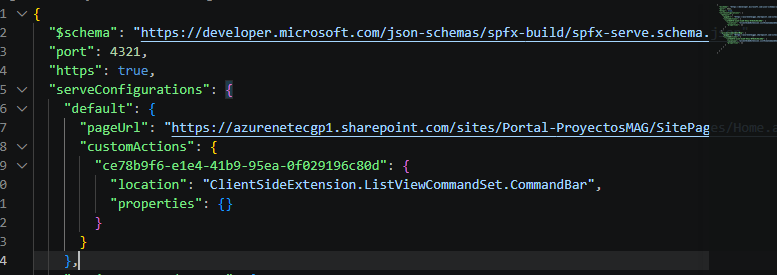

La selección se valida antes de acceder a event.selectedRows[0]. Además, onListViewUpdated mantiene ocultos los comandos cuando no existe selección. Para consultar un campo por su nombre interno se utiliza getValueByName().


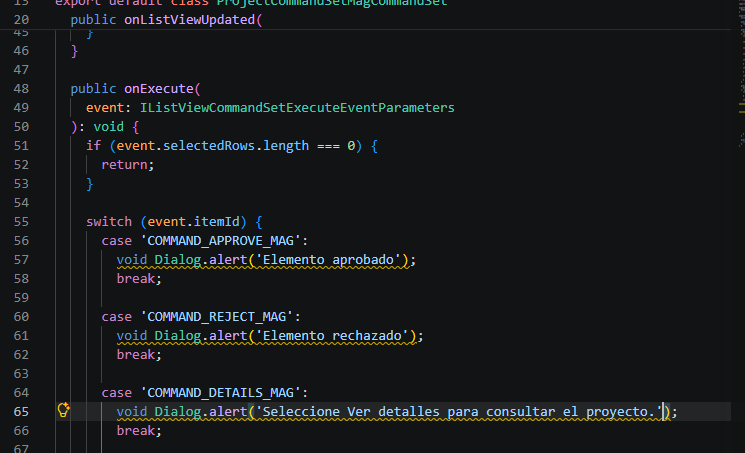

## Paso 2. Probar la lectura de datos

El Command Set debe probarse directamente sobre la vista de la lista Proyectos. Para evitar una configuración incompleta, reemplaza el contenido completo de config\serve.json por el siguiente archivo.

Archivo que se va a modificar: config\serve.json

```
{
  "$schema": "https://developer.microsoft.com/json-schemas/spfx-build/spfx-serve.schema.json",
  "port": 4321,
  "https": true,
  "serveConfigurations": {
    "default": {
      "pageUrl": "https://azurenetecgp1.sharepoint.com/sites/Portal-ProyectosXXX/Lists/Proyectos/AllItems.aspx",
      "customActions": {
        "GUID-GENERADO-POR-YEOMAN": {
          "location": "ClientSideExtension.ListViewCommandSet.CommandBar",
          "properties": {}
        }
      }
    }
  }
}


```

Desde la terminal del proyecto CommandSetXXX, ejecuta:

```
heft build
heft start


```

Como el componente aún no está compilado y publicado, la prueba se realiza en modo depuración sobre la vista de la lista Proyectos.

https://azurenetecgp1.sharepoint.com/sites/Portal-ProyectosXXX/Lists/Proyectos/AllItems.aspx?loadSPFX=true&debugManifestsFile=https://localhost:4321/temp/build/manifests.js&customActions={"TU_ID_GENERADO":{"location":"ClientSideExtension.ListViewCommandSet.CommandBar","properties":{}}}Abre una URL con esta estructura. Sustituye TU_GUID_GENERADO por el GUID real del manifest y codifica los parámetros JSON si el navegador lo requiere:

```
https://azurenetecgp1.sharepoint.com/sites/Portal-ProyectosXXX/Lists/Proyectos/AllItems.aspx?loadSPFX=true&debugManifestsFile=https://localhost:4321/temp/build/manifests.js&customActions={"TU_GUID_GENERADO":{"location":"ClientSideExtension.ListViewCommandSet.CommandBar","properties":{}}}
```

La URL utiliza loadSPFX=true y debugManifestsFile=https://localhost:4321/temp/build/manifests.js para cargar la extensión desde el entorno local.

Esto le dice a SharePoint, esencialmente:

"Carga SPFx desde el entorno de desarrollo y utiliza los manifests que estoy sirviendo desde mi máquina local."

El parámetro customActions registra específicamente este Command Set en la vista de la lista.

"Registra este Command Set en esta lista."

Por eso no necesitamos tener la solución compilada, empaquetada e instalada en SharePoint para hacer esta prueba.

Cuando heft start esté ejecutándose, abre la vista Proyectos configurada para las pruebas.

1. Selecciona un elemento de la lista.

2. Abre el menú de comandos.

3. Selecciona Ver detalles.

4. Comprueba que el diálogo muestre los valores correspondientes a Title, Owner y Status del elemento seleccionado.

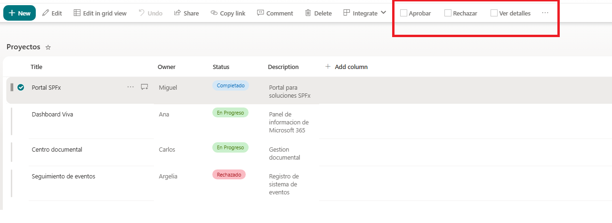

Resultado esperado. Para el elemento Portal SPFx, el diálogo muestra Title: Portal SPFx, Owner: Miguel y Status: Completado. Al seleccionar otro proyecto, los valores deben cambiar.


# Actividad 6. Agrupar comandos

Configurar los comandos relacionados bajo un mismo grupo de acciones.

## Paso 1. Revisar el manifiesto

Abre nuevamente el manifiesto del Command Set.

En esta actividad se reemplaza el objeto items completo para utilizar la agrupación disponible en SPFx 1.23 y posteriores. El grupo y los comandos incluyen iconos porque forman parte de la configuración que se validó en el entorno del laboratorio.

• COMMAND_APPROVE_XXX

• COMMAND_REJECT_XXX

• COMMAND_DETAILS_XXX

## Paso 2. Reemplazar el manifest completo

Para evitar errores de llaves, comas o asociaciones entre comandos y grupo, reemplaza el contenido completo del manifest por el archivo final mostrado a continuación.

```
Archivo que se va a modificar: src\extensions\projectCommandSetXXX\ProjectCommandSetXXXCommandSet.manifest.json
```

Archivo completo al finalizar el Paso 2

```
{
  "$schema": "https://developer.microsoft.com/json-schemas/spfx/command-set-extension.manifest.schema.json",
  "id": "GUID-GENERADO-POR-YEOMAN",
  "alias": "ProjectCommandSetXXXCommandSet",
  "componentType": "Extension",
  "extensionType": "ListViewCommandSet",
  "version": "*",
  "manifestVersion": 2,
  "requiresCustomScript": false,
  "items": {
    "GROUP_PROJECT_XXX": {
      "title": { "default": "Acciones del proyecto" },
      "iconImageUrl": "data:image/svg+xml,%3Csvg xmlns='http://www.w3.org/2000/svg' viewBox='0 0 2048 2048'%3E%3Cpath d='M1920 640q27 0 45 19t19 45v1152q0 26-19 45t-45 19H128q-26 0-45-19t-19-45V384q0-27 19-45t45-19h768l256 320h768z' fill='%23333333'%3E%3C/path%3E%3C/svg%3E",
      "type": "group"
    },
    "COMMAND_APPROVE_XXX": {
      "title": { "default": "Aprobar" },
      "iconImageUrl": "data:image/svg+xml,%3Csvg xmlns='http://www.w3.org/2000/svg' viewBox='0 0 2048 2048'%3E%3Cpath d='M1024 0q141 0 272 37t240 104 207 160 160 208 103 239 38 272q0 141-37 272t-104 240-160 207-208 160-239 103-272 38q-141 0-272-37t-240-104-207-160-160-208-103-239-38-272q0-141 37-272t104-240 160-207 208-160T752 37t272-37zm128 576H896v384H512v256h384v384h256v-384h384V960h-384V576z' fill='%23333333'%3E%3C/path%3E%3C/svg%3E",
      "type": "command",
      "group": "GROUP_PROJECT_XXX"
    },
    "COMMAND_REJECT_XXX": {
      "title": { "default": "Rechazar" },
      "iconImageUrl": "data:image/svg+xml,%3Csvg xmlns='http://www.w3.org/2000/svg' viewBox='0 0 2048 2048'%3E%3Cpath d='M1024 0q141 0 272 37t240 104 207 160 160 208 103 239 38 272q0 141-37 272t-104 240-160 207-208 160-239 103-272 38q-141 0-272-37t-240-104-207-160-160-208-103-239-38-272q0-141 37-272t104-240 160-207 208-160T752 37t272-37zm-256 576h512v256H768V576zm0 640h512v256H768v-256z' fill='%23333333'%3E%3C/path%3E%3C/svg%3E",
      "type": "command",
      "group": "GROUP_PROJECT_XXX"
    },
    "COMMAND_DETAILS_XXX": {
      "title": { "default": "Ver detalles" },
      "iconImageUrl": "data:image/svg+xml,%3Csvg xmlns='http://www.w3.org/2000/svg' viewBox='0 0 2048 2048'%3E%3Cpath d='M1024 0q141 0 272 37t240 104 207 160 160 208 103 239 38 272q0 141-37 272t-104 240-160 207-208 160-239 103-272 38q-141 0-272-37t-240-104-207-160-160-208-103-239-38-272q0-141 37-272t104-240 160-207 208-160T752 37t272-37zm-128 512h256v256H896V512zm0 384h256v640H896V896z' fill='%23333333'%3E%3C/path%3E%3C/svg%3E",
      "type": "command",
      "group": "GROUP_PROJECT_XXX"
    }
  }
}


```

GROUP_PROJECT_XXX es un identificador nuevo y solo se utiliza para el grupo. Los tres comandos conservan sus identificadores originales porque el código TypeScript depende de ellos. El GUID de id sigue siendo el generado por Yeoman.

Guarda los cambios.

## Paso 3. Probar la agrupación

Vuelve a ejecutar heft start si lo habías detenido. En la vista Proyectos, selecciona un elemento y comprueba que los tres comandos aparezcan agrupados bajo Acciones del proyecto.

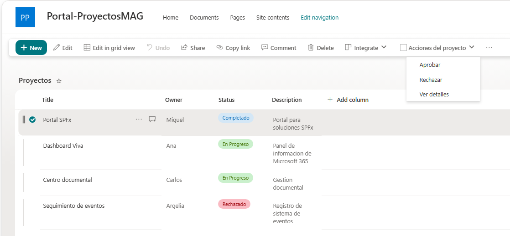

Nota. La agrupación de ListView Command Sets está disponible a partir de SPFx 1.23. La configuración de este paso corresponde a SPFx 1.23.2.

Resultado esperado. Los comandos Aprobar, Rechazar y Ver detalles aparecen agrupados bajo Acciones del proyecto cuando existe un elemento seleccionado.

# Actividad 7. Crear el panel de detalles

Mostrar la información del proyecto seleccionado en un panel lateral mediante Fluent UI.

## Paso 1. Crear el componente

Dentro de src\extensions\projectCommandSetXXX crea una carpeta llamada:

components

```
Archivo que se va a crear: src\extensions\projectCommandSetXXX\components\DetailsPanelXXX.tsx

```

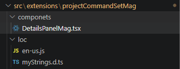

Crea el archivo y reemplaza su contenido completo por el siguiente código. No agregues código al Command Set principal todavía; la conexión se realizará en la Actividad 8.

```
import * as React from 'react';
import { Panel, Text } from '@fluentui/react';

export interface IDetailsPanelXXXProps {
  item: any;
  onDismiss: () => void;
}

export default function DetailsPanelXXX(
  props: IDetailsPanelXXXProps
): React.ReactElement {
  const title = props.item.getValueByName('Title');
  const owner = props.item.getValueByName('Owner');
  const status = props.item.getValueByName('Status');

  return (
    <Panel
      isOpen={true}
      onDismiss={props.onDismiss}
      headerText="Detalles del proyecto"
    >
      <Text>Nombre: {title}</Text>
      <br />
      <Text>Propietario: {owner}</Text>
      <br />
      <Text>Estado: {status}</Text>
    </Panel>
  );
}


```

El componente recibe el elemento seleccionado y una función onDismiss. El Panel se abre con isOpen=true. Para obtener los datos se utiliza getValueByName() con los nombres internos Title, Owner y Status. La captura que acompaña esta actividad se conserva como referencia visual de la estructura del archivo; no copies el uso de getValue() que aparece en ella. El código final que debe copiarse es el bloque anterior y utiliza getValueByName().

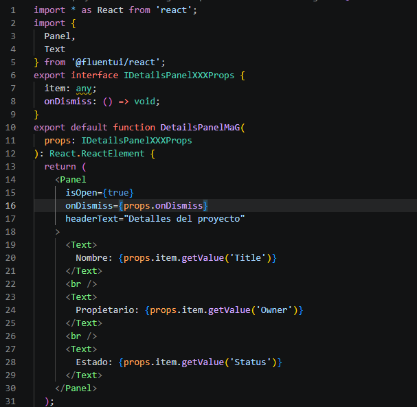

# Actividad 8. Conectar Ver detalles con el panel

Conectar la selección de un elemento, el comando Ver detalles y el componente DetailsPanelXXX. En este paso se reemplaza el archivo completo del Command Set.

## Paso 1. Reemplazar la clase completa

La clase final importa DetailsPanelXXX, mantiene la visibilidad de los comandos según exista una selección, crea un contenedor HTML, monta el panel con ReactDom.render() y lo limpia con closeDetails(). El caso COMMAND_DETAILS_XXX pasa el primer elemento seleccionado al panel.

```
Archivo que se va a modificar: src\extensions\projectCommandSetXXX\ProjectCommandSetXXXCommandSet.ts
import * as React from 'react';
import * as ReactDom from 'react-dom';
import {
  BaseListViewCommandSet,
  IListViewCommandSetExecuteEventParameters,
  IListViewCommandSetListViewUpdatedParameters
} from '@microsoft/sp-listview-extensibility';
import { Dialog } from '@microsoft/sp-dialog';
import DetailsPanelXXX from './components/DetailsPanelXXX';

export interface IProjectCommandSetXXXProperties {
  Title: string;
}

export default class ProjectCommandSetXXXCommandSet
  extends BaseListViewCommandSet<IProjectCommandSetXXXProperties> {
  private _detailsContainer: HTMLDivElement | undefined;

  public onInit(): Promise<void> {
    return Promise.resolve();
  }

  public onListViewUpdated(
    event: IListViewCommandSetListViewUpdatedParameters
  ): void {
    const hasSelection = event.selectedRows.length > 0;
    const approveCommand = this.tryGetCommand('COMMAND_APPROVE_XXX');
    const rejectCommand = this.tryGetCommand('COMMAND_REJECT_XXX');
    const detailsCommand = this.tryGetCommand('COMMAND_DETAILS_XXX');
    if (approveCommand) { approveCommand.visible = hasSelection; }
    if (rejectCommand) { rejectCommand.visible = hasSelection; }
    if (detailsCommand) { detailsCommand.visible = hasSelection; }
  }

  public onExecute(
    event: IListViewCommandSetExecuteEventParameters
  ): void {
    if (event.selectedRows.length === 0) { return; }
    switch (event.itemId) {
      case 'COMMAND_APPROVE_XXX':
        void Dialog.alert('Elemento aprobado');
        break;
      case 'COMMAND_REJECT_XXX':
        void Dialog.alert('Elemento rechazado');
        break;
      case 'COMMAND_DETAILS_XXX':
        this.showDetails(event.selectedRows[0]);
        break;
      default:
        throw new Error(`Comando no reconocido: ${event.itemId}`);
    }
  }

  private showDetails(item: any): void {
    this.closeDetails();
    this._detailsContainer = document.createElement('div');
    document.body.appendChild(this._detailsContainer);
    ReactDom.render(
      React.createElement(DetailsPanelXXX, {
        item,
        onDismiss: () => this.closeDetails()
      }),
      this._detailsContainer
    );
  }

  private closeDetails(): void {
    if (this._detailsContainer) {
      ReactDom.unmountComponentAtNode(this._detailsContainer);
      this._detailsContainer.remove();
      this._detailsContainer = undefined;
    }
  }

  public onDispose(): void {
    this.closeDetails();
  }
}


```

showDetails() crea un contenedor HTML, lo agrega al body y monta DetailsPanelXXX mediante ReactDom.render(). Antes de crear otro contenedor llama a closeDetails().


La función onDismiss del panel llama a closeDetails(). Esta función desmonta el componente React, elimina el contenedor y evita dejar elementos residuales. onDispose() también ejecuta closeDetails() cuando la extensión se destruye.

La interacción completa es:

Usuario selecciona proyecto → Ver detalles → onExecute() → selectedRows[0] → DetailsPanelXXX → Fluent UI Panel

## Paso 2. Validar

Selecciona Portal SPFx en Proyectos. Abre Acciones del proyecto y selecciona Ver detalles.

Debe aparecer:

• Detalles del proyecto

• Nombre: Portal SPFx

• Propietario: Miguel

• Estado: Completado

Resultado esperado. Ver detalles abre el panel lateral con la información del elemento seleccionado y el panel puede cerrarse sin dejar el contenedor en la página.

# Actividad 9. Crear el Navigation Customizer

Agregar accesos rápidos a la navegación de SharePoint mediante un Application Customizer.

## Paso 1. Crear el proyecto

Desde PowerShell, cambia a la carpeta de trabajo del laboratorio y ejecuta los siguientes comandos para crear la solución y entrar en ella:

```
cd C:\SPFx\M4-Extensiones
mkdir NavigationCustomizerXXX
cd NavigationCustomizerXXX
yo @microsoft/sharepoint
```

Cuando se inicie el generador de SharePoint Framework, responde las preguntas con los siguientes valores:

1. What is your solution name? → NavigationCustomizerXXX

2. Which type of client-side component to create? → Extension

3. Which type of client-side extension to create? → Application Customizer

4. What is your Application Customizer name? → PortalNavigationXXX

## Paso 2. Abrir el proyecto y verificar dependencias

Cuando termine el generador, abre el proyecto en Visual Studio Code:

```
code .
```

En la terminal del proyecto, comprueba las versiones instaladas:

```
npm list react react-dom @fluentui/react
```

Si React o React DOM no aparecen con la versión 17.0.1, instala las versiones exactas:

```
npm install react@17.0.1 react-dom@17.0.1 --save-exact
```

Si @fluentui/react no está disponible, instálalo con:

```
npm install @fluentui/react --save-exact
```

## Paso 3. Definir las propiedades

Las propiedades Links forman parte del archivo completo que se reemplazará en el Paso 5. No modifiques todavía el archivo principal con un fragmento aislado.

## Paso 4. Identificar la navegación

La extensión localizará el contenedor de navegación mediante el selector del DOM que aparece dentro del archivo completo del Paso 5. No copies este selector a otro lugar ni modifiques el archivo por separado.

La extensión no utiliza un tipo de extensión SPFx independiente llamado Navigation Customizer; se implementa como un Application Customizer que modifica el DOM de la navegación. El selector depende de la estructura de la experiencia moderna de SharePoint. Si el selector no devuelve un elemento, la extensión finaliza sin intentar agregar contenido. Esta dependencia del DOM debe considerarse una limitación del ejercicio.

## Paso 5. Reemplazar la clase completa

```
Archivo: src/extensions/portalNavigationXXX/PortalNavigationXXXApplicationCustomizer.ts
```

Reemplaza el contenido completo por el archivo final mostrado al terminar este paso. No agregues por separado los fragmentos de propiedades o del selector; ambos ya forman parte de este archivo.

```
import * as React from 'react';
import * as ReactDom from 'react-dom';

import {
  BaseApplicationCustomizer
} from '@microsoft/sp-application-base';

import {
  Dropdown,
  IDropdownOption
} from '@fluentui/react';

export interface INavigationCustomizerXXXProperties {
  Links: string[];
}

export default class PortalNavigationXXX
  extends BaseApplicationCustomizer<INavigationCustomizerXXXProperties> {

  private _container:
    HTMLDivElement | undefined;

  public onInit(): Promise<void> {
    const navBar =
      document.querySelector(
        '.ms-compositeHeader-nav'
      ) as HTMLElement | null;

    if (!navBar) {
      return Promise.resolve();
    }

    const options: IDropdownOption[] = [
      {
        key: 'teams',
        text: 'Microsoft Teams'
      },
      {
        key: 'planner',
        text: 'Planner'
      },
      {
        key: 'outlook',
        text: 'Outlook'
      }
    ];

    this._container =
      document.createElement('div');

    navBar.appendChild(
      this._container
    );

    ReactDom.render(
      React.createElement(Dropdown, {
        placeholder: 'Aplicaciones',
        options,
        onChange: (
          _event,
          option?: IDropdownOption
        ) => {
          if (!option) {
            return;
          }
          const target =
            this.getTargetUrl(option.key as string);

          if (target) {
            window.location.href = target;
          }
        }
      }),
      this._container
    );

    return Promise.resolve();
  }

  private getTargetUrl(
    key: string
  ): string | undefined {
    const links =
      this.properties.Links || [];

    const index =
      key === 'teams'
        ? 0
        : key === 'planner'
          ? 1
          : key === 'outlook'
            ? 2
            : -1;

    return index >= 0
      ? links[index]
      : undefined;
  }

  public onDispose(): void {
    if (this._container) {
      ReactDom.unmountComponentAtNode(
        this._container
      );
      this._container.remove();
      this._container = undefined;
    }
  }
}
```

La propiedad Links proporciona las direcciones de destino. El código relaciona cada opción con la posición correspondiente del arreglo y navega hacia la dirección seleccionada.

Resultado esperado. La solución PortalNavigationXXX puede localizar la navegación y agregar un contenedor para el menú de aplicaciones.

# Actividad 10. Integrar Fluent UI en el Navigation Customizer

Construir el menú de aplicaciones con Dropdown de Fluent UI.

## Paso 1. Definir las opciones

El menú utiliza tres opciones:

• Microsoft Teams

• Planner

• Outlook

## Paso 2. Renderizar el Dropdown

La clase PortalNavigationXXX crea un contenedor y monta Dropdown dentro de él mediante ReactDom.render. El usuario puede seleccionar una opción y el evento onChange determina el destino.

## Paso 3. Configurar los destinos

Abre config\serve.json y localiza serveConfigurations > default > customActions. En properties, configura Links en el orden Teams, Planner y Outlook. Mantén el GUID que generó Yeoman y sustituye únicamente los valores de Links si el instructor proporciona otras URL. Al finalizar este paso, conserva el archivo completo mostrado a continuación.

```
Archivoconfig\serve.json
{
  "$schema": "https://developer.microsoft.com/json-schemas/spfx-build/serve.schema.json",
  "port": 4321,
  "https": true,
  "serveConfigurations": {
    "default": {
      "pageUrl": "https://azurenetecgp1.sharepoint.com/sites/Portal-ProyectosXXX/SitePages/Home.aspx",
      "customActions": {
        "GUID-GENERADO-POR-YEOMAN": {
          "location": "ClientSideExtension.ApplicationCustomizer",
          "properties": {
            "Links": [
              "https://teams.microsoft.com/",
              "https://planner.cloud.microsoft/",
              "https://outlook.office.com/"
            ]
          }
        }
      }
    }
  }
}
```

No fijes direcciones sensibles o específicas del tenant dentro del código TypeScript cuando puedan configurarse mediante las propiedades de la extensión. Las URL anteriores son ejemplos de prueba; si el instructor proporciona otras, utiliza esas direcciones.

## Paso 4. Validar

En la página de SharePoint debe aparecer el menú Aplicaciones. Al abrirlo deben mostrarse las tres opciones.

Resultado esperado. El menú Aplicaciones aparece en la navegación y contiene Microsoft Teams, Planner y Outlook. La selección dirige al destino configurado.

# Actividad 11. Consultar SharePoint REST y revisar cuándo utilizar Microsoft Graph

Comprobar cómo una extensión puede obtener datos dinámicos de SharePoint y determinar cuándo tendría sentido utilizar Microsoft Graph.

## Paso 1. Probar SharePoint REST

Esta actividad es de comprobación conceptual. No agrega una dependencia de Microsoft Graph a las soluciones del laboratorio. SharePoint REST se prueba directamente en el sitio y Graph solo se considera cuando una necesidad funcional requiere datos que no proporciona la lista o el sitio.

Abre en el navegador la API del sitio de laboratorio, sustituyendo tenant por el dominio de tu entorno:

```
https://<tuTenant>.sharepoint.com/sites/Portal-ProyectosXXX/_api/web/lists/getbytitle('Proyectos')/items
```

Comprueba que la respuesta incluya los elementos de la lista Proyectos. La URL utiliza el nombre de la lista y, por tanto, Proyectos debe conservarse exactamente.

## Paso 2. Identificar el uso de Microsoft Graph

Microsoft Graph resulta adecuado cuando la funcionalidad necesita información que no pertenece directamente a los elementos de la lista, por ejemplo usuarios, grupos o equipos.

No agregues permisos de Graph que no sean necesarios para una funcionalidad implementada. Si una extensión no necesita Graph, no solicites permisos adicionales.

Resultado esperado. Puedes distinguir cuándo la información procede de SharePoint REST y cuándo una necesidad funcional justificaría una integración con Microsoft Graph.

# Actividad 12. Compilar cada extensión

Esta actividad se realiza después de completar las actividades de desarrollo anteriores. En este punto ya deben existir todos los archivos que utiliza cada solución, incluido DetailsPanelXXX.tsx del Command Set.

Compilar cada solución por separado y corregir cualquier error antes de generar los paquetes.

Application Customizer

```
cd C:\SPFx\M4-Extensiones\ApplicationCustomizerXXX
heft build --production
```

Command Set

```
cd C:\SPFx\M4-Extensiones\CommandSetXXX
heft build --production
```

Navigation Customizer

```
cd C:\SPFx\M4-Extensiones\NavigationCustomizerXXX
heft build --production
```

No continúes al empaquetado mientras una solución presente errores de compilación. Revisa primero el mensaje mostrado por Heft y corrige el archivo que lo provoca.

Resultado esperado. Las tres soluciones terminan heft build sin errores.

# Actividad 13. Generar los paquetes

Generar el paquete de producción de cada extensión.

## Paso 1. Empaquetar cada solución

```
cd C:\SPFx\M4-Extensiones\ApplicationCustomizerXXX
heft package-solution --production
cd C:\SPFx\M4-Extensiones\CommandSetXXX
heft package-solution --production
cd C:\SPFx\M4-Extensiones\NavigationCustomizerXXX
heft package-solution --production
```

## Paso 2. Localizar los paquetes

En cada proyecto, localiza el archivo .sppkg generado dentro de sharepoint/solution/.

Resultado esperado. Se dispone de tres paquetes .sppkg, uno por cada solución: Application Customizer, Command Set y Navigation Customizer.

# Actividad 14. Publicar en el App Catalog

Publicar los paquetes generados en el App Catalog compartido del tenant.

## Paso 1. Localizar los paquetes

Localiza los tres archivos .sppkg generados en la Actividad 13.

## Paso 2. Entregar los paquetes

Entrega al instructor los paquetes correspondientes a las tres soluciones desarrolladas en este laboratorio.

## Paso 3. Publicación

El instructor cargará los archivos .sppkg en la biblioteca Apps for SharePoint del App Catalog compartido y completará la implementación de las soluciones.

Importante. Utiliza únicamente el App Catalog compartido asignado al tenant. No crees un catálogo adicional.

Resultado esperado. Los tres paquetes .sppkg fueron entregados al instructor para su publicación en el App Catalog compartido.

# Actividad 15. Asociar las extensiones al sitio

Verificar que las tres soluciones estén disponibles en Portal-ProyectosXXX y que cada extensión esté asociada con la superficie que debe personalizar.

## Paso 1. Abrir el sitio

```
https://azurenetecgp1.sharepoint.com/sites/Portal-ProyectosXXX
```

## Paso 2. Comprobar cada superficie

• Página: comprobar el Application Customizer y el mensaje global.

• Elementos de Proyectos: comprobar el Command Set y sus comandos.

• Navegación: comprobar el Navigation Customizer y el menú Aplicaciones.

## Paso 3. Resolver una extensión que no aparezca

Si una extensión no aparece, revisa el paquete publicado, su implementación en el App Catalog y la configuración del manifiesto. Comprueba también que la extensión esté asociada a la superficie correcta.

Resultado esperado. Las tres extensiones están disponibles en Portal-ProyectosXXX y cada una actúa únicamente sobre la superficie prevista.

# Actividad 16. Prueba integral

Comprobar el funcionamiento conjunto de las extensiones.

## Prueba 1. Application Customizer

Abre Portal-ProyectosXXX y comprueba que aparezca el mensaje:

Bienvenido al Portal-ProyectosXXX

## Prueba 2. Navigation Customizer

Comprueba que la navegación muestre Aplicaciones. Al abrir el menú deben aparecer:

• Teams

• Planner

• Outlook

## Prueba 3. Command Set

Selecciona un proyecto y comprueba que aparezca Acciones del proyecto con:

• Aprobar

• Rechazar

• Ver detalles

## Prueba 4. Panel

Selecciona Ver detalles. Debe abrirse Detalles del proyecto con:

• Nombre

• Propietario

• Estado

## Comprobación final

☐ El entorno utiliza SPFx 1.23.2, Node.js 22 LTS y Heft.

☐ El sitio de trabajo es Portal-ProyectosXXX.

☐ Existe la lista Proyectos con los campos necesarios.

☐ Application Customizer funciona en el sitio del participante.

☐ Command Set aparece para los elementos seleccionados.

☐ Ver detalles abre el panel con la información del proyecto.

☐ La navegación personalizada muestra los accesos configurados.

☐ Las extensiones utilizan Fluent UI donde corresponde.

☐ SharePoint REST se utiliza para consultar los datos requeridos.

☐ Microsoft Graph no se agregó como dependencia cuando la funcionalidad del laboratorio no lo requiere.

☐ Las soluciones no utilizan despliegue tenant-wide.

☐ Se generaron los paquetes .sppkg.

☐ El instructor publicó las soluciones en el App Catalog compartido.

☐ Las extensiones fueron asociadas únicamente al sitio Portal-ProyectosXXX.

☐ La prueba integral se ejecutó correctamente.

Resultado esperado. Las tres extensiones funcionan en conjunto y cada una personaliza la superficie de SharePoint definida en el laboratorio.

## Archivos de código completo

La carpeta de código entregada junto con este documento contiene los archivos completos utilizados en las tres extensiones. Los archivos que se muestran en las actividades incluyen el código final que debe quedar en cada caso.

| Extensión | Archivos completos |
| --- | --- |
| Application Customizer | PortalBannerXXXApplicationCustomizer.ts |
| Command Set | ProjectCommandSetXXXCommandSet.ts; DetailsPanelXXX.tsx; ProjectCommandSetXXXCommandSet.manifest.json |
| Navigation Customizer | PortalNavigationXXXApplicationCustomizer.ts |
